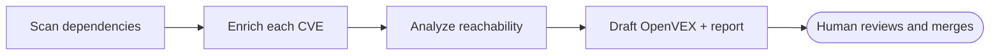

HVE Core delivers VEX (Vulnerability Exploitability eXchange) as a capability split across the
**SSSC Reviewer** (assesses evidence and drafts OpenVEX statements), the **SSSC Planner** (plans
standing up VEX in a target project as a backlog for the Task-* implementors), the
[`vex` skill](https://github.com/microsoft/hve-core/blob/main/.github/skills/security/vex/SKILL.md)
(OpenVEX v0.2.0 specification reference plus implement and review playbooks), and the
`vex-detect` / `vex-draft` workflows (automated detection and drafting). Together they turn scanner
noise into accountable answers: scanning dependencies for known vulnerabilities, enriching each from
public advisory sources, analyzing whether the vulnerable code is reachable in HVE Core, and drafting
an [OpenVEX](https://openvex.dev/) document plus a human-readable triage report. The tooling drafts;
a human reviews and merges. The merge-commit author is the accountable author of record, never the AI.

> [!CAUTION]
> This capability is an assistive tool. It drafts VEX status determinations for human review and does not replace professional security assessment, penetration testing, or qualified human judgment. Every status it drafts, especially `not_affected`, must be independently validated by a CODEOWNERS-required reviewer before the OpenVEX document is merged or published.

## Prerequisites

| Requirement                        | Notes                                                                                                                                                                                  |
|------------------------------------|----------------------------------------------------------------------------------------------------------------------------------------------------------------------------------------|
| Trivy CLI v0.63.0+                 | Required for Mode 1 (full scan). Mode 2 can run from an existing scan report instead.                                                                                                  |
| Network access to advisory sources | OSV.dev, NVD API 2.0, and the GitHub Advisory Database. In a sandboxed workflow these hosts must be in the `network:` allowlist; the GitHub Advisory Database is reachable by default. |
| An OpenVEX document                | `security/vex/hve-core.openvex.json`. A foundation document with an empty `statements` array is a valid starting point.                                                                |

## How It Works

The `vex-draft` workflow (via the SSSC Reviewer VEX assessment capability) runs a four-phase pipeline and can delegate per-CVE exploitability analysis to the `CVE Analyzer` subagent:



1. **Scan** the dependency set with Trivy (Mode 1) or read an existing scan report (Mode 2).
2. **Enrich** each finding from public sources. Because each source is keyed by a different identifier, the agent collects every alias and queries each source by the id it uses: the GitHub Advisory Database and OSV.dev by the `GHSA-`/`PYSEC-` id, NVD by the `CVE-` id. It falls back across aliases until a source resolves.
3. **Analyze** reachability for each CVE through the `CVE Analyzer` subagent, tracing the import path, confirming dead code, or identifying a mitigation, with file and line citations as evidence.
4. **Draft** the OpenVEX document and a triage report, applying the document mutation contract (version bump, timestamps, preserve unrelated statements).

## Usage

The agent is invoked through two prompts.

### `/vex-scan` (Mode 1, full pipeline)

Runs the complete pipeline against the repository or a scoped subdirectory.

```text
/vex-scan
/vex-scan scope=scripts/ product=pkg:npm/@microsoft/hve-core
```

| Input     | Required | Description                                                                 |
|-----------|----------|-----------------------------------------------------------------------------|
| `scope`   | No       | Directory or path focus to limit the scan. Defaults to the repository root. |
| `product` | No       | Product identifier in PURL format. Inferred from the manifest when omitted. |

### `/vex-triage` (Mode 2, triage from a report)

Triages an existing Trivy or OSV-Scanner JSON report without re-scanning. Use this when a scanner has already run, for example from the VEX Detection workflow.

```text
/vex-triage report=osv-results.json
```

| Input    | Required | Description                                                |
|----------|----------|------------------------------------------------------------|
| `report` | Yes      | Path to a Trivy JSON, OSV-Scanner JSON, or SPDX-JSON file. |

## Confidence Routing

The agent classifies each finding into a confidence band, and each band constrains the status it is allowed to draft. The non-negotiable rule: when reachability or exploitability cannot be determined, the only valid status is `under_investigation`. The agent is forbidden from drafting `not_affected` at low confidence.

| Confidence                     | Reachability evidence                    | Status the agent may draft                                  |
|--------------------------------|------------------------------------------|-------------------------------------------------------------|
| High                           | Vulnerable symbol provably unreachable   | `not_affected` with a justification code and code citations |
| High                           | Vulnerable symbol on a reachable path    | `affected` with a remediation note                          |
| Medium / Low / Vendor-disputed | Reachability ambiguous or undeterminable | `under_investigation` only                                  |

The authoritative routing rules and forbidden-transition list live in the agent and its referenced instructions; see the [VEX generation instructions](https://github.com/microsoft/hve-core/blob/main/.github/instructions/security/vex-generation.instructions.md).

## Output

* The updated OpenVEX document at `security/vex/hve-core.openvex.json`, validated against the OpenVEX v0.2.0 schema.
* A markdown triage report: executive summary, per-CVE technical findings, and the generated OpenVEX JSON.
* For automated runs, a single pull request whose body follows the VEX triage template, listing each determination with its evidence, confidence band, and reviewer questions.

Every `not_affected` and `affected` determination is surfaced for the human reviewer, along with structured questions for Medium and Low confidence findings.

## Related Resources

* [VEX Verification](../../security/vex-verification.md): How consumers download, verify, and interpret the published VEX document
* [Security Model](../../security/security-model.md): VEX attestation control (SC-9)
* [OpenVEX specification](https://github.com/openvex/spec): The OpenVEX v0.2.0 format reference

---

🤖 *Crafted with precision by ✨Copilot following brilliant human instruction, then carefully refined by our team of discerning human reviewers.*
