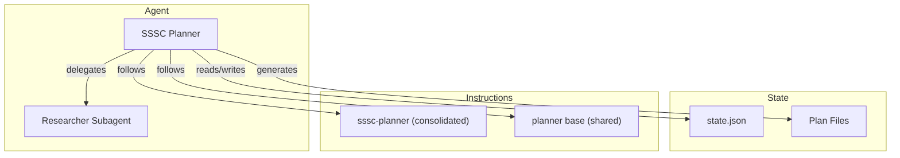

The SSSC Planner is a phase-based conversational agent that produces supply chain security assessments, standards mappings, gap analyses, and backlog handoff artifacts. It inventories capabilities across hve-core and physical-ai-toolchain, maps them to OpenSSF standards, and generates improvement projections.

## Architecture

The agent is driven by a single consolidated SSSC instruction file (`sssc-planner.instructions.md`) plus the shared planner base (`planner-identity-base.instructions.md`), with phase-specific guidance carried in the agent definition itself rather than in separate per-phase instruction files.

## State Management

All state lives in `.copilot-tracking/sssc-plans/{project-slug}/state.json`. The agent follows a six-step protocol on every turn:

| Step      | Action                                                                 |
|-----------|------------------------------------------------------------------------|
| READ      | Load the current state file                                            |
| VALIDATE  | Confirm the state schema is intact and the current phase is consistent |
| DETERMINE | Decide which phase and step to execute based on state and user input   |
| EXECUTE   | Perform the phase work (questions, analysis, artifact generation)      |
| UPDATE    | Modify the in-memory state to reflect completed work                   |
| WRITE     | Persist the updated state back to the file                             |

### State Fields

The state file tracks fields across scoping, analysis, handoff, and trust concerns.

| Field                       | Type     | Description                                                                                                                         |
|-----------------------------|----------|-------------------------------------------------------------------------------------------------------------------------------------|
| `projectSlug`               | string   | Kebab-case project identifier                                                                                                       |
| `ssscPlanFile`              | string   | Path to the main SSSC plan markdown file                                                                                            |
| `currentPhase`              | number   | Current phase (1-6)                                                                                                                 |
| `entryMode`                 | string   | `capture`, `from-prd`, `from-brd`, or `from-security-plan`                                                                          |
| `phaseGates`                | object   | Per-phase gate status; phases 1, 4, 6 are hard gates and phases 2, 3, 5 are summary-and-advance                                     |
| `scopingComplete`           | boolean  | Whether Phase 1 scoping has been completed                                                                                          |
| `assessmentComplete`        | boolean  | Whether Phase 2 capability inventory is complete                                                                                    |
| `standardsMapped`           | boolean  | Whether Phase 3 standards mapping is complete                                                                                       |
| `gapAnalysisComplete`       | boolean  | Whether Phase 4 gap analysis is complete                                                                                            |
| `backlogGenerated`          | boolean  | Whether Phase 5 backlog generation is complete                                                                                      |
| `handoffGenerated`          | object   | `{ado: boolean, github: boolean}`                                                                                                   |
| `context.techStack`         | string[] | Target repository technology stack                                                                                                  |
| `context.packageManagers`   | string[] | Package managers in use                                                                                                             |
| `context.ciPlatform`        | string   | CI/CD platform (GitHub Actions, Azure Pipelines, etc.)                                                                              |
| `context.releaseStrategy`   | string   | Release strategy (tags, branches, etc.)                                                                                             |
| `context.complianceTargets` | string[] | Compliance frameworks being targeted                                                                                                |
| `referencesProcessed`       | object[] | Reference entries (`filePath`, `type`, `sourceDescription`, `processedInPhase`, `status`) for consumed artifacts                    |
| `nextActions`               | string[] | Pending actions for the current or next phase                                                                                       |
| `userPreferences`           | object   | Autonomy tier (`guided`, `partial`, or `full`), output detail level, target system, audience profile, and optional artifact toggles |
| `ssscEnabled`               | boolean  | Whether SSSC planning is active                                                                                                     |
| `signingRequested`          | boolean  | Whether the user opted into Sigstore signing of artifacts                                                                           |
| `signingManifestPath`       | string   | Path to the signing manifest produced after Phase 6                                                                                 |
| `disclaimerShownAt`         | string   | ISO 8601 timestamp when the full disclaimer was shown                                                                               |
| `noticeLog`                 | object[] | Audit log of disclaimers, framework attributions, and review reminders                                                              |
| `securityPlannerLink`       | string   | Path to the upstream Security Planner state file                                                                                    |
| `raiPlannerLink`            | string   | Path to an associated RAI Planner state file                                                                                        |

## Interaction Model

The agent follows strict question rules during each phase:

| Guardrail                             | Description                                                                                        |
|---------------------------------------|----------------------------------------------------------------------------------------------------|
| 3-5 questions per turn                | Enough to make progress without overwhelming the user                                              |
| Emoji checklists                      | Questions use ❓ for pending, ✅ for answered, and ❌ for blocked items                               |
| No phase advance without confirmation | The agent summarizes phase findings and asks for explicit approval before moving to the next phase |

## Session Resume

When a conversation resumes from a prior session, the agent follows a five-step resume sequence:

1. Read the state file from `.copilot-tracking/sssc-plans/{project-slug}/`.
2. Display the SSSC Planning disclaimer when `disclaimerShownAt` is missing, then record the timestamp in state.
3. Present current phase progress and checklist status.
4. Summarize completed work and remaining actions.
5. Continue from the last incomplete action.

When conversation context was compacted by the chat system, the agent also reads existing assessment, standards mapping, gap analysis, and backlog artifacts before rebuilding the active question set.

## Operational Constraints

* All generated files are placed under `.copilot-tracking/sssc-plans/{project-slug}/`.
* The agent never modifies source code or files outside its tracking directory.
* The Researcher Subagent is dispatched for WAF/CAF runtime lookups when cloud-hosted components are in scope.
* Cross-agent links (`securityPlannerLink`, `raiPlannerLink`) are populated but the agent does not force handoff to other agents.

## Related Files

| File type    | Location                                                 |
|--------------|----------------------------------------------------------|
| Agent        | `.github/agents/security/sssc-planner.agent.md`          |
| Prompts      | `.github/prompts/security/sssc-*.prompt.md`              |
| Instructions | `.github/instructions/security/`                         |
| Skill        | `.github/skills/security/supply-chain-security/`         |
| State        | `.copilot-tracking/sssc-plans/{project-slug}/state.json` |

<!-- markdownlint-disable MD036 -->
*🤖 Crafted with precision by ✨Copilot following brilliant human instruction,
then carefully refined by our team of discerning human reviewers.*
<!-- markdownlint-enable MD036 -->
