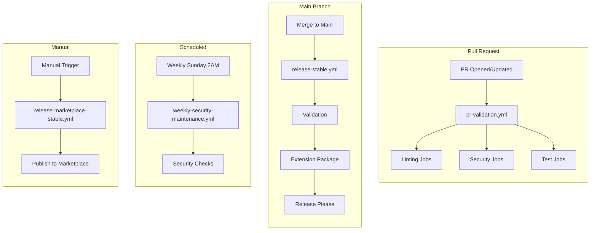
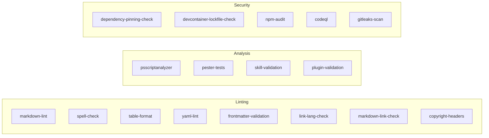
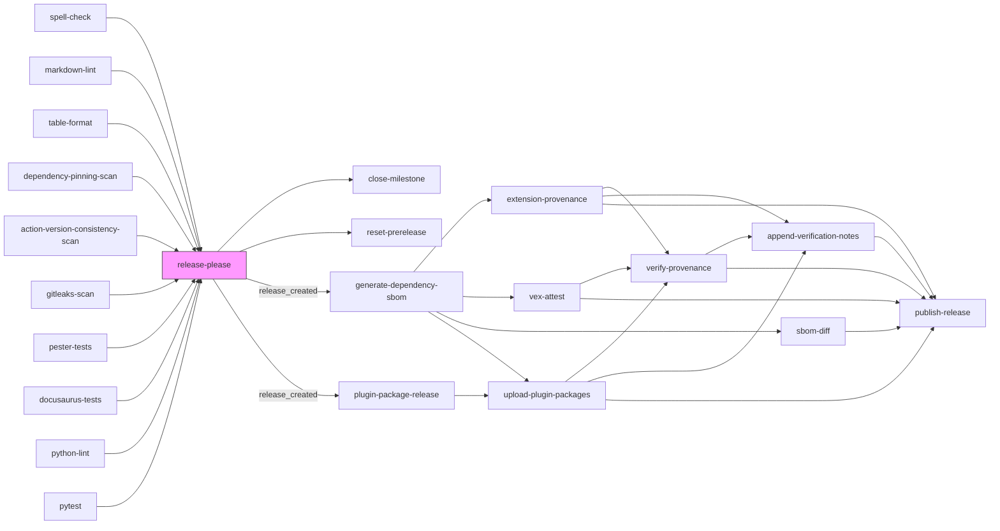
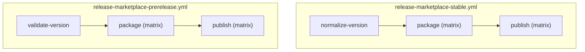

HVE Core uses GitHub Actions for continuous integration, quality validation, security scanning, and release automation. The workflow architecture emphasizes reusable components and parallel execution for fast feedback.

## Pipeline Overview

## Workflow Inventory

| Workflow                             | Trigger                   | Purpose                                                           |
|--------------------------------------|---------------------------|-------------------------------------------------------------------|
| `pr-validation.yml`                  | Pull request, manual      | Pre-merge quality gate with parallel validation                   |
| `release-stable.yml`                 | Push to main, manual      | Post-merge validation and release automation                      |
| `weekly-security-maintenance.yml`    | Sunday 2 AM UTC, manual   | Scheduled security posture review                                 |
| `weekly-validation.yml`              | Schedule, manual          | Weekly full validation sweep                                      |
| `security-scan.yml`                  | Push to main/develop      | CodeQL security validation                                        |
| `release-marketplace-stable.yml`     | Manual                    | VS Code extension marketplace publishing                          |
| `release-marketplace-prerelease.yml` | Manual                    | VS Code extension pre-release publishing                          |
| `copilot-setup-steps.yml`            | Manual                    | Coding agent environment setup                                    |
| `devcontainer-change-log.yml`        | Push to main/develop      | Logs devcontainer infrastructure file changes to the step summary |
| `devcontainer-lockfile-check.yml`    | Reusable                  | Validates devcontainer lockfile integrity and SHA-256 pinning     |
| `release-prerelease.yml`             | PR closed                 | Pre-release tag and publish on merge to main                      |
| `release-prerelease-pr.yml`          | Push to main              | Pre-release companion PR management                               |
| `scorecard.yml`                      | Schedule, push            | OpenSSF Scorecard security analysis                               |
| `codeql-analysis.yml`                | Schedule                  | Weekly CodeQL security scan (also reusable)                       |
| `dependency-review.yml`              | Pull request              | Dependency vulnerability review (also reusable)                   |
| `sha-staleness-check.yml`            | Manual                    | SHA reference freshness check (also reusable)                     |
| `deploy-docs.yml`                    | Push to main, manual      | Docusaurus documentation site deployment                          |
| `create-stale-docs-issues.yml`       | Schedule                  | Automated stale docs issue creation from ms.date freshness        |
| `msdate-freshness-check.yml`         | Schedule, manual          | ms.date freshness validation across documentation                 |
| `label-sync.yml`                     | Push to main, manual      | Repository label synchronization                                  |
| `workflow-permissions-scan.yml`      | Schedule, manual          | GitHub Actions permissions audit                                  |
| `weekly-gh-code-scanning.yml`        | Monday 3 AM UTC, manual   | Weekly GitHub code scanning alert retrieval and issue creation    |
| `vex-detect.yml`                     | Schedule, release, manual | Dependency vulnerability scan and VEX triage issue creation       |

GitHub Agentic Workflow markdown files (`issue-triage.md`, `issue-implement.md`, `pr-review.md`, `dependency-pr-review.md`, `doc-update-check.md`, and `vex-draft.md`) compile to `*.lock.yml` workflows and are documented in [Agentic Workflows](agentic-workflows).

### Reusable Workflows

Individual validation workflows called by orchestration workflows:

| Workflow                              | Purpose                                        | npm Script                               |
|---------------------------------------|------------------------------------------------|------------------------------------------|
| `markdown-lint.yml`                   | Markdownlint validation                        | `npm run lint:md`                        |
| `spell-check.yml`                     | cspell dictionary check                        | `npm run spell-check`                    |
| `frontmatter-validation.yml`          | AI artifact frontmatter schemas                | `npm run lint:frontmatter`               |
| `markdown-link-check.yml`             | Broken link detection                          | `npm run lint:md-links`                  |
| `link-lang-check.yml`                 | Link language validation                       | `npm run lint:links`                     |
| `yaml-lint.yml`                       | YAML syntax validation                         | `npm run lint:yaml`                      |
| `ps-script-analyzer.yml`              | PowerShell static analysis                     | `npm run lint:ps`                        |
| `table-format.yml`                    | Markdown table formatting                      | `npm run format:tables`                  |
| `pester-tests.yml`                    | PowerShell unit tests                          | `npm run test:ps`                        |
| `skill-validation.yml`                | Skill structure validation                     | `npm run validate:skills`                |
| `dependency-pinning-scan.yml`         | Dependency pinning validation                  | N/A (PowerShell direct)                  |
| `sha-staleness-check.yml`             | SHA reference freshness*                       | N/A (PowerShell direct)                  |
| `codeql-analysis.yml`                 | CodeQL security scanning*                      | N/A (GitHub native)                      |
| `dependency-review.yml`               | Dependency vulnerability review*               | N/A (GitHub native)                      |
| `gh-code-scanning.yml`                | GitHub code scanning alert retrieval           | N/A (PowerShell direct)                  |
| `create-gh-code-scanning-issues.yml`  | Create GitHub code scanning issues from alerts | N/A (bash + gh CLI direct)               |
| `extension-package.yml`               | VS Code extension packaging                    | `npm run extension:package`              |
| `copyright-headers.yml`               | Copyright header validation                    | `npm run validate:copyright`             |
| `gitleaks-scan.yml`                   | Secret detection scanning                      | N/A (gitleaks direct)                    |
| `plugin-package.yml`                  | Plugin collection packaging                    | N/A                                      |
| `plugin-validation.yml`               | Plugin and collection metadata                 | `npm run lint:collections-metadata`      |
| `extension-marketplace-publish.yml`   | Extension marketplace publishing               | N/A                                      |
| `python-lint.yml`                     | Python linting (ruff)                          | `npm run lint:py`                        |
| `pytest-tests.yml`                    | Python unit tests                              | `npm run test:py`                        |
| `pip-audit.yml`                       | Python dependency auditing                     | N/A (pip-audit direct)                   |
| `fuzz-tests.yml`                      | Python fuzz testing                            | N/A (pytest direct)                      |
| `docusaurus-tests.yml`                | Docusaurus test suite                          | N/A (npm test)                           |
| `model-validation.yml`                | Model reference validation                     | `npm run lint:models`                    |
| `ai-artifact-validation.yml`          | AI artifact structure validation               | `npm run lint:ai-artifacts`              |
| `devcontainer-lockfile-check.yml`     | Devcontainer lockfile integrity                | `npm run validate:devcontainer-lockfile` |
| `action-version-consistency-scan.yml` | Action version consistency                     | `npm run lint:version-consistency`       |

Workflows marked with `*` are dual-purpose: they accept `workflow_call` for reuse by orchestration workflows and also run independently via their own triggers.

### Composite Actions

Composite actions package reusable step sequences that workflows invoke directly. Unlike reusable workflows (called via `uses:` at the job level with `workflow_call`), composite actions are referenced as steps within a job.

| Action             | Purpose                                     | Reference                                  |
|--------------------|---------------------------------------------|--------------------------------------------|
| `setup-ps-modules` | Cached PowerShell module install with retry | `uses: ./.github/actions/setup-ps-modules` |

The `setup-ps-modules` action caches modules keyed on `scripts/security/ps-module-versions.json` and retries installation with exponential backoff on PSGallery failures. Workflows that need PowerShell modules must use `uses: ./.github/actions/setup-ps-modules` instead of inline `Install-Module` steps, consistent with the convention recorded in `.github/copilot-instructions.md`.

## PR Validation Pipeline

The `pr-validation.yml` workflow serves as the primary quality gate for all pull requests. It runs 16 parallel jobs covering linting, security, and testing.

### Jobs

| Job                         | Reusable Workflow                 | Validates                       |
|-----------------------------|-----------------------------------|---------------------------------|
| spell-check                 | `spell-check.yml`                 | Spelling across all files       |
| markdown-lint               | `markdown-lint.yml`               | Markdown formatting rules       |
| table-format                | `table-format.yml`                | Markdown table structure        |
| psscriptanalyzer            | `ps-script-analyzer.yml`          | PowerShell code quality         |
| yaml-lint                   | `yaml-lint.yml`                   | YAML syntax                     |
| pester-tests                | `pester-tests.yml`                | PowerShell unit tests           |
| frontmatter-validation      | `frontmatter-validation.yml`      | AI artifact metadata            |
| skill-validation            | `skill-validation.yml`            | Skill directory structure       |
| link-lang-check             | `link-lang-check.yml`             | Link accessibility              |
| markdown-link-check         | `markdown-link-check.yml`         | Broken links                    |
| dependency-pinning-check    | `dependency-pinning-scan.yml`     | Dependency pinning              |
| devcontainer-lockfile-check | `devcontainer-lockfile-check.yml` | Devcontainer lockfile integrity |
| npm-audit                   | Inline                            | npm dependency vulnerabilities  |
| codeql                      | `codeql-analysis.yml`             | Code security patterns          |
| copyright-headers           | `copyright-headers.yml`           | Copyright header compliance     |
| plugin-validation           | `plugin-validation.yml`           | Plugin and collection metadata  |
| gitleaks-scan               | `gitleaks-scan.yml`               | Secret detection                |

All jobs run in parallel with no dependencies, enabling fast feedback (typically under 3 minutes).

## Main Branch Pipeline

The `release-stable.yml` workflow runs after merges to main, performing validation and release automation.

Release-please v4 handles `chore`-type commits natively. They are not releasable and do not produce spurious release PRs, so no commit-message guard is needed.

### Main Branch Jobs

| Job                             | Purpose                                        | Dependencies                                                                                                                      |
|---------------------------------|------------------------------------------------|-----------------------------------------------------------------------------------------------------------------------------------|
| spell-check                     | Post-merge spelling validation                 | None                                                                                                                              |
| markdown-lint                   | Post-merge markdown validation                 | None                                                                                                                              |
| table-format                    | Post-merge table validation                    | None                                                                                                                              |
| dependency-pinning-scan         | Dependency pinning security check              | None                                                                                                                              |
| action-version-consistency-scan | Action version consistency check               | None                                                                                                                              |
| gitleaks-scan                   | Secret detection scanning                      | None                                                                                                                              |
| pester-tests                    | PowerShell unit tests                          | None                                                                                                                              |
| docusaurus-tests                | Docs site build and tests                      | None                                                                                                                              |
| discover-python-projects        | Enumerate Python projects                      | None                                                                                                                              |
| python-lint                     | Python lint (ruff)                             | discover-python-projects                                                                                                          |
| pytest                          | Python unit tests                              | discover-python-projects                                                                                                          |
| release-please                  | Automated release management                   | All validation jobs                                                                                                               |
| close-milestone                 | Close the released milestone                   | release-please                                                                                                                    |
| reset-prerelease                | Reset pre-release tracking                     | release-please                                                                                                                    |
| generate-dependency-sbom        | Generate dependency SBOM                       | release-please                                                                                                                    |
| plugin-package-release          | Build release plugin packages                  | release-please                                                                                                                    |
| extension-provenance            | Build, sign, and attest release VSIX (SLSA L3) | release-please, generate-dependency-sbom                                                                                          |
| upload-plugin-packages          | Upload plugin packages                         | release-please, plugin-package-release, generate-dependency-sbom                                                                  |
| vex-attest                      | Attest and upload VEX document                 | release-please, generate-dependency-sbom                                                                                          |
| sbom-diff                       | Compare SBOM changes                           | release-please, generate-dependency-sbom                                                                                          |
| verify-provenance               | Verify extension, plugin, and VEX attestations | release-please, extension-provenance, upload-plugin-packages, vex-attest                                                          |
| append-verification-notes       | Append artifact verification instructions      | release-please, extension-provenance, upload-plugin-packages, verify-provenance                                                   |
| publish-release                 | Finalize GitHub Release                        | release-please, extension-provenance, upload-plugin-packages, vex-attest, verify-provenance, sbom-diff, append-verification-notes |

When release-please creates a release, parallel jobs generate an SBOM (`generate-dependency-sbom`) and package plugin collections (`plugin-package-release`). The `extension-provenance` reusable workflow then builds, signs, and attests the extension VSIX for SLSA Build Level 3, `upload-plugin-packages` uploads collection artifacts, and `sbom-diff` compares dependency changes. The `verify-provenance` job verifies the extension, plugin, and VEX attestations before the release is finalized.

The `vex-attest` job attests the VEX document (`security/vex/hve-core.openvex.json`) twice: a build-provenance attestation of the document, plus an in-toto attestation that binds the VEX statements as a predicate over the dependency SBOM. The `append-verification-notes` job adds artifact verification instructions to the release notes before `publish-release` finalizes the release.

## Security Workflows

### Weekly Security Maintenance

The `weekly-security-maintenance.yml` workflow runs every Sunday at 2AM UTC, providing scheduled security posture review.

| Job              | Purpose                              |
|------------------|--------------------------------------|
| validate-pinning | Verify dependency pinning compliance |
| check-staleness  | Detect outdated SHA references       |
| codeql-analysis  | Full CodeQL security scan            |
| summary          | Aggregate security status report     |

### Security Validation Tools

| Tool               | Script                            | Checks                                                                        |
|--------------------|-----------------------------------|-------------------------------------------------------------------------------|
| Dependency Pinning | `Test-DependencyPinning.ps1`      | Actions use SHA refs; npm uses exact versions                                 |
| SHA Staleness      | `Test-SHAStaleness.ps1`           | SHAs reference recent commits                                                 |
| audit-ci           | `audit-ci --config audit-ci.json` | Known vulnerabilities in dependencies, using the allowlist in `audit-ci.json` |
| CodeQL             | GitHub native                     | Code patterns indicating security issues                                      |
| Gitleaks           | `gitleaks`                        | Secret detection in repository history                                        |
| Dependency Review  | GitHub native                     | Dependency vulnerability analysis                                             |

## Extension Publishing

The `release-marketplace-stable.yml` and `release-marketplace-prerelease.yml` workflows handle VS Code extension marketplace publishing through manual dispatch. Both workflows use collection-based packaging to produce and publish a separate VSIX per collection.

### Publishing Jobs

| Job               | Purpose                                                     | Workflow                             |
|-------------------|-------------------------------------------------------------|--------------------------------------|
| normalize-version | Ensure version consistency                                  | `release-marketplace-stable.yml`     |
| validate-version  | Enforce odd minor version for pre-release channel           | `release-marketplace-prerelease.yml` |
| package (matrix)  | Build one VSIX per collection using `extension-package.yml` | Both                                 |
| publish (matrix)  | Upload each VSIX to VS Code Marketplace via OIDC + vsce     | Both                                 |

### Collection-Based Packaging

Collection manifests in `collections/*.collection.yml` define collection-scoped subsets of the full artifact set. The `extension-package.yml` reusable workflow discovers these manifests, filters by maturity and channel, and packages each as an independent VSIX.

| Collection         | Maturity     | Included In        |
|--------------------|--------------|--------------------|
| `hve-core-all`     | Stable       | Stable, PreRelease |
| `hve-core`         | Stable       | Stable, PreRelease |
| `ado`              | Stable       | Stable, PreRelease |
| `github`           | Stable       | Stable, PreRelease |
| `project-planning` | Stable       | Stable, PreRelease |
| `coding-standards` | Stable       | Stable, PreRelease |
| `data-science`     | Stable       | Stable, PreRelease |
| `security`         | Experimental | Stable, PreRelease |
| `design-thinking`  | Preview      | Stable, PreRelease |
| `installer`        | Stable       | Stable, PreRelease |
| `experimental`     | Experimental | PreRelease only    |

Maturity filtering rules:

| Maturity Level | Build Inclusion                                 |
|----------------|-------------------------------------------------|
| Deprecated     | Always excluded                                 |
| Experimental   | Excluded from Stable channel builds             |
| Preview        | Included in both Stable and PreRelease channels |
| Stable         | Included in all channel builds                  |

### Version Channels

| Channel     | Version Pattern    | Marketplace      |
|-------------|--------------------|------------------|
| Stable      | Even minor (1.2.0) | Main listing     |
| Pre-release | Odd minor (1.3.0)  | Pre-release flag |

## npm Script Mapping

Workflows invoke validation through npm scripts defined in `package.json`:

| npm Script                     | Command                                                                                               | Used By                       |
|--------------------------------|-------------------------------------------------------------------------------------------------------|-------------------------------|
| `lint:md`                      | `markdownlint-cli2`                                                                                   | markdown-lint.yml             |
| `lint:md:fix`                  | `markdownlint-cli2 --fix`                                                                             | Local                         |
| `spell-check`                  | `cspell`                                                                                              | spell-check.yml               |
| `spell-check:fix`              | `cspell --show-suggestions`                                                                           | Local                         |
| `lint:frontmatter`             | `Validate-MarkdownFrontmatter.ps1`                                                                    | frontmatter-validation.yml    |
| `lint:md-links`                | `Markdown-Link-Check.ps1`                                                                             | markdown-link-check.yml       |
| `lint:links`                   | `Invoke-LinkLanguageCheck.ps1`                                                                        | link-lang-check.yml           |
| `lint:yaml`                    | `Invoke-YamlLint.ps1`                                                                                 | yaml-lint.yml                 |
| `lint:ps`                      | `Invoke-PSScriptAnalyzer.ps1`                                                                         | ps-script-analyzer.yml        |
| `lint:collections-metadata`    | `Validate-Collections.ps1`                                                                            | plugin-validation.yml         |
| `lint:marketplace`             | `Validate-Marketplace.ps1`                                                                            | plugin-validation.yml         |
| `lint:version-consistency`     | `Test-ActionVersionConsistency.ps1`                                                                   | Local                         |
| `lint:all`                     | Chains all linters (incl. `eval:lint:*`)                                                              | Local                         |
| `format:tables`                | `markdown-table-formatter`                                                                            | table-format.yml              |
| `test:ps`                      | `Invoke-PesterTests.ps1`                                                                              | pester-tests.yml              |
| `validate:skills`              | `Validate-SkillStructure.ps1`                                                                         | skill-validation.yml          |
| `validate:copyright`           | `Test-CopyrightHeaders.ps1`                                                                           | copyright-headers.yml         |
| `extension:prepare`            | `pwsh ./scripts/extension/Prepare-Extension.ps1 && npm run extension:postprocess`                     | extension-package.yml         |
| `extension:prepare:prerelease` | `pwsh ./scripts/extension/Prepare-Extension.ps1 -Channel PreRelease && npm run extension:postprocess` | extension-package.yml         |
| `extension:postprocess`        | `markdownlint-cli2 + markdown-table-formatter (extension/**/*.md, collections/*.md)`                  | extension-package.yml         |
| `extension:package`            | `Package-Extension.ps1`                                                                               | extension-package.yml         |
| `package:extension`            | Alias for `extension:package`                                                                         | extension-package.yml         |
| `extension:package:prerelease` | `Package-Extension.ps1 -PreRelease`                                                                   | extension-package.yml         |
| `plugin:generate`              | `Generate-Plugins.ps1` + post-process                                                                 | plugin-package.yml            |
| `plugin:validate`              | Alias for `lint:collections-metadata`                                                                 | plugin-validation.yml         |
| `lint:py`                      | `ruff check`                                                                                          | python-lint.yml               |
| `lint:models`                  | `Validate-ModelReferences.ps1`                                                                        | model-validation.yml          |
| `lint:ai-artifacts`            | `Validate-PlannerArtifacts.ps1 -FailOnMissing`                                                        | ai-artifact-validation.yml    |
| `lint:permissions`             | `Test-WorkflowPermissions.ps1`                                                                        | workflow-permissions-scan.yml |
| `lint:ps-module-pins`          | `Test-PSModulePins.ps1`                                                                               | Local                         |
| `lint:dependency-pinning`      | `Test-DependencyPinning.ps1`                                                                          | dependency-pinning-scan.yml   |
| `audit:npm`                    | `audit-ci --config audit-ci.json`                                                                     | pr-validation.yml             |
| `test:py`                      | `uv run pytest`                                                                                       | pytest-tests.yml              |
| `eval:lint:vally`              | `Build-AgentBehaviorSpec.ps1 -WhatIf && vally lint --eval-spec evals/`                                | Local                         |
| `eval:lint:schema`             | `Test-EvalSpec.ps1`                                                                                   | Local                         |
| `eval:lint:text`               | `Test-EvalSpecText.ps1`                                                                               | Local                         |
| `eval:lint:safety`             | `Test-VallyTestSafety.ps1`                                                                            | Local                         |
| `eval:lint:skills`             | `vally lint .github/skills/`                                                                          | Local                         |
| `eval:run`                     | Runs all eval suites                                                                                  | Local                         |
| `eval:run:skills`              | `vally eval --suite skill-quality`                                                                    | Local                         |
| `eval:run:agents`              | `vally eval --suite agent-behavior`                                                                   | Local                         |
| `eval:run:scripts`             | `vally eval --suite script-validation`                                                                | Local                         |
| `eval:compare`                 | `vally compare`                                                                                       | Local                         |
| `eval:presence`                | `Test-StimulusPresence.ps1` (changed-artifact eval-spec coverage gate)                                | Local                         |
| `eval:execute`                 | `Invoke-VallyEvals.ps1` (run evals for changed artifacts)                                             | Local                         |
| `eval:moderate`                | `Invoke-ContentModeration.ps1`                                                                        | Local                         |
| `eval:moderate:corpus`         | `Invoke-CorpusModeration.ps1`                                                                         | Local                         |
| `eval:moderate:artifacts`      | `Invoke-ArtifactModeration.ps1`                                                                       | Local                         |
| `eval:moderate:test`           | Runs `Invoke-ContentModeration.Tests.ps1`                                                             | Local                         |
| `eval:equivalence`             | `Invoke-BaselineEquivalence.ps1`                                                                      | Local                         |
| `eval:dashboard`               | `New-EquivalenceDashboard.ps1`                                                                        | Local                         |
| `eval:run:equivalence`         | Runs baseline and customized equivalence specs                                                        | Local                         |
| `eval:behavior-prompts`        | `vally eval --eval-spec evals/behavior-conformance/prompts.eval.yaml`                                 | Local                         |
| `eval:behavior-instructions`   | `vally eval --eval-spec evals/behavior-conformance/instructions.eval.yaml`                            | Local                         |
| `eval:behavior-skills`         | `vally eval --eval-spec evals/behavior-conformance/skill-behavior.eval.yaml`                          | Local                         |
| `eval:agent`                   | `Invoke-AgentMatrix.ps1` (agent behavior matrix)                                                      | Local                         |
| `eval:agent:matrix`            | `Invoke-AgentMatrix.ps1 -All -Tier nightly`                                                           | Local                         |
| `eval:agent:matrix:dryrun`     | `Invoke-AgentMatrix.ps1 -All -Tier nightly -WhatIf`                                                   | Local                         |
| `eval:agent:changed`           | `Invoke-AgentMatrix.ps1` for changed agents (PR tier)                                                 | Local                         |
| `eval:agent:dashboard`         | `New-AgentMatrixDashboard.ps1`                                                                        | Local                         |
| `eval:agent:dashboard:open`    | `New-AgentMatrixDashboard.ps1 -Open`                                                                  | Local                         |
| `eval:agent:report`            | Runs `eval:agent:matrix` then `eval:agent:dashboard:open`                                             | Local                         |
| `eval:agent:report:dryrun`     | Runs `eval:agent:matrix:dryrun` then `eval:agent:dashboard:open`                                      | Local                         |

## Related Documentation

* [Testing Architecture](testing.md) - PowerShell Pester test infrastructure
* [Scripts README](https://github.com/microsoft/hve-core/blob/main/scripts/README.md) - Script organization and usage

🤖 *Crafted with precision by ✨Copilot following brilliant human instruction, then carefully refined by our team of discerning human reviewers.*
