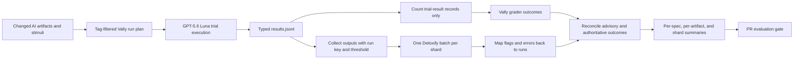

## Context

ADR 0002 established Vally as the behavior-evaluation framework for hve-core's
AI customization artifacts. The first broad HVE Builder evaluation run exposed
three separate sources of apparent randomness and excess duration in the
PR-time execution path.

First, Vally 0.6 writes one typed `run-summary` record after the typed
`trial-result` records in each `results.jsonl` file. The repository parser
treated every parseable line as a trial. Because the summary has no grade
result, the parser classified it as an errored trial. The wrapper then retried
the entire tag-filtered spec up to two more times, expanding five intended
trials to as many as fifteen. The current logs showed three complete run
directories for every affected tag.

Second, output moderation loaded Detoxify and Torch after every tag-filtered
Vally invocation. A local measurement took 16.9 seconds for a cold invocation
and 12.2 seconds for a subsequent invocation, even for one benign output. The
model startup cost was therefore paid repeatedly inside each sequential shard.

Third, the agent-behavior suite does not invoke a specific `.agent.md` file.
The worker stimuli described a role to a generic model while loading unrelated
global skills. Exact status words and order-sensitive regular expressions then
graded model phrasing rather than the worker's public contract. Switching the
model alone did not fix this: in a paired 47-trial benchmark, Claude Haiku 4.5
and GPT-5.6 Luna each cleared 41 trials, while deterministic vocabulary misses
remained concentrated in tests that lacked the worker decision rules.

> Evidence: `scripts/evals/Modules/VallyRunner.psm1` owns JSONL aggregation, errored-trial classification, retry decisions, and output-moderation result attribution.
> Evidence: `scripts/evals/Invoke-VallyEvals.ps1` runs tag-filtered specs sequentially inside each artifact-kind shard and reconciles advisory, authoritative, and moderation failures.
> Evidence: `evals/agent-behavior/eval.yaml` states that Vally does not yet support direct agent routing and runs five trials at a 0.7 threshold.
> Evidence: `scripts/tests/evals/Invoke-VallyEvals.Tests.ps1` reproduces typed summary handling, moderation batching, threshold preservation, and failure accounting.

The decision is how to correct the execution semantics and reduce PR latency
without weakening moderation policy, advisory behavior, or backward
compatibility with legacy Vally result files.

## Decision Drivers

* Correct result accounting
* Lower PR feedback latency
* Behavior-test fidelity
* Safety-policy preservation
* Maintainable grader semantics

Correct accounting prevents metadata records from becoming trials or triggering
retries. Lower latency avoids repeating model and moderation work without added
signal. Behavior fidelity tests public worker decisions instead of generic
model guesses. Safety preservation keeps per-spec thresholds and CI gating
intact. Maintainable grader semantics accept equivalent ordering without
dropping required behavior.

## Considered Options

* Option A: Keep the current Claude Haiku 4.5 execution path and tune individual failing regular expressions as failures appear.
* Option B: Switch the PR model to GPT-5.6 Luna but leave result parsing, per-run moderation, and worker stimulus structure unchanged.
* Option C: Correct result parsing, batch moderation per shard, make worker stimuli self-contained, use order-independent semantic graders, and then adopt GPT-5.6 Luna for Low-profile PR execution.

## Decision Outcome

| Decision driver               | Option A: status quo plus regex fixes | Option B: model switch only | Option C: integrated reliability changes |
|-------------------------------|---------------------------------------|-----------------------------|------------------------------------------|
| Correct result accounting     | No                                    | No                          | Yes                                      |
| Lower PR feedback latency     | No                                    | Partial                     | Yes                                      |
| Behavior-test fidelity        | Partial                               | No                          | Yes                                      |
| Safety-policy preservation    | Yes                                   | Yes                         | Yes                                      |
| Maintainable grader semantics | No                                    | No                          | Yes                                      |

Chosen option: **Option C**, because the failures had independent causes that
could not be solved by changing the model or widening regular expressions
alone. The model benchmark showed that Luna was materially faster but not more
accurate against underspecified stimuli. The execution path therefore needed
to become correct and the stimuli needed to encode their public contracts
before the faster model could be adopted safely.

The decision has five parts:

1. Parse typed Vally JSONL records by meaning. Count `trial-result` records,
   ignore other typed records, and continue accepting legacy untyped trials.
2. Collect outputs from all tag-filtered runs in a shard and invoke Detoxify
   once. Carry each run's effective threshold on every moderation record and
   attribute every flagged record back to its originating run.
3. Include the minimum public decision rules in each HVE worker stimulus until
   Vally supports direct `.agent.md` routing. Do not copy internal procedures or
   hidden answer keys.
4. Use positive lookahead assertions for requirements whose ordering is
  irrelevant, while retaining every semantic signal the grader is intended to
  require.
5. Use GPT-5.6 Luna as the Low-profile PR evaluation default in the dispatcher,
   agent matrix, baseline-equivalence PR fallback, and eval workflow.

## Moderation Reconciliation Semantics

Batching moves moderation after Vally grading, so the dispatcher must merge two
independent outcomes without changing the existing CI contract.

| Condition                          | Dispatcher behavior                                                                                          |
|------------------------------------|--------------------------------------------------------------------------------------------------------------|
| Moderation disabled or no outputs  | Skip the batch and preserve the Vally result.                                                                |
| Output is clean                    | Attach the moderation result and preserve the Vally status.                                                  |
| Wholly advisory run is flagged     | Record an advisory failure without blocking CI.                                                              |
| Authoritative or mixed run flagged | Record `content-moderation-output`, update authoritative failure accounting, and block CI once for that run. |
| Moderation cannot run or attribute | Record `content-moderation-error-output` and block CI as an infrastructure failure.                          |

`promotedRunKeys` prevents a run that already failed Vally grading from
incrementing the failed-spec count again during moderation. `Math.Max` prevents
the total failure count from double-counting overlapping grader and moderation
failures. The resulting delta is assigned to the advisory or authoritative
bucket so per-spec, per-artifact, and shard totals remain internally
consistent.

## Consequences

* Good, because typed Vally summary records no longer create false errored trials or unconditional full-spec retries.
* Good, because Detoxify initializes once per shard instead of once per tag-filtered run.
* Good, because every output retains its effective moderation threshold and originating run identity through the batch.
* Good, because self-contained worker stimuli measure documented decision behavior until native agent routing exists.
* Good, because order-independent graders recognize semantically equivalent output without dropping required signals.
* Good, because GPT-5.6 Luna reduced median trial time from 12.8 seconds to 7.9 seconds and mean trial time from 14.0 seconds to 8.2 seconds in the paired benchmark.
* Bad, because deferred moderation requires explicit reconciliation branches for advisory posture, hard failures, attribution errors, and duplicate promotion.
* Bad, because the temporary worker stimuli repeat a compact subset of public decision rules and can drift from their source agents.
* Bad, because changing the default model changes the PR evaluation baseline and requires periodic re-evaluation as hosted models evolve.
* Neutral, because Vally's own retry and timeout behavior remains unchanged; this decision removes only the repository wrapper's false retries.
* Neutral, because advisory versus authoritative policy remains unchanged even though moderation executes later.

Telemetry strategy: no new production OpenTelemetry instrument is introduced.
This path is CI-only and does not cross a production service boundary. Per the
`telemetry-foundations` skill's Decision Tree and Metric Vocabulary cardinality
guidance, run keys, spec paths, and free-form model output remain in structured
Vally JSONL, moderation reports, and `eval-summary.json` rather than becoming
metric dimensions. Existing bounded fields such as trial count, duration, error
count, model, and shard remain the operational evidence for this decision.

## Confirmation

The implementation was confirmed on 2026-07-10 with the following evidence:

* All 66 focused Vally dispatcher unit and integration tests passed, including typed-summary filtering, single-attempt execution, threshold-preserving batching, flag attribution, and authoritative failure reconciliation.
* All 34 agent-matrix tests and all 31 baseline-equivalence tests passed.
* All Python projects passed, including the focused moderation suite and its per-record threshold override case.
* Vally lint, eval schema validation, YAML lint, PowerShell analysis, Python lint, Markdown lint, frontmatter validation, model-reference validation, eval text checks, and eval safety checks passed.
* All seven HVE worker stimuli passed five of five GPT-5.6 Luna trials after their public decision contracts were made explicit.
* The `hve-builder`, `hve-builder-tester`, `rpi-walkthrough`, and Prompt Builder compatibility scenarios passed three of three GPT-5.6 Luna trials.
* One real Detoxify batch processed 44 outputs from two Vally runs with different thresholds in one model load and returned zero flags or attribution errors.

## Architecture

## Risks and Mitigations

* Risk: output flags are attributed to a run rather than an individual stimulus, so a mixed advisory and authoritative run must be treated conservatively. Mitigation: tag routing already narrows shared specs by artifact; any unattributed flag becomes an infrastructure error instead of being silently demoted.
* Risk: a moderation backend can return a flag count without record identifiers. Mitigation: single-run batches can conservatively receive the unmatched count; multi-run batches fail attribution and block as an infrastructure error.
* Risk: compact decision rules in worker prompts drift from the actual worker contracts. Mitigation: keep the copied surface limited to public stop and status rules, retain exact artifact backlinks, and remove the workaround when Vally supports direct agent routing.
* Risk: tolerant regular expressions become too broad. Mitigation: use lookahead assertions to preserve every required semantic signal and keep five-trial target-model checks for the worker suite.
* Risk: GPT-5.6 Luna availability or behavior changes. Mitigation: keep explicit model-reference validation, an ordered Low-profile fallback in authored agents, and periodic paired-model benchmarks before future default changes.
* Risk: batching changes CI failure accounting. Mitigation: regression tests assert advisory, authoritative, moderation-error, duplicate-promotion, and per-artifact roll-up behavior.

## Rollback / Exit Strategy

The changes are reversible in layers:

1. Revert the PR execution default to Claude Haiku 4.5 in the workflow and three model-resolution wrappers if Luna becomes unavailable or materially less reliable.
2. Restore per-run output moderation if batch attribution proves insufficient, while retaining per-spec thresholds.
3. Remove the self-contained worker decision rules when Vally supports direct `.agent.md` routing and validate the native path with the same observable outcomes.
4. Tighten or replace individual semantic graders when a broader pattern admits a documented false positive.
5. Retain typed `trial-result` filtering unless Vally removes typed result records; reverting that correction would reintroduce false retries against Vally 0.6 output.

A reversal that changes the decision's meaning should be captured in a new ADR
related to this record and ADR 0002 rather than editing an accepted version of
this record in place.

## Affected Components

* .github/workflows/eval-validation.yml
* evals/agent-behavior/
* evals/behavior-conformance/
* scripts/evals/Invoke-AgentMatrix.ps1
* scripts/evals/Invoke-BaselineEquivalence.ps1
* scripts/evals/Invoke-VallyEvals.ps1
* scripts/evals/Modules/VallyRunner.psm1
* scripts/evals/moderation/
* scripts/tests/evals/

## More Information

* Related decision: [ADR 0002](0002)
* PR execution workflow: `.github/workflows/eval-validation.yml`
* Result parsing and moderation batching: `scripts/evals/Modules/VallyRunner.psm1`
* Failure-policy reconciliation: `scripts/evals/Invoke-VallyEvals.ps1`
* Agent-matrix model default: `scripts/evals/Invoke-AgentMatrix.ps1`
* Baseline-equivalence PR fallback: `scripts/evals/Invoke-BaselineEquivalence.ps1`
* Worker behavior corpus: `evals/agent-behavior/stimuli/`
* Mounted skill behavior corpus: `evals/behavior-conformance/skill-behavior.eval.yaml`
* Regression evidence: `scripts/tests/evals/Invoke-VallyEvals.Tests.ps1`

This decision should be reviewed again when Vally supports direct custom-agent
routing, when the hosted Low-profile model catalog changes, or when PR telemetry
shows that moderation batching or model execution has become the dominant
latency source again.

> [!CAUTION]
> This ADR was prepared with AI assistance. HVE Core Maintainers must independently review the decision, alternatives, benchmark interpretation, ASR triggers, and lineage before changing the status to accepted.

* [ ] Reviewed and validated by HVE Core Maintainers

---

🤖 *Crafted with precision by ✨Copilot following brilliant human instruction, then carefully refined by our team of discerning human reviewers.*
