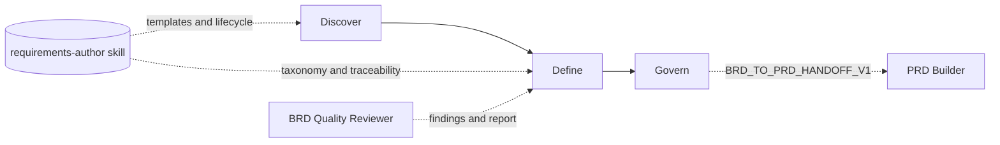

> **PRD-2026-Q2-BRD-BUILDER** | Status: approved | Version: 1.0.0 | Last Updated: 2026-06-14

## Executive Summary

The BRD Builder is an HVE-Core project-planning agent that produces standards-aligned Business Requirements Documents (BRDs) through a guided, three-phase question-and-answer workflow (Discover → Define → Govern). This PRD specifies the BRD Builder as a product and is seeded from the approved sibling BRD `BRD-2026-Q2-BRD-BUILDER` via its `BRD_TO_PRD_HANDOFF_V1` payload.

The strategic driver is the `feat/brd-skills` initiative, which consolidates requirements-document authoring onto the shared `requirements-author` skill (formerly `brd-author`). The BRD Builder already consumes the external skill for its template, taxonomy, traceability model, and lifecycle; this PRD captures the product requirements that keep that consumption stable while the shared skill evolves.

The primary success metric is that generated BRDs pass the shared quality contracts on the Define→Govern gate with no blocking findings, while the guided three-phase user experience and pause/resume reliability are preserved with no regression. Secondary outcomes are a consistent FR/AC/NFR/CON/BR requirements taxonomy and a clean `BRD_TO_PRD_HANDOFF_V1` handoff that seeds downstream PRD authoring.

Scope is limited to the BRD Builder agent, its external-template strategy, and its integration with the `requirements-author` skill and the BRD Quality Reviewer subagent. It excludes the PRD Builder (covered by a sibling PRD), the shared skill itself (covered by a dedicated PRD), and downstream backlog tooling (ADO, GitHub, and Jira planners). The release horizon aligns with the 2026-06-30 initiative milestone.

---

## Product Context

HVE-Core ships AI agent customizations (agents, prompts, instructions, and skills) bundled into collections and distributed through plugins and a VS Code extension. The `project-planning` collection includes twin requirements agents (the BRD Builder and the PRD Builder) that share a Q&A authoring architecture.

The user problem is requirement drift and duplication: when authoring logic lives inline in each agent, the BRD and PRD flows diverge over time, producing inconsistent taxonomies, quality gates, and handoffs. The `feat/brd-skills` changeset renames `brd-author` to `requirements-author` and restructures its references into `_shared/`, `brd/`, and `prd/` groupings so both document types draw from one canonical source.

The BRD Builder is the more consolidated of the two agents: it already sources its template and lifecycle from the shared skill. The product vision for this release is to harden that consumption (keeping the three-phase user experience, the quality contracts, and the PRD handoff stable as the shared skill changes) so the BRD Builder remains a dependable front door for business-requirements capture.

External constraints include the repository's authoring conventions (markdownlint, frontmatter schemas, and collection/plugin/extension regeneration) and the CC BY 4.0 licensing posture for skill content.

---

## Users and Personas

| Persona                            | Role                                           | Primary jobs-to-be-done                                   | Key pain points                                                       | Success outcome                                           |
|------------------------------------|------------------------------------------------|-----------------------------------------------------------|-----------------------------------------------------------------------|-----------------------------------------------------------|
| Business Analyst / Product Manager | End user authoring a BRD                       | Convert a business need into a structured, reviewable BRD | Manual templating; inconsistent quality; lost context across sessions | A complete, quality-gated BRD produced through guided Q&A |
| project-planning maintainer        | Owns the BRD/PRD agents and shared skill       | Keep authoring logic consistent and low-drift             | Divergence between BRD and PRD flows                                  | Single shared skill drives both agents                    |
| Downstream PRD author              | Consumes the BRD handoff                       | Seed a PRD from an approved BRD                           | Re-keying goals and requirements by hand                              | Valid `BRD_TO_PRD_HANDOFF_V1` seeds the PRD               |
| HVE-Core platform maintainer       | Owns collections, plugins, extension packaging | Keep distribution outputs green                           | Manual edits to generated outputs                                     | Regeneration stays consistent after changes               |

---

## Design Decisions

* `DD-001`: Treat the BRD Builder agent as the product under specification; the `requirements-author` skill is a shared dependency, specified by its own PRD.
* `DD-002`: Scope this PRD to the BRD Builder only. The PRD Builder and the shared skill are specified in sibling PRDs to keep lineage and ownership clean.
* `DD-003`: Preserve the BRD Builder's three-phase lifecycle (Discover → Define → Govern) and its external-skill template strategy as non-negotiable continuity constraints.
* `DD-004`: Seed this PRD from the approved sibling BRD `BRD-2026-Q2-BRD-BUILDER` via `source_brd_id`, restating shared requirements so the document stands alone.

---

## Product Goals

GOAL-001: Ensure the BRD Builder produces standards-aligned BRDs that satisfy the shared quality contracts on the Define→Govern gate.
Priority: MUST
KPI: Generated BRDs pass `BRD_STANDARD_FINDINGS_V1` with no blocking findings and produce a `BRD_QUALITY_REPORT_V1` summary.

GOAL-002: Preserve the BRD Builder's guided three-phase user experience and resume/recovery reliability as the shared skill evolves.
Priority: MUST
KPI: Discover, Define, and Govern phases plus pause/resume behavior remain available with no regression.

GOAL-003: Maintain a consistent requirements taxonomy and a clean handoff to the PRD Builder.
Priority: SHOULD
KPI: BRDs use the FR/AC/NFR/CON/BR taxonomy and emit a valid `BRD_TO_PRD_HANDOFF_V1` payload.

**SMART Evaluation** (assessed at Validate→Finalize gate per `requirements-quality` skill):

* [x] **S**pecific: each goal names a concrete outcome: standards-aligned BRD output (GOAL-001), preserved three-phase UX and resume/recovery (GOAL-002), and a consistent taxonomy plus clean PRD handoff (GOAL-003).
* [x] **M**easurable: each goal carries a verifiable KPI: passing the quality contracts with no blocking findings (GOAL-001), no phase or pause/resume regression (GOAL-002), and a valid handoff payload using the canonical taxonomy (GOAL-003).
* [x] **A**chievable: the BRD Builder already uses the external template, quality rubric, and Quality Reviewer subagent, so the goals refine existing behavior.
* [x] **R**elevant: all three goals serve the `feat/brd-skills` consolidation onto the shared `requirements-author` skill.
* [x] **T**ime-bound: target milestone 2026-06-30.

Status: graded (all five SMART criteria satisfied at the Validate→Finalize assessment; time-bound target 2026-06-30).

---

## Functional Requirements

FR-001: The BRD Builder guides users through the three-phase lifecycle (Discover → Define → Govern) to produce a complete BRD.
Actor: HVE-Core contributor authoring a BRD.
Trigger: User selects the BRD Builder agent and describes a business need.
Expected Outcome: A structured BRD is produced with all sections populated through iterative Q&A.
Acceptance Criteria: AC-001.
Product Goals: GOAL-002.

FR-002: The BRD Builder creates and maintains a session state file enabling pause and resume across conversations.
Actor: HVE-Core contributor.
Trigger: A BRD session begins or resumes.
Expected Outcome: State persists in `.copilot-tracking/brd-sessions/<name>.state.json`; the agent resumes from the last completed phase, including `phaseSkillsLoaded` tracking.
Acceptance Criteria: AC-002.
Product Goals: GOAL-002.

FR-003: The BRD Builder uses an emoji-based refinement-questions checklist with stable composite IDs to gather requirements without repetition.
Actor: HVE-Core contributor.
Trigger: The agent needs additional requirement detail.
Expected Outcome: Questions are tracked with ❓/✅/❌ and supporting indicators; answered items are not re-asked.
Acceptance Criteria: AC-003.
Product Goals: GOAL-002.

FR-004: The BRD Builder produces BRD documents that conform to repository markdown conventions (markdownlint-clean, no document-wide disable markers).
Actor: BRD Builder agent.
Trigger: BRD file creation or update at `docs/project-planning/<kebab-case-name>-brd.md`.
Expected Outcome: Output passes markdownlint and frontmatter validation.
Acceptance Criteria: AC-004.
Product Goals: GOAL-001.

FR-005: The BRD Builder sources its template, taxonomy, traceability model, and lifecycle from the shared `requirements-author` skill.
Actor: BRD Builder agent.
Trigger: BRD authoring and phase execution.
Expected Outcome: Template and lifecycle content load from `requirements-author/templates/brd/` and the skill's lifecycle sections.
Acceptance Criteria: AC-005.
Product Goals: GOAL-001.

FR-006: The BRD Builder validates BRDs against the quality rubric using the BRD Quality Reviewer subagent and surfaces findings.
Actor: BRD Builder agent.
Trigger: Define→Govern gate evaluation.
Expected Outcome: A `BRD_STANDARD_FINDINGS_V1` payload and `BRD_QUALITY_REPORT_V1` summary are produced; blocking findings prevent advancement.
Acceptance Criteria: AC-006.
Product Goals: GOAL-001.

FR-007: The BRD Builder emits a `BRD_TO_PRD_HANDOFF_V1` payload to seed downstream PRD authoring.
Actor: BRD Builder agent.
Trigger: Govern phase completion on an approved BRD.
Expected Outcome: A valid handoff payload carrying business goals, requirements, and traceability context is produced.
Acceptance Criteria: AC-007.
Product Goals: GOAL-003.

---

## Non-Functional Requirements

*Organized by NIST SP 800-160 NFR category buckets (per `requirements-quality` skill)*

### Performance and Capacity

NFR-001: Across a multi-turn session, no question ID already recorded in `answeredQuestions` is re-asked, and the agent issues at most three to five refinement questions per turn. Verification: inspect `questionsAsked`/`answeredQuestions` state across turns for zero duplicate answered IDs and a per-turn question count within the documented bound.

NFR-009: The BRD Builder loads template sections and skill references on demand for the active phase rather than inlining the full template into baseline context. Verification: trace a representative session and confirm references for inactive phases are not loaded into context.

### Reliability and Resilience

NFR-002: Pause/resume reconstructs context from the state file (including `phaseSkillsLoaded`) with no silent loss of answered questions. Verification: interrupt and resume a session, then confirm `answeredQuestions` and `phaseSkillsLoaded` are restored intact and no answered question is re-asked.

### Security

NFR-003: No secrets, tokens, or credentials are written into BRD documents or session state files. Verification: scan produced BRD documents and session state files for credential, token, or secret patterns and confirm none are present.

### Maintainability and Operability

NFR-004: Template, taxonomy, traceability, and lifecycle have a single source of truth in the `requirements-author` skill rather than duplicated in the agent. Verification: confirm the agent file references the shared skill sections and contains no duplicated template, taxonomy, or lifecycle prose.

### Usability and Accessibility

NFR-005: BRD output sections (goals, stakeholders, FR/AC/NFR/CON/BR, traceability) are complete with no empty mandatory sections at Govern. Verification: inspect the finalized BRD at the Govern gate for any unfilled mandatory section or residual `{{placeholder}}` token.

NFR-006: Each of the three phases (Discover, Define, Govern) is reachable and gated in order; the question checklist uses the documented ❓/✅/❌ state markers with stable composite IDs; and a resume renders the documented summary fields (progress %, completed sections, next steps, last session). Verification: a resumed session reproduces all four summary fields and preserves question IDs.

### Compatibility and Interoperability

NFR-007: The `BRD_TO_PRD_HANDOFF_V1` payload remains schema-compatible with what the PRD Builder consumes. Verification: validate an emitted handoff payload against the `BRD_TO_PRD_HANDOFF_V1` schema and confirm the PRD Builder ingests it without missing required fields.

### Portability

NFR-008: The BRD Builder operates across HVE-Core distribution contexts (repository, extension, plugin) using shared-skill path resolution. Verification: resolve the `requirements-author` skill path from repository, extension, and plugin contexts and confirm each locates the shared skill.

---

## Constraints

* `CON-001`: The BRD Builder MUST preserve its existing three-phase workflow and naming; phase structure changes are out of scope for this PRD. Imposing source: product continuity / DD-003. Affected boundary: scope. Non-negotiability: avoids breaking existing user workflows and documentation. Category: organizational. Impact: design.
* `CON-002`: Changes MUST keep `collections/*.collection.yml`/`.md`, `plugins/`, and `extension/` outputs consistent via the repository's regeneration scripts. Imposing source: repository distribution pipeline. Affected boundary: operations. Non-negotiability: generated outputs must not be hand-edited. Category: technical. Impact: delivery.
* `CON-003`: Shared skill content MUST follow the CC BY 4.0 cite-only standards posture. Imposing source: repository licensing. Affected boundary: compliance. Non-negotiability: licensing obligation. Category: contractual. Impact: acceptance.
* `CON-004`: Specification and migration work MUST land by the 2026-06-30 milestone to align with the `feat/brd-skills` initiative. Imposing source: initiative schedule / DD-003 continuity window. Affected boundary: schedule. Non-negotiability: calendar-driven target. Category: organizational. Impact: delivery.

---

## Process Models

*Guidance*: Illustrates the BRD Builder's three phases, its dependency on the shared `requirements-author` skill and the BRD Quality Reviewer, and the handoff that seeds the PRD Builder.

---

## Acceptance Criteria

* `AC-001`: Given a business need, When the user completes the workflow, Then a BRD with all required sections is produced and saved under `docs/project-planning/`. Covers: FR-001. Status: Not Started.
* `AC-002`: Given an interrupted session, When the user resumes, Then the agent restores context from the state file and continues from the last completed phase without re-asking answered questions. Covers: FR-002. Status: Not Started.
* `AC-003`: Given an ongoing session, When the agent asks refinement questions, Then question IDs remain stable and answered items are marked ✅ and not re-asked. Covers: FR-003. Status: Not Started.
* `AC-004`: Given a generated BRD, When validation runs, Then markdownlint and frontmatter checks pass with no document-wide disable markers. Covers: FR-004. Status: Not Started.
* `AC-005`: Given the agent, When a BRD is created, Then the template and lifecycle content originate from the `requirements-author` skill rather than inline agent prose. Covers: FR-005. Status: Not Started.
* `AC-006`: Given a BRD at the Define→Govern gate, When quality review runs, Then a `BRD_STANDARD_FINDINGS_V1` payload and `BRD_QUALITY_REPORT_V1` summary are produced and blocking findings prevent advancement. Covers: FR-006. Status: Not Started.
* `AC-007`: Given an approved BRD at Govern completion, When the handoff is emitted, Then a valid `BRD_TO_PRD_HANDOFF_V1` payload carries business goals, requirements, and traceability context. Covers: FR-007. Status: Not Started.

---

## Traceability Matrix

### FR-to-AC Coverage

| FR     | Linked AC |
|--------|-----------|
| FR-001 | AC-001    |
| FR-002 | AC-002    |
| FR-003 | AC-003    |
| FR-004 | AC-004    |
| FR-005 | AC-005    |
| FR-006 | AC-006    |
| FR-007 | AC-007    |

Coverage: 7/7 = 100.0%.

### FR-to-GOAL Alignment

| FR     | Linked GOAL |
|--------|-------------|
| FR-001 | GOAL-002    |
| FR-002 | GOAL-002    |
| FR-003 | GOAL-002    |
| FR-004 | GOAL-001    |
| FR-005 | GOAL-001    |
| FR-006 | GOAL-001    |
| FR-007 | GOAL-003    |

Coverage: 7/7 = 100.0%.

---

## MVP and Release Framing

The first release preserves the BRD Builder's current capability set on the shared skill foundation.
In-scope for the release: the three-phase lifecycle (FR-001), session state and resume (FR-002), the refinement-question checklist (FR-003), markdown-clean output (FR-004), shared-skill sourcing (FR-005), quality-gated advancement (FR-006), and the PRD handoff (FR-007); GOAL-001, GOAL-002, and GOAL-003 are all in the first release.
Deferred: any expansion of the phase model or new document types beyond the BRD. The cut line is drawn to deliver continuity with zero UX regression by the 2026-06-30 milestone.

---

## Success Metrics

* Metric: Quality-gate pass rate. Definition: share of generated BRDs that clear the Define→Govern gate with no blocking findings. Baseline: current inline-quality behavior. Target: 100% no-blocking-findings. Window: per BRD session. Data source: `BRD_QUALITY_REPORT_V1`. Linked: GOAL-001.
* Metric: UX continuity. Definition: phases and pause/resume available with no regression. Baseline: pre-migration behavior. Target: no regression. Window: per release. Data source: resume summary fields and phase traversal. Linked: GOAL-002.
* Metric: Handoff validity. Definition: emitted handoffs that validate against the `BRD_TO_PRD_HANDOFF_V1` schema. Baseline: existing handoff. Target: 100% valid. Window: per Govern completion. Data source: handoff payload validation. Linked: GOAL-003.

---

## Risks and Assumptions

### Key Assumptions

* Assumption: The `requirements-author` skill continues to host BRD templates and lifecycle guidance. Impact if false: High. Mitigation: keep the agent pinned to a known-good skill revision until shared assets stabilize.
* Assumption: The PRD Builder depends on the current `BRD_TO_PRD_HANDOFF_V1` shape. Impact if false: Medium. Mitigation: validate the handoff against the consumer before Govern.

### Risk Register

* Risk: Shared-skill edits regress the BRD UX. Probability: Medium. Impact: High. Mitigation: treat the three-phase UX as a continuity constraint (CON-001) and verify with NFR-006.
* Risk: Generated collection/plugin/extension outputs drift after agent or skill edits. Probability: Medium. Impact: Medium. Mitigation: run regeneration and validation scripts as part of acceptance (CON-002).

---

## Glossary

| Term                      | Definition                                                                                                                               |
|---------------------------|------------------------------------------------------------------------------------------------------------------------------------------|
| BRD                       | Business Requirements Document: defines business need, outcomes, and constraints.                                                        |
| PRD                       | Product Requirements Document: defines product features and measurable requirements.                                                     |
| requirements-author skill | Shared HVE-Core skill (formerly `brd-author`) providing templates, taxonomy, traceability, and lifecycle for both BRD and PRD authoring. |
| BRD_TO_PRD_HANDOFF_V1     | Data contract carrying goals, requirements, and traceability from an approved BRD to seed a PRD.                                         |
| HVE-Core                  | Hyper Velocity Engineering Core: the repository providing these agents and skills.                                                       |

---

## Sign-Off

| Approver | Role                           | Decision | Date       | Comments                                                                          |
|----------|--------------------------------|----------|------------|-----------------------------------------------------------------------------------|
| wberry   | Named sign-off authority (DRI) | Approved | 2026-06-14 | Seeded from approved BRD-2026-Q2-BRD-BUILDER; preserves three-phase UX continuity |

### Waivers

None. FR-to-GOAL coverage is 100% and FR-to-AC coverage is 100%; no coverage waiver is required.

### Handoff Readiness

* Final quality report: PRD-2026-Q2-BRD-BUILDER-quality (Validate→Finalize: APPROVED).
* Identifier counts: 3 GOAL, 7 FR, 7 AC, 8 NFR, 4 CON.
* Traceability: FR-to-AC 100%, FR-to-GOAL 100%.
* Source BRD: BRD-2026-Q2-BRD-BUILDER.
* Waivers: none.

---

## Disclaimer

This Product Requirements Document was prepared with AI assistance and reflects the requirements understood at authoring time. It requires review by the named approver and relevant subject-matter experts before it governs implementation.

---

## Document Metadata

* Template Version: 1.0.0.
* Canonical Template: `requirements-author/templates/prd/prd-full.md`.
* License: CC-BY 4.0 (Microsoft HVE-Core).
* Attribution: Microsoft HVE-Core Team.

---

🤖 Crafted with precision by ✨Copilot following brilliant human instruction, then carefully refined by our team of discerning human reviewers.
