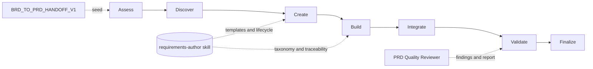

> **PRD-2026-Q2-PRD-BUILDER** | Status: approved | Version: 1.0.0 | Last Updated: 2026-06-14

## Executive Summary

The PRD Builder is an HVE-Core project-planning agent that produces standards-aligned Product Requirements Documents (PRDs) through a guided, seven-phase question-and-answer workflow (Assess → Discover → Create → Build → Integrate → Validate → Finalize). This PRD specifies the PRD Builder as a product and is seeded from the approved sibling BRD `BRD-2026-Q2-PRD-BUILDER` via its `BRD_TO_PRD_HANDOFF_V1` payload.

The strategic driver is the `feat/brd-skills` initiative, which consolidates requirements-document authoring onto the shared `requirements-author` skill (formerly `brd-author`). Unlike the BRD Builder, the PRD Builder historically embedded its template and lifecycle inline; the product objective for this release is to migrate that logic onto the shared skill while preserving the seven-phase experience, output modes, and pause/resume-and-recovery reliability with no regression.

The primary success metric is that the migration introduces no UX regression (the same phases, output modes, resume summaries, and recovery behavior remain available) while generated PRDs continue to pass the shared quality contracts on the Validate gate. Secondary outcomes are a requirements taxonomy consistent with the BRD Builder and the ability to consume a `BRD_TO_PRD_HANDOFF_V1` payload so a PRD can be seeded directly from an approved BRD.

Scope is limited to the PRD Builder agent, its template-migration strategy, and its integration with the `requirements-author` skill and the PRD Quality Reviewer subagent. It excludes the BRD Builder (covered by a sibling PRD), the shared skill itself (covered by a dedicated PRD), and downstream PRD-to-WIT planners (ADO, GitHub, and Jira). The release horizon aligns with the 2026-06-30 initiative milestone.

---

## Product Context

HVE-Core ships AI agent customizations (agents, prompts, instructions, and skills) bundled into collections and distributed through plugins and a VS Code extension. The `project-planning` collection includes twin requirements agents (the BRD Builder and the PRD Builder) that share a Q&A authoring architecture.

The user problem is divergence and duplication: the PRD Builder's inline template and lifecycle drift away from the BRD Builder's shared-skill foundation over time, producing inconsistent taxonomies and quality gates between the two document types. The `feat/brd-skills` changeset renames `brd-author` to `requirements-author`, adds `templates/prd/` assets and PRD lifecycle sections, and restructures references into `_shared/`, `brd/`, and `prd/` groupings so both agents draw from one canonical source.

The product vision for this release is to move the PRD Builder onto that shared foundation without disturbing what users already rely on: the seven-phase flow, the emoji refinement-question checklist, the output modes (Full, Section, Status, Delta), and robust pause/resume including post-summarization recovery. The PRD Builder must also be able to start from an approved BRD by consuming the BRD handoff, closing the loop between the two agents.

External constraints include the repository's authoring conventions (markdownlint, frontmatter schemas, collection/plugin/extension regeneration) and the CC BY 4.0 licensing posture for skill content.

---

## Users and Personas

| Persona                       | Role                                     | Primary jobs-to-be-done                             | Key pain points                                       | Success outcome                              |
|-------------------------------|------------------------------------------|-----------------------------------------------------|-------------------------------------------------------|----------------------------------------------|
| Product Manager / Owner       | End user authoring a PRD                 | Turn a product idea into a structured, testable PRD | Manual templating; lost context; inconsistent quality | A complete, quality-gated PRD via guided Q&A |
| project-planning maintainer   | Owns the BRD/PRD agents and shared skill | Keep authoring logic consistent and low-drift       | PRD inline logic diverging from the BRD flow          | Both agents share one canonical skill        |
| BRD-to-PRD transitioner       | Moves from an approved BRD to a PRD      | Seed a PRD from a completed BRD                     | Re-keying goals and requirements by hand              | `BRD_TO_PRD_HANDOFF_V1` seeds the PRD        |
| Downstream PRD-to-WIT planner | Consumes PRD output                      | Generate ADO/GitHub/Jira work items                 | Unexpected changes to PRD output shape                | Stable PRD output shape preserved            |

---

## Design Decisions

* `DD-001`: Treat the PRD Builder agent as the product under specification; the `requirements-author` skill is a shared dependency, specified by its own PRD.
* `DD-002`: Scope this PRD to the PRD Builder only. The BRD Builder and the shared skill are specified in sibling PRDs to keep lineage and ownership clean.
* `DD-003`: Preserve the PRD Builder's seven-phase workflow, output modes, and pause/resume-and-recovery behavior as non-negotiable continuity constraints throughout the migration.
* `DD-004`: Seed this PRD from the approved sibling BRD `BRD-2026-Q2-PRD-BUILDER` via `source_brd_id`, restating shared requirements so the document stands alone.

---

## Product Goals

GOAL-001: Consolidate PRD authoring onto the shared `requirements-author` skill so the template and lifecycle have a single source of truth.
Priority: MUST
KPI: PRD template and lifecycle content originate from `requirements-author/templates/prd/` and the skill's PRD lifecycle sections, with no duplicated inline authoring logic in the agent.

GOAL-002: Preserve the PRD Builder's seven-phase user experience, output modes, and resume/recovery reliability through the migration.
Priority: MUST
KPI: All seven phases, the documented output modes, and pause/resume plus post-summarization recovery remain available with no regression.

GOAL-003: Maintain a requirements taxonomy consistent with the BRD Builder and support seeding from an approved BRD.
Priority: SHOULD
KPI: PRDs use the FR/AC/NFR/CON taxonomy and can be initialized from a `BRD_TO_PRD_HANDOFF_V1` payload.

**SMART Evaluation** (assessed at Validate→Finalize gate per `requirements-quality` skill):

* [x] **S**pecific: each goal names a concrete outcome: single-source template/lifecycle (GOAL-001), preserved seven-phase UX and recovery (GOAL-002), and a consistent taxonomy plus BRD seeding (GOAL-003).
* [x] **M**easurable: each goal carries a verifiable KPI: template/lifecycle sourced from the shared skill with no inline duplication (GOAL-001), no phase/output-mode/recovery regression (GOAL-002), and a canonical taxonomy with handoff ingestion (GOAL-003).
* [x] **A**chievable: the BRD Builder already demonstrates the shared-skill pattern, so the migration follows a proven path.
* [x] **R**elevant: all three goals serve the `feat/brd-skills` consolidation onto the shared `requirements-author` skill.
* [x] **T**ime-bound: target milestone 2026-06-30.

Status: graded (all five SMART criteria satisfied at the Validate→Finalize assessment; time-bound target 2026-06-30).

---

## Functional Requirements

FR-001: The PRD Builder guides users through the seven-phase lifecycle (Assess → Discover → Create → Build → Integrate → Validate → Finalize) to produce a complete PRD.
Actor: HVE-Core contributor authoring a PRD.
Trigger: User selects the PRD Builder agent and describes a product idea.
Expected Outcome: A structured PRD is produced and saved under `docs/project-planning/` with all sections populated through iterative Q&A.
Acceptance Criteria: AC-001.
Product Goals: GOAL-002.

FR-002: The PRD Builder creates and maintains a session state file enabling pause and resume across conversations.
Actor: HVE-Core contributor.
Trigger: A PRD session begins or resumes.
Expected Outcome: State persists in `.copilot-tracking/prd-sessions/<name>.state.json`; the agent resumes from the last completed phase, including `phaseSkillsLoaded` tracking.
Acceptance Criteria: AC-002.
Product Goals: GOAL-002.

FR-003: The PRD Builder uses an emoji-based refinement-questions checklist with stable composite IDs to gather requirements without repetition.
Actor: HVE-Core contributor.
Trigger: The agent needs additional requirement detail.
Expected Outcome: Questions are tracked with ❓/✅/❌ states and never renumbered; answered items are not re-asked.
Acceptance Criteria: AC-003.
Product Goals: GOAL-002.

FR-004: The PRD Builder produces PRD documents that conform to repository markdown conventions and the required PRD format markers.
Actor: PRD Builder agent.
Trigger: PRD file creation or update.
Expected Outcome: Output passes markdownlint and frontmatter validation and includes required format markers.
Acceptance Criteria: AC-004.
Product Goals: GOAL-001.

FR-005: The PRD Builder sources its PRD template and lifecycle definition from the shared `requirements-author` skill rather than an inline-embedded template.
Actor: PRD Builder agent.
Trigger: PRD file creation and phase execution.
Expected Outcome: Template/lifecycle content is loaded from `requirements-author/templates/prd/` and the skill's PRD lifecycle sections.
Acceptance Criteria: AC-005.
Product Goals: GOAL-001.

FR-006: The PRD Builder applies a requirements taxonomy and traceability model consistent with the BRD Builder (FR/AC/NFR/CON identifiers).
Actor: PRD Builder agent.
Trigger: Requirement capture during the Build phase.
Expected Outcome: Requirements carry canonical identifiers, linked product goals, and acceptance criteria.
Acceptance Criteria: AC-006.
Product Goals: GOAL-003.

FR-007: The PRD Builder can consume a `BRD_TO_PRD_HANDOFF_V1` payload to seed a PRD from an approved BRD.
Actor: HVE-Core contributor transitioning from a BRD to a PRD.
Trigger: A user supplies a completed BRD handoff payload.
Expected Outcome: The PRD is initialized with goals, requirements, and traceability context from the handoff, with `source_brd_id` set.
Acceptance Criteria: AC-007.
Product Goals: GOAL-003.

---

## Non-Functional Requirements

*Organized by NIST SP 800-160 NFR category buckets (per `requirements-quality` skill)*

### Performance and Capacity

NFR-001: The migration does not increase the number of user turns required to reach a complete PRD relative to the current inline workflow. Verification: capture a pre-migration baseline turn count for a representative PRD scenario, then confirm the post-migration turn count for the same scenario is less than or equal to that baseline.

NFR-009: The PRD Builder loads template sections and skill references on demand for the active phase rather than inlining the full template into baseline context. Verification: trace a representative session and confirm references for inactive phases are not loaded into context.

### Reliability and Resilience

NFR-002: Pause/resume and post-summarization recovery reconstruct context from the state file or, when missing/corrupt, from PRD content, with no silent loss of answered questions. Verification: interrupt, summarize, and resume a session, then confirm answered questions are restored from state or reconstructed from PRD content without re-asking.

### Security

NFR-003: No secrets, tokens, or credentials are written into PRD documents or session state files. Verification: scan produced PRD documents and session state files for credential, token, or secret patterns and confirm none are present.

### Maintainability and Operability

NFR-004: PRD template and lifecycle definitions have a single source of truth in the `requirements-author` skill, removing duplicated authoring logic from the agent file. Verification: confirm the agent file references the shared skill PRD sections and contains no duplicated template or lifecycle prose.

### Usability and Accessibility

NFR-005: PRD output sections (goals, personas, requirements, acceptance criteria, metrics) are complete and measurable, with no empty mandatory sections at Finalize. Verification: inspect the finalized PRD for any unfilled mandatory section or residual `{{placeholder}}` token.

NFR-006: The seven-phase experience, output modes (Full, Section, Status, Delta), and resume summaries remain available and behave as documented after migration. Verification: traverse all seven phases, exercise each output mode, and confirm a resume renders the documented summary fields.

### Compatibility and Interoperability

NFR-007: PRD output remains consumable by downstream PRD-to-WIT planning agents (ADO, GitHub, Jira) without changes to their expected input shape. Verification: feed a generated PRD to the downstream planners and confirm ingestion without changes to their required input fields.

### Portability

NFR-008: The PRD Builder operates across HVE-Core distribution contexts (repository, extension, plugin) using shared-skill path resolution. Verification: resolve the `requirements-author` skill path from repository, extension, and plugin contexts and confirm each locates the shared skill.

---

## Constraints

* `CON-001`: The PRD Builder MUST preserve its existing seven-phase workflow and naming; phase structure changes are out of scope for this PRD. Imposing source: product continuity / DD-003. Affected boundary: scope. Non-negotiability: avoids breaking existing user workflows and documentation. Category: organizational. Impact: design.
* `CON-002`: Changes MUST keep `collections/*.collection.yml`/`.md`, `plugins/`, and `extension/` outputs consistent via the repository's regeneration scripts. Imposing source: repository distribution pipeline. Affected boundary: operations. Non-negotiability: generated outputs must not be hand-edited. Category: technical. Impact: delivery.
* `CON-003`: Shared skill content MUST follow the CC BY 4.0 cite-only standards posture. Imposing source: repository licensing. Affected boundary: compliance. Non-negotiability: licensing obligation. Category: contractual. Impact: acceptance.
* `CON-004`: Specification and migration work MUST land by the 2026-06-30 milestone to align with the `feat/brd-skills` initiative. Imposing source: initiative schedule / DD-003 continuity window. Affected boundary: schedule. Non-negotiability: calendar-driven target. Category: organizational. Impact: delivery.

---

## Process Models

*Guidance*: Illustrates the PRD Builder's seven phases, its dependency on the shared `requirements-author` skill, the optional BRD-to-PRD seed, and the Validate-gate quality review.

---

## Acceptance Criteria

* `AC-001`: Given a product idea, When the user completes the workflow, Then a PRD with all required sections is produced and saved under `docs/project-planning/`. Covers: FR-001. Status: Not Started.
* `AC-002`: Given an interrupted session, When the user resumes, Then the agent restores context from the state file and continues from the last completed phase without re-asking answered questions. Covers: FR-002. Status: Not Started.
* `AC-003`: Given an ongoing session, When the agent asks refinement questions, Then question IDs remain stable and answered items are marked ✅ and not re-asked. Covers: FR-003. Status: Not Started.
* `AC-004`: Given a generated PRD, When validation runs, Then markdownlint and frontmatter checks pass and required format markers are present. Covers: FR-004. Status: Not Started.
* `AC-005`: Given the migrated agent, When a PRD is created, Then the template and lifecycle content originate from the `requirements-author` skill rather than inline agent prose. Covers: FR-005. Status: Not Started.
* `AC-006`: Given captured requirements, When they are written to the PRD, Then each carries a canonical FR/AC/NFR/CON identifier with linked product goals and acceptance criteria. Covers: FR-006. Status: Not Started.
* `AC-007`: Given a `BRD_TO_PRD_HANDOFF_V1` payload, When a PRD is initialized from it, Then product goals, requirements, and traceability context are seeded into the PRD and `source_brd_id` is set. Covers: FR-007. Status: Not Started.

---

## Traceability Matrix

### FR-to-AC Coverage

| FR     | Linked AC |
|--------|-----------|
| FR-001 | AC-001    |
| FR-002 | AC-002    |
| FR-003 | AC-003    |
| FR-004 | AC-004    |
| FR-005 | AC-005    |
| FR-006 | AC-006    |
| FR-007 | AC-007    |

Coverage: 7/7 = 100.0%.

### FR-to-GOAL Alignment

| FR     | Linked GOAL |
|--------|-------------|
| FR-001 | GOAL-002    |
| FR-002 | GOAL-002    |
| FR-003 | GOAL-002    |
| FR-004 | GOAL-001    |
| FR-005 | GOAL-001    |
| FR-006 | GOAL-003    |
| FR-007 | GOAL-003    |

Coverage: 7/7 = 100.0%.

---

## MVP and Release Framing

The first release migrates the PRD Builder onto the shared skill with full feature parity.
In-scope: the seven-phase lifecycle (FR-001), session state and resume (FR-002), the refinement-question checklist (FR-003), markdown-clean output (FR-004), shared-skill sourcing (FR-005), consistent taxonomy (FR-006), and BRD-handoff seeding (FR-007); GOAL-001, GOAL-002, and GOAL-003 are all in the first release.
Deferred: any expansion of the phase model or new document types beyond the PRD. The cut line is drawn to deliver the migration with zero UX regression by the 2026-06-30 milestone.

---

## Success Metrics

* Metric: Single-source authoring. Definition: template and lifecycle content sourced from the shared skill with no inline duplication. Baseline: inline-embedded template. Target: 100% shared-sourced. Window: per release. Data source: agent file review. Linked: GOAL-001.
* Metric: UX continuity. Definition: phases, output modes, and recovery available with no regression and no turn-count increase. Baseline: pre-migration workflow. Target: no regression; turns ≤ baseline. Window: per release. Data source: phase traversal, output-mode checks, turn-count comparison. Linked: GOAL-002.
* Metric: Handoff ingestion. Definition: PRDs successfully seeded from a `BRD_TO_PRD_HANDOFF_V1` payload. Baseline: none. Target: 100% successful seeding for valid payloads. Window: per BRD-seeded session. Data source: PRD frontmatter `source_brd_id` and seeded content. Linked: GOAL-003.

---

## Risks and Assumptions

### Key Assumptions

* Assumption: The `requirements-author` skill hosts PRD templates (`templates/prd/`) and PRD lifecycle guidance. Impact if false: High. Mitigation: keep the inline template until shared PRD assets are complete.
* Assumption: Downstream PRD-to-WIT agents depend on the current PRD output shape. Impact if false: Medium. Mitigation: validate output against those agents before Finalize.

### Risk Register

* Risk: Migrating the inline template to the shared skill regresses the PRD UX. Probability: Medium. Impact: High. Mitigation: treat the seven-phase UX as a continuity constraint (CON-001) and verify with NFR-006.
* Risk: Generated collection/plugin/extension outputs drift after agent or skill edits. Probability: Medium. Impact: Medium. Mitigation: run regeneration and validation scripts as part of acceptance (CON-002).

---

## Glossary

| Term                      | Definition                                                                                                                               |
|---------------------------|------------------------------------------------------------------------------------------------------------------------------------------|
| PRD                       | Product Requirements Document: defines product features and measurable requirements.                                                     |
| BRD                       | Business Requirements Document: defines business need, outcomes, and constraints.                                                        |
| requirements-author skill | Shared HVE-Core skill (formerly `brd-author`) providing templates, taxonomy, traceability, and lifecycle for both BRD and PRD authoring. |
| BRD_TO_PRD_HANDOFF_V1     | Data contract carrying goals, requirements, and traceability from an approved BRD to seed a PRD.                                         |
| HVE-Core                  | Hyper Velocity Engineering Core: the repository providing these agents and skills.                                                       |

---

## Sign-Off

| Approver | Role                           | Decision | Date       | Comments                                                                          |
|----------|--------------------------------|----------|------------|-----------------------------------------------------------------------------------|
| wberry   | Named sign-off authority (DRI) | Approved | 2026-06-14 | Seeded from approved BRD-2026-Q2-PRD-BUILDER; preserves seven-phase UX continuity |

### Waivers

None. FR-to-GOAL coverage is 100% and FR-to-AC coverage is 100%; no coverage waiver is required.

### Handoff Readiness

* Final quality report: PRD-2026-Q2-PRD-BUILDER-quality (Validate→Finalize: APPROVED).
* Identifier counts: 3 GOAL, 7 FR, 7 AC, 8 NFR, 4 CON.
* Traceability: FR-to-AC 100%, FR-to-GOAL 100%.
* Source BRD: BRD-2026-Q2-PRD-BUILDER.
* Waivers: none.

---

## Disclaimer

This Product Requirements Document was prepared with AI assistance and reflects the requirements understood at authoring time. It requires review by the named approver and relevant subject-matter experts before it governs implementation.

---

## Document Metadata

* Template Version: 1.0.0.
* Canonical Template: `requirements-author/templates/prd/prd-full.md`.
* License: CC-BY 4.0 (Microsoft HVE-Core).
* Attribution: Microsoft HVE-Core Team.

---

🤖 Crafted with precision by ✨Copilot following brilliant human instruction, then carefully refined by our team of discerning human reviewers.
