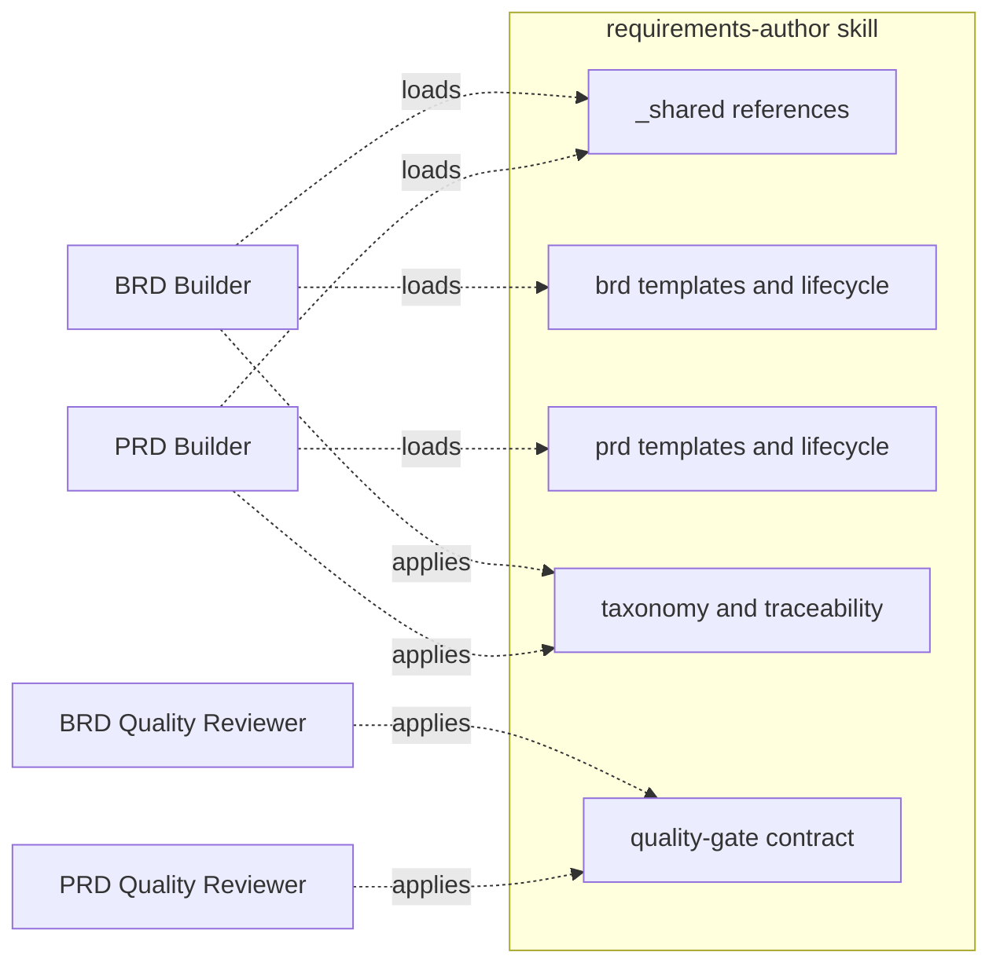

> **PRD-2026-Q2-REQUIREMENTS-AUTHOR** | Status: approved | Version: 1.0.0 | Last Updated: 2026-06-14

## Executive Summary

The `requirements-author` skill is the shared HVE-Core project-planning skill (formerly `brd-author`) that supplies templates, requirements taxonomy, traceability rules, and authoring lifecycles to both the BRD Builder and PRD Builder agents. This PRD specifies the skill as a product in its own right. It has no sibling BRD; its upstream context is the pair of agent BRDs (`BRD-2026-Q2-BRD-BUILDER` and `BRD-2026-Q2-PRD-BUILDER`), so `source_brd_id` is null.

The strategic driver is the `feat/brd-skills` initiative, which renames `brd-author` to `requirements-author` and generalizes it from a BRD-only skill into a dual-document foundation that serves both BRD and PRD authoring. The objective is to provide one canonical source of truth (`_shared/` references plus `brd/` and `prd/` template and lifecycle scopes) so the two agents stay consistent and low-drift rather than carrying duplicated authoring logic.

The primary success metric is that both agents source their templates and lifecycles exclusively from this skill, with no duplicated inline authoring prose, while the shared quality and traceability contracts (coverage thresholds, identifier schema, SMART/quality gates) apply uniformly across both document types. Secondary outcomes are clean reference organization (`_shared/`, `brd/`, `prd/`) and resolvable skill paths across all HVE-Core distribution contexts.

Scope is limited to the shared skill: its templates, references, taxonomy, traceability model, and lifecycle sections. It excludes the BRD Builder and PRD Builder agents themselves (each covered by a sibling PRD) and the downstream WIT planners. The release horizon aligns with the 2026-06-30 initiative milestone.

---

## Product Context

HVE-Core distributes AI agent customizations through collections, plugins, and a VS Code extension. Within the `project-planning` collection, two requirements agents (the BRD Builder and the PRD Builder) share a question-and-answer authoring architecture. Historically the BRD Builder drew from the `brd-author` skill while the PRD Builder embedded its own template and lifecycle, allowing the two to diverge.

The user problem is duplication and drift across document types: without a shared foundation, BRD and PRD authoring evolve independently, yielding inconsistent taxonomies, traceability rules, and quality gates. The `feat/brd-skills` changeset addresses this by renaming `brd-author` to `requirements-author` and restructuring it to serve both document types: references grouped into `_shared/`, `brd/`, and `prd/`, and template assets added under `templates/prd/` alongside the existing BRD templates.

The product vision for this release is a single canonical skill that both agents consume: shared references (taxonomy, traceability, quality, lifecycle scaffolding) plus per-document template and lifecycle scopes. The skill becomes the authority for what a well-formed BRD or PRD looks like, how requirements are identified and traced, and how quality gates are evaluated, so each agent only orchestrates the conversation.

External constraints include repository authoring conventions (markdownlint, frontmatter schemas, skill-structure validation, collection/plugin/extension regeneration) and the CC BY 4.0 cite-only licensing posture for standards content.

---

## Users and Personas

| Persona                     | Role              | Primary jobs-to-be-done                          | Key pain points                     | Success outcome                |
|-----------------------------|-------------------|--------------------------------------------------|-------------------------------------|--------------------------------|
| BRD Builder agent           | Skill consumer    | Source BRD templates, taxonomy, lifecycle        | Inline logic drifting from PRD flow | One shared BRD source of truth |
| PRD Builder agent           | Skill consumer    | Source PRD templates, taxonomy, lifecycle        | Duplicated inline PRD template      | One shared PRD source of truth |
| project-planning maintainer | Skill owner       | Maintain templates/taxonomy/quality in one place | Edits needed in two agents          | Single skill to maintain       |
| Quality Reviewer subagents  | Contract consumer | Apply consistent quality/traceability gates      | Divergent rules per document type   | Uniform gate definitions       |

---

## Design Decisions

* `DD-001`: Specify the `requirements-author` skill as the product; the BRD Builder and PRD Builder agents are consumers specified by their own sibling PRDs.
* `DD-002`: Generalize the former `brd-author` skill into a dual-document foundation supporting both BRD (`brd/`) and PRD (`prd/`) template and lifecycle scopes, with cross-cutting `_shared/` references.
* `DD-003`: Treat the two agent BRDs (`BRD-2026-Q2-BRD-BUILDER`, `BRD-2026-Q2-PRD-BUILDER`) as upstream context; this skill PRD has no sibling BRD, so `source_brd_id` is null.
* `DD-004`: Centralize the requirements taxonomy, traceability model, and quality/coverage contracts in the skill so both document types share one definition.

---

## Product Goals

GOAL-001: Provide a single canonical source of truth for BRD and PRD templates and lifecycles, eliminating duplicated inline authoring logic in the agents.
Priority: MUST
KPI: Both agents source templates and lifecycle content from this skill; no agent file contains a duplicated inline template or lifecycle.

GOAL-002: Support both document types from one skill via `_shared/`, `brd/`, and `prd/` scopes.
Priority: MUST
KPI: BRD and PRD authoring both resolve their templates, references, and lifecycle sections from the correspondingly scoped skill assets.

GOAL-003: Enforce a consistent requirements taxonomy, traceability model, and quality contract across both document types.
Priority: SHOULD
KPI: BRD and PRD output share the FR/AC/NFR/CON identifier schema, coverage thresholds, and quality-gate definitions.

**SMART Evaluation** (assessed at Validate→Finalize gate per `requirements-quality` skill):

* [x] **S**pecific: each goal names a concrete outcome: single canonical template/lifecycle source (GOAL-001), dual-document scoping (GOAL-002), and unified taxonomy/traceability/quality (GOAL-003).
* [x] **M**easurable: each goal carries a verifiable KPI: no duplicated inline authoring logic (GOAL-001), both document types resolving scoped assets (GOAL-002), and a shared identifier schema with shared coverage/quality gates (GOAL-003).
* [x] **A**chievable: the skill already exists as `brd-author`; this release renames and extends it along a proven structure.
* [x] **R**elevant: all three goals serve the `feat/brd-skills` consolidation onto one shared skill.
* [x] **T**ime-bound: target milestone 2026-06-30.

Status: graded (all five SMART criteria satisfied at the Validate→Finalize assessment; time-bound target 2026-06-30).

---

## Functional Requirements

FR-001: The skill provides canonical document templates for both BRD and PRD authoring.
Actor: Consuming agent (BRD Builder or PRD Builder).
Trigger: An agent creates a requirements document.
Expected Outcome: A complete template is loaded from `templates/brd/` or `templates/prd/` as appropriate.
Acceptance Criteria: AC-001.
Product Goals: GOAL-002.

FR-002: The skill defines the authoring lifecycle phases for both document types.
Actor: Consuming agent.
Trigger: An agent advances through its phases.
Expected Outcome: Phase definitions are loaded from the skill's BRD or PRD lifecycle sections.
Acceptance Criteria: AC-002.
Product Goals: GOAL-002.

FR-003: The skill defines a shared requirements taxonomy with canonical identifier prefixes (FR/AC/NFR/CON and goal identifiers).
Actor: Consuming agent.
Trigger: Requirement capture in either document type.
Expected Outcome: Requirements carry canonical identifiers consistent across BRD and PRD output.
Acceptance Criteria: AC-003.
Product Goals: GOAL-003.

FR-004: The skill defines the traceability model and coverage thresholds applied to both document types.
Actor: Consuming agent and Quality Reviewer subagent.
Trigger: Traceability evaluation during Validate.
Expected Outcome: FR-to-AC and FR-to-goal coverage are computed against the skill's defined thresholds.
Acceptance Criteria: AC-004.
Product Goals: GOAL-003.

FR-005: The skill organizes references into `_shared/`, `brd/`, and `prd/` scopes so cross-cutting and document-specific guidance are cleanly separated.
Actor: Consuming agent.
Trigger: An agent loads reference material for a phase.
Expected Outcome: Shared references resolve from `_shared/`; document-specific references resolve from `brd/` or `prd/`.
Acceptance Criteria: AC-005.
Product Goals: GOAL-001.

FR-006: The skill defines the quality-gate contract (findings and report payloads) consumed by the BRD and PRD Quality Reviewer subagents.
Actor: Quality Reviewer subagent.
Trigger: Validate-gate quality review.
Expected Outcome: A consistent findings/report contract is applied to both document types.
Acceptance Criteria: AC-006.
Product Goals: GOAL-003.

FR-007: The skill resolves its assets across HVE-Core distribution contexts (repository, extension, plugin).
Actor: Consuming agent at runtime.
Trigger: An agent references a skill asset in any distribution context.
Expected Outcome: Templates, references, and lifecycle sections resolve correctly in each context.
Acceptance Criteria: AC-007.
Product Goals: GOAL-001.

---

## Non-Functional Requirements

*Organized by NIST SP 800-160 NFR category buckets (per `requirements-quality` skill)*

### Performance and Capacity

NFR-001: Loading a template, lifecycle section, or reference imposes no more than a single file read per asset request from a consuming agent. Verification: trace an agent's asset loads for one phase and confirm each distinct asset corresponds to a single file read.

NFR-009: Skill references are independently addressable so consuming agents load only the sections relevant to the current phase rather than the whole reference set. Verification: confirm each reference is a separately resolvable asset and that an agent can load a subset without pulling the full reference set.

### Reliability and Resilience

NFR-002: When a referenced skill asset is missing, consuming agents fail loudly with the missing artifact identified rather than improvising prose. Verification: simulate a missing asset path and confirm the agent halts with the missing artifact reported.

### Security

NFR-003: Skill assets contain no secrets, tokens, or credentials and reproduce standards content under the cite-only posture. Verification: scan skill assets for credential/token/secret patterns and confirm standards text is cited rather than reproduced beyond the licensed posture.

### Maintainability and Operability

NFR-004: Template, taxonomy, traceability, and lifecycle definitions exist once in the skill, with no duplicated copies in consuming agents. Verification: confirm each definition appears once in the skill and that agents reference rather than copy it.

### Usability and Accessibility

NFR-005: Skill markdown assets pass repository markdownlint, frontmatter, and skill-structure validation. Verification: run markdownlint, frontmatter validation, and `validate:skills` against the skill assets and confirm they pass.

### Compatibility and Interoperability

NFR-006: The shared taxonomy and traceability model keep BRD and PRD output consumable by downstream WIT planners (ADO, GitHub, Jira) without per-document-type input changes. Verification: feed both a generated BRD and PRD to the downstream planners and confirm ingestion without changes to required input fields.

### Portability

NFR-007: Skill asset paths resolve from repository, extension, and plugin contexts using HVE-Core location resolution. Verification: resolve representative asset paths from all three contexts and confirm each locates the skill.

### Build and Release Consistency

NFR-008: Changes to the skill keep `collections/*`, `plugins/`, and `extension/` generated outputs consistent via the repository regeneration scripts. Verification: edit a skill asset, run the regeneration and validation scripts, and confirm generated outputs reflect the change with no manual edits.

---

## Constraints

* `CON-001`: The skill MUST serve both BRD and PRD authoring from one source; splitting into separate per-document skills is out of scope. Imposing source: consolidation objective / DD-002. Affected boundary: scope. Non-negotiability: avoids reintroducing drift. Category: organizational. Impact: design.
* `CON-002`: Changes MUST keep `collections/*.collection.yml`/`.md`, `plugins/`, and `extension/` outputs consistent via the repository's regeneration scripts. Imposing source: repository distribution pipeline. Affected boundary: operations. Non-negotiability: generated outputs must not be hand-edited. Category: technical. Impact: delivery.
* `CON-003`: Skill content MUST follow the CC BY 4.0 cite-only standards posture. Imposing source: repository licensing. Affected boundary: compliance. Non-negotiability: licensing obligation. Category: contractual. Impact: acceptance.
* `CON-004`: Specification and consolidation work MUST land by the 2026-06-30 milestone to align with the `feat/brd-skills` initiative. Imposing source: initiative schedule. Affected boundary: schedule. Non-negotiability: calendar-driven target. Category: organizational. Impact: delivery.

---

## Process Models

*Guidance*: Illustrates the shared skill as the single source for both agents: `_shared/` references plus per-document scopes, a common taxonomy/traceability model, and one quality-gate contract.

---

## Acceptance Criteria

* `AC-001`: Given an agent creating a document, When it requests a template, Then a complete template is loaded from `templates/brd/` or `templates/prd/` matching the document type. Covers: FR-001. Status: Not Started.
* `AC-002`: Given an agent advancing phases, When it loads its lifecycle, Then phase definitions resolve from the skill's corresponding BRD or PRD lifecycle sections. Covers: FR-002. Status: Not Started.
* `AC-003`: Given requirement capture, When requirements are written, Then they carry canonical FR/AC/NFR/CON and goal identifiers consistent across both document types. Covers: FR-003. Status: Not Started.
* `AC-004`: Given a document at Validate, When traceability is evaluated, Then FR-to-AC and FR-to-goal coverage are computed against the skill's defined thresholds. Covers: FR-004. Status: Not Started.
* `AC-005`: Given a phase needing references, When an agent loads them, Then shared references resolve from `_shared/` and document-specific references from `brd/` or `prd/`. Covers: FR-005. Status: Not Started.
* `AC-006`: Given a Validate-gate review, When a Quality Reviewer runs, Then it applies the skill's findings/report contract consistently to both document types. Covers: FR-006. Status: Not Started.
* `AC-007`: Given any distribution context, When an agent references a skill asset, Then templates, references, and lifecycle sections resolve correctly. Covers: FR-007. Status: Not Started.

---

## Traceability Matrix

### FR-to-AC Coverage

| FR     | Linked AC |
|--------|-----------|
| FR-001 | AC-001    |
| FR-002 | AC-002    |
| FR-003 | AC-003    |
| FR-004 | AC-004    |
| FR-005 | AC-005    |
| FR-006 | AC-006    |
| FR-007 | AC-007    |

Coverage: 7/7 = 100.0%.

### FR-to-GOAL Alignment

| FR     | Linked GOAL |
|--------|-------------|
| FR-001 | GOAL-002    |
| FR-002 | GOAL-002    |
| FR-003 | GOAL-003    |
| FR-004 | GOAL-003    |
| FR-005 | GOAL-001    |
| FR-006 | GOAL-003    |
| FR-007 | GOAL-001    |

Coverage: 7/7 = 100.0%.

---

## MVP and Release Framing

The first release delivers the dual-document shared skill with full template, lifecycle, taxonomy, traceability, and quality-gate coverage.
In-scope: BRD and PRD templates (FR-001), lifecycle definitions (FR-002), shared taxonomy (FR-003), traceability and coverage (FR-004), `_shared/`/`brd/`/`prd/` reference organization (FR-005), the quality-gate contract (FR-006), and cross-context resolution (FR-007); GOAL-001, GOAL-002, and GOAL-003 are all in the first release.
Deferred: additional document types beyond BRD and PRD. The cut line delivers a single canonical foundation for both existing agents by the 2026-06-30 milestone.

---

## Success Metrics

* Metric: Single source of truth. Definition: agents source templates and lifecycle from the skill with no inline duplication. Baseline: PRD Builder inline template. Target: 100% shared-sourced. Window: per release. Data source: agent file review. Linked: GOAL-001.
* Metric: Dual-document coverage. Definition: both BRD and PRD authoring resolve their scoped assets. Baseline: BRD-only skill. Target: both document types fully served. Window: per release. Data source: asset resolution checks. Linked: GOAL-002.
* Metric: Contract consistency. Definition: shared identifier schema, coverage thresholds, and quality gates applied to both document types. Baseline: divergent per-agent rules. Target: uniform across both. Window: per release. Data source: taxonomy/traceability/quality review. Linked: GOAL-003.

---

## Risks and Assumptions

### Key Assumptions

* Assumption: Both agents can be refactored to consume the shared skill without UX regression. Impact if false: High. Mitigation: treat agent UX continuity as a constraint in the agent PRDs and verify before Finalize.
* Assumption: The `_shared/`/`brd/`/`prd/` reference structure covers all cross-cutting and document-specific guidance. Impact if false: Medium. Mitigation: audit references during consolidation and fill gaps.

### Risk Register

* Risk: Generalizing the skill regresses BRD authoring while enabling PRD authoring. Probability: Medium. Impact: High. Mitigation: keep BRD assets stable under `brd/` and validate both document types against their quality gates.
* Risk: Generated collection/plugin/extension outputs drift after skill edits. Probability: Medium. Impact: Medium. Mitigation: run regeneration and validation scripts as acceptance (CON-002, NFR-008).

---

## Glossary

| Term                       | Definition                                                                                                                                              |
|----------------------------|---------------------------------------------------------------------------------------------------------------------------------------------------------|
| requirements-author skill  | Shared HVE-Core skill (formerly `brd-author`) providing templates, taxonomy, traceability, quality contracts, and lifecycles for BRD and PRD authoring. |
| BRD                        | Business Requirements Document: defines business need, outcomes, and constraints.                                                                       |
| PRD                        | Product Requirements Document: defines product features and measurable requirements.                                                                    |
| _shared / brd / prd scopes | Reference and template groupings for cross-cutting guidance and per-document-type assets.                                                               |
| HVE-Core                   | Hyper Velocity Engineering Core: the repository providing these agents and skills.                                                                      |

---

## Sign-Off

| Approver | Role                           | Decision | Date       | Comments                                                                                                   |
|----------|--------------------------------|----------|------------|------------------------------------------------------------------------------------------------------------|
| wberry   | Named sign-off authority (DRI) | Approved | 2026-06-14 | Shared-skill product; no sibling BRD; upstream context BRD-2026-Q2-BRD-BUILDER and BRD-2026-Q2-PRD-BUILDER |

### Waivers

None. FR-to-GOAL coverage is 100% and FR-to-AC coverage is 100%; no coverage waiver is required.

### Handoff Readiness

* Final quality report: PRD-2026-Q2-REQUIREMENTS-AUTHOR-quality (Validate→Finalize: APPROVED).
* Identifier counts: 3 GOAL, 7 FR, 7 AC, 8 NFR, 4 CON.
* Traceability: FR-to-AC 100%, FR-to-GOAL 100%.
* Source BRD: none (upstream context: BRD-2026-Q2-BRD-BUILDER, BRD-2026-Q2-PRD-BUILDER).
* Waivers: none.

---

## Disclaimer

This Product Requirements Document was prepared with AI assistance and reflects the requirements understood at authoring time. It requires review by the named approver and relevant subject-matter experts before it governs implementation.

---

## Document Metadata

* Template Version: 1.0.0.
* Canonical Template: `requirements-author/templates/prd/prd-full.md`.
* License: CC-BY 4.0 (Microsoft HVE-Core).
* Attribution: Microsoft HVE-Core Team.

---

🤖 Crafted with precision by ✨Copilot following brilliant human instruction, then carefully refined by our team of discerning human reviewers.
