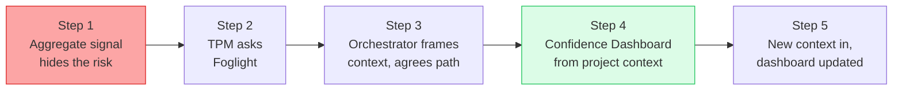

<!-- cspell:words Foglight foglight timebox Timeboxed MSSP templatizes fundable Ratcliffe Parag Alurkar Namit -->

## Purpose

This BRD presents the business and product framing for integrating Project
Foglight into HVE Core as an experimental collection. It is intended to be
reviewed in public before any implementation work is proposed in the HVE Core
repository.

The document is intended to do four things:

* explain the problem Foglight addresses for TPMs and Dev and Data Science leads
* define the **MVP integration** with HVE Core (the smallest pilot pack the
  working group is asking maintainers to consider)
* show how Foglight composes with existing HVE Core primitives instead of
  duplicating them
* give maintainers enough specificity to review fit before any implementation PR
  is opened

This BRD scopes the **MVP only**. It is not a roadmap for the full Foglight
tool catalogue. Items beyond the pilot pack are flagged as *future
opportunities* and are intentionally not committed in this document.

This is intentionally a requirements and architecture-fit document, not an
implementation plan.

## Problem Statement

Deterministic software delivery assumes that a feature, once shipped and
tested, behaves the same way tomorrow as it did today. TPM tooling, status
reports, and definitions of done are built on that assumption: a closed work
item is evidence that the work is done, and a green project is one with no open
risks.

Intelligent systems do not behave that way. A retrieval-augmented copilot that
passed evaluation last sprint can regress this sprint because the index
refreshed, the base model rolled forward, the prompt changed, or the user
population shifted. A model-driven workflow can pass functional tests and still
fail in production because the operator escalation path was never exercised.
An agent can hit every acceptance criterion in the backlog and still be unsafe
to release because the team has not built the evaluation capacity to know
whether it behaves correctly at scale.

This creates a structural gap for TPMs and Dev and Data Science leads:

* outputs are probabilistic and context-sensitive, so functional tests alone are
  insufficient and evaluation discipline becomes a first-class delivery concern
* model, prompt, evaluation set, and workflow assumptions age, so confidence
  has a shelf life rather than a one-time signoff
* progress cannot be represented safely by completed tasks alone, because the
  next decision (rollout, expansion, model swap, prompt change) depends on
  evidence quality, not task count
* a project can appear green on scope, schedule, and risk while the next major
  decision is still unsafe

Traditional TPM tooling does not make uncertainty, evidence maturity, decision
readiness, evaluation capacity, or post-launch drift first-class concerns.
Foglight exists to close that gap with tools and workflows that help crews make
safer decisions faster.

### Example 1: Retrieval-Augmented Security Copilot

A security operations team ships an internal AI copilot that helps analysts
investigate incidents using retrieval from threat intelligence, policy
documents, and prior alerts. Sprint tracking shows all backlog items complete
and evaluation scores passed during UAT. Two weeks later, the vector index
refreshes and a base model update changes retrieval ranking behaviour. The
copilot now confidently surfaces outdated remediation guidance for live
incidents.

The tools helps the crew detect that "green delivery" is no longer equivalent
to "safe to expand" by continuously tracking evaluation drift, evidence
freshness, regression risk, and rollout readiness. Instead of only reporting
completed tasks, the tool highlights that confidence has decayed because the
retrieval corpus and model dependencies changed after signoff. That allows TPMs
and Dev/DS Leads to pause rollout until the evaluation set is refreshed and
operational confidence is rebuilt.

### Example 2: Retail Product Discovery Chatbot

A furniture retailer develops an AI-powered customer chatbot that helps
shoppers discover furniture assembly instructions, product care guidance, and
room-planning advice across thousands of products. Functional testing passes
and the bot meets all acceptance criteria before launch. In production,
however, customers start asking multi-product questions and using natural
language that was poorly represented in the evaluation set. The chatbot begins
confidently giving outdated assembly sequences for revised product models and
fails to escalate when instructions are ambiguous.

The tool exposes that the system is not actually safe to scale despite
appearing green in traditional TPM reporting. The tool surfaces gaps in
evaluation coverage, low confidence in escalation workflows, and insufficient
evidence maturity for real-world customer interactions. This allows the team to
strengthen evaluation datasets and monitor post-launch behavioural drift before
expanding the chatbot across all international support channels.

## Audience

Foglight is targeted at two primary user groups in the first release phase.

| Audience                   | Primary Need                                                                                                                                  |
|----------------------------|-----------------------------------------------------------------------------------------------------------------------------------------------|
| Technical Program Managers | Need delivery artifacts that express confidence, uncertainty, evidence quality, readiness, and decision posture in stakeholder-ready language |
| Dev and Data Science leads | Need planning and operating tools that treat evaluation capacity, drift, model behavior, and operator workflow as delivery constraints        |

Secondary stakeholders, such as RAI reviewers, security reviewers, governance
owners, and operations leads, are consumers of Foglight outputs but are not the
primary authors in the first phase.

## Product Vision

Foglight helps TPMs and Dev and Data Science leads deliver intelligent systems
confidently under uncertainty. It does this by giving crews the right
evidence-oriented artifact for the decision in front of them, generated from
real project context, and composable with the HVE Core agents they already use.

To deliver that outcome, Foglight is proposed as an HVE Core accelerator that
provides:

* a Foglight orchestrator agent that coaches users toward the right Foglight tool
  for the current project context
* Foglight subagents and skills that generate or update specific artifacts
* prompts and instructions that standardize recurring TPM workflows and output
  conventions
* reusable markdown templates for the tools and processes in the Foglight model
* a small pilot pack with concrete use cases and starter artifacts
* contributor guidance for extending Foglight without breaking HVE Core
  conventions or duplicating existing agents

The goal is not to create another status surface. The goal is to make it easier
for a crew to choose the right evidence-oriented tool, generate it quickly from
real project context, and hand the result into adjacent HVE Core workflows.

## Key Product Principles

Foglight follows these product principles.

* Confidence is always tied to a named decision.
* Confidence has a shelf life and decays when evidence ages or context changes.
* Composite project-health scores are out of scope by design.
* Evidence maturity matters more than task completion.
* The smallest useful pack is preferred over process weight.
* Existing HVE Core agents are composed with, not replaced.
* Every decision-linked artifact must carry the named decision it supports, its
  evidence source, the uncertainty that remains, and a shelf life or refresh
  trigger.

## User Outcomes

Foglight should let a TPM or Dev and Data Science lead do the following within a
single working session:

* understand which major decision is pending
* see what evidence exists and what uncertainty remains
* choose the right Foglight tool for the moment
* generate a usable artifact from current repo and backlog context
* hand off the result to adjacent HVE Core agents when planning, RAI, security,
  review, or backlog operations are needed

## Proposed Solution Shape

### Foglight Orchestrator

Foglight's primary entry point is a domain-specific coaching agent.

Its role is to:

* gather bounded project context from repo documents and optional backlog sources
* classify the current situation by decision type, evidence maturity,
  uncertainty posture, and lifecycle phase
* recommend the smallest useful Foglight artifact for the moment
* dispatch to Foglight subagents or skills to generate that artifact
* hand off to existing HVE Core agents when the next best action is outside
  Foglight's lane

This orchestrator is intentionally not a generic planning agent or a generic
research agent. It exists to coach crews on probabilistic delivery and artifact
selection for intelligent systems. Research remains the responsibility of Task
Researcher and related agents. Work planning remains the responsibility of Task
Planner and backlog agents.

### Orchestrator Interaction Sequence

The interaction sequence below is **guidance, not a rigid script**. The
orchestrator can loop back to earlier stages, skip stages when prior context
already covers them, or hand off to another HVE Core agent when that is the
better next action. It is expected to evolve as the pilot reveals which flows
actually help crews. It draws inspiration from the DT Coach pattern, which
allows non-linear navigation between methods when evidence is already in hand.

A typical session with the Foglight Orchestrator follows six stages. The
orchestrator may loop back to earlier stages as the conversation reveals new
context.

| Stage                       | Orchestrator behavior                                                                                                                                                | User outcome                                                                                                                    |
|-----------------------------|----------------------------------------------------------------------------------------------------------------------------------------------------------------------|---------------------------------------------------------------------------------------------------------------------------------|
| 1. Understand the context   | Gather bounded project context from repo documents, optional backlog sources, and a short user statement of the situation                                            | A shared, explicit framing of the current project state and the decision in front of the crew                                   |
| 2. Frame the capability     | Explain what Foglight can and cannot do for the situation, and where it defers to other HVE Core agents                                                              | Clear expectations and no false promises of generic research, planning, or implementation help                                  |
| 3. Offer areas of expertise | Surface the Foglight expertise areas that apply, for example scope framing, evidence maturity, readiness, operations, learning loops, or change control              | A short menu of relevant lanes rather than a flat list of all 27 tools                                                          |
| 4. Prescribe relevant tools | Recommend the smallest useful Foglight artifact for the chosen lane, with the rationale for why that artifact fits the decision and evidence posture                 | A focused recommendation tied to a named decision, not a generic checklist                                                      |
| 5. Templatize for context   | Generate a context-specific version of the artifact by populating the template from repo evidence, backlog signals, and the user's framing                           | A working draft that reflects the actual project, not a blank template                                                          |
| 6. Co-author interactively  | Work the artifact with the user, prompt for missing evidence, refine confidence and shelf-life entries, and prepare handoffs to adjacent HVE Core agents when needed | A usable artifact and a clear next action, including any handoff to Task Planner, RAI Planner, Code Reviewer, or backlog agents |

The orchestrator must be explicit when a stage produces insufficient signal to
continue, and must offer the user the option to defer, gather more evidence, or
hand off to a more appropriate HVE Core agent rather than force an artifact.

#### Example interaction (illustrative)

A TPM running an enterprise RAG rollout invokes the Foglight Orchestrator a
week before a planned expansion decision.

1. **Understand the context.** The orchestrator scans repo docs and the TPM's
   one-line framing ("we want to expand the copilot to two more business
   units next sprint") and identifies the pending decision: *expand or hold*.
2. **Frame the capability.** It tells the TPM that Foglight can help articulate
   the evidence behind the expansion decision and its shelf life, but that
   research into the new business units' workflows should go to Task
   Researcher and any backlog updates to the relevant backlog agent.
3. **Offer areas of expertise.** It surfaces two relevant lanes: *evidence
   maturity for a rollout decision* and *operational readiness for new
   tenants*, rather than listing all 27 tools.
4. **Prescribe relevant tools.** It recommends a Confidence Dashboard tied to
   the expansion decision plus a Decision Ledger entry, and explains why those
   two fit better than a generic readiness checklist for this moment.
5. **Templatize for context.** It populates both artifacts from the repo's
   eval results, the existing rollout ADR, and the TPM's framing.
6. **Co-author interactively.** It prompts for missing evidence (the
   evaluation set has not been refreshed for the new tenants' domains), flags
   that confidence has a 14-day shelf life until that gap closes, and offers
   to hand the gap to Task Planner as a follow-on work item.

### Foglight Tools as HVE Core Primitives

Foglight tools are expected to map to one of the standard HVE Core primitives:

* agent
* subagent
* skill
* prompt
* instruction

The primitive is chosen based on the behavior required:

* use an agent or subagent when multi-turn reasoning, handoffs, or stateful
  update behavior is required
* use a skill when the artifact is a documented package with optional scripts,
  references, tests, or assets
* use a prompt for one-shot workflow entry points
* use an instruction when a convention should automatically apply to downstream
  artifacts

## Inputs and Dependencies

This section defines Foglight's upstream producers, dependency posture, and
minimum pilot inputs.

### Upstream HVE Core Relationships

| Existing HVE Core artifact                             | Relationship to Foglight                                                                                                                                                       | Dependency posture                                        |
|--------------------------------------------------------|--------------------------------------------------------------------------------------------------------------------------------------------------------------------------------|-----------------------------------------------------------|
| Task Researcher                                        | Provides optional discovery context when repo evidence is incomplete                                                                                                           | Optional enricher                                         |
| Task Planner                                           | Receives structured handoff when Foglight identifies follow-on work                                                                                                            | Optional downstream consumer                              |
| Code Reviewer                                          | Consumes readiness or QA outputs during review flows                                                                                                                           | Optional downstream consumer                              |
| RAI Planner                                            | Receives evidence pointers for model behavior, evaluation, and operator workflow concerns; may also be iterative with Foglight (similar to the RAI Planner ↔ DT Coach pattern) | Under investigation - likely upstream, possibly iterative |
| Security Planner                                       | Consumes operational readiness or change-control outputs when relevant                                                                                                         | Optional downstream consumer                              |
| SSSC Planner                                           | Consumes supply-chain-relevant evidence when operational or packaging concerns are surfaced                                                                                    | Optional downstream consumer                              |
| DT Coach                                               | Can supply earlier scope and stakeholder framing for projects that began with design work                                                                                      | Optional enricher                                         |
| Backlog agents (`ado-*`, `github-backlog-*`, `jira-*`) | Provide backlog discovery context now and may accept structured handoff later                                                                                                  | Optional enricher in phase 1                              |

### Backlog Integration Posture

For the pilot phase, backlog integration is read-only.

Foglight may read backlog context to understand:

* decisions pending
* owners and dependencies
* assumptions and open risks
* work already planned that should influence artifact generation

Foglight does not write directly to backlogs in the first phase. If write-back is
added later, it will align to the existing HVE Core discovery to planning to
handoff pattern rather than introducing a separate contract.

### Minimum Useful Input Set

The smallest useful pilot pack requires only:

* a short project context statement
* access to repo markdown that captures scope, architecture, risks, or decisions
* optional read-only backlog context

No upstream HVE Core agent is a hard prerequisite for pilot use.

## Outputs and Surfaces

This section defines where Foglight artifacts live and how durable each surface
is expected to be.

| Output surface                              | Purpose                                                                             | Expected durability                    |
|---------------------------------------------|-------------------------------------------------------------------------------------|----------------------------------------|
| Repo-resident markdown artifacts            | Core Foglight tools such as dashboards, ledgers, contracts, and readiness artifacts | Durable and reviewable                 |
| `.copilot-tracking/foglight/` artifacts     | Ephemeral generation traces, pilot outputs, experiment notes, or workflow records   | Useful but not primary source of truth |
| Structured handoff payloads to other agents | Passing the next action into planner, reviewer, or backlog workflows                | Transient but contract-based           |

Per-artifact field contracts are owned by each artifact's own definition file
and are not enumerated in this BRD.

## RAI Posture

Foglight does not generate composite risk or confidence scores for the project
as a whole. Where thresholds appear, they support discussion for a named
decision and must always carry the evidence behind them, the uncertainty that
remains, the consequence of meeting or missing them, and a refresh condition.

Detailed RAI specifics (taxonomies, controls, evaluation coverage rubrics) are
out of scope for this BRD and defer to RAI Planner.

## Planning Concepts in Pilot Artifacts

Three planning concepts are expected to surface across the pilot artifacts.
They are listed here at a high level; per-artifact field contracts live in each
artifact's own definition file.

* Minimum Viable Experiment (MVE) - formal scoping pattern (hypothesis,
  evidence needed, timebox, pass/fail threshold, kill criteria, owner). Surfaces
  in the Hypothesis-Driven Scope Pack, Timeboxed Learning Cycles, and Kill
  Criteria artifacts.
* Evaluation capacity as a delivery constraint - schedule and scope
  recommendations account for how much model behaviour the crew can
  meaningfully evaluate in the next timebox, not just how much code can ship.
* Context freshness and feedback loop velocity - confidence decays as
  prompts, eval sets, ADRs, runbooks, and business rules age; the elapsed time
  between production signal and the next redeploy decision is a better
  heartbeat than story completion alone.

## Architecture Fit

This section maps Foglight to HVE Core primitives and defines how Foglight
composes with existing HVE Core agents.

### Proposed Primitive Mapping

**Only the rows marked *MVP* are committed in this BRD.** All other rows are
*illustrative* - they show how the broader Foglight tool catalogue is *likely*
to map to HVE Core primitives once the pilot validates the pattern. They are
not a commitment to implement in the first release.

Proposed agent names are suggestions and may change during implementation.

| Scope        | Artifact                             | Proposed primitive | Proposed name                  | Reasoning                                                       |
|--------------|--------------------------------------|--------------------|--------------------------------|-----------------------------------------------------------------|
| MVP          | Foglight Orchestrator                | Agent              | `foglight-orchestrator`        | Multi-turn coaching, context gathering, and dispatch            |
| MVP          | Confidence Dashboard                 | Subagent           | `confidence-dashboard`         | Multi-step generation and update behavior anchored to decisions |
| MVP          | Decision Ledger                      | Subagent           | `decision-ledger`              | Stateful append or update behavior and evidence linkage         |
| MVP          | Uncertainty Framing Contract         | Prompt             | `uncertainty-framing-contract` | One-shot workflow entry point                                   |
| MVP          | Model Operations Readiness Checklist | Subagent           | `model-operations-readiness`   | Multi-source readiness synthesis and signing candidate          |
| Illustrative | Dependency Intelligence Pack         | Subagent           | `dependency-intelligence-pack` | Multi-source reasoning over dependency surfaces                 |
| Illustrative | Quality Assurance Pack               | Subagent           | `quality-assurance-pack`       | Multi-domain evidence synthesis                                 |
| Illustrative | Confidence Heatmap for Experiments   | Skill              | -                              | Repeatable artifact package                                     |
| Illustrative | Hypothesis-Driven Scope Pack         | Skill              | -                              | Repeatable artifact package                                     |
| Illustrative | Timeboxed Learning Cycles            | Skill              | -                              | Repeatable artifact package                                     |
| Illustrative | Schedule vs Confidence Matrix        | Skill              | -                              | Repeatable artifact package                                     |
| Illustrative | Decision-Based Milestones            | Skill              | -                              | Repeatable artifact package                                     |
| Illustrative | Risk Heatmap                         | Skill              | -                              | Repeatable artifact package                                     |
| Illustrative | Kill Criteria                        | Skill              | -                              | Repeatable artifact package                                     |
| Illustrative | Assumption Register                  | Skill              | -                              | Repeatable artifact package                                     |
| Illustrative | Iteration or Sprint DoD Scorecard    | Skill              | -                              | Repeatable artifact package                                     |
| Illustrative | Ownership and Escalation Matrix      | Skill              | -                              | Repeatable artifact package                                     |
| Illustrative | Operational Failure Mode Playbook    | Skill              | -                              | Repeatable artifact package                                     |
| Illustrative | Monitoring Signal Map                | Skill              | -                              | Repeatable artifact package                                     |
| Illustrative | Cost of Operation Tracker            | Skill              | -                              | Repeatable artifact package                                     |
| Illustrative | Learning and Change Log              | Skill              | -                              | Repeatable artifact package                                     |
| Illustrative | Decision Log                         | Skill              | -                              | Repeatable artifact package                                     |
| Illustrative | Change Control Card                  | Skill              | -                              | Repeatable artifact package                                     |
| Illustrative | Backtracking Narrative Template      | Skill              | -                              | Repeatable artifact package                                     |
| Illustrative | Risk Discovery Checklist             | Skill              | -                              | Repeatable artifact package                                     |
| Illustrative | Weekly Learning Reviews              | Skill              | -                              | Repeatable artifact package                                     |
| Illustrative | First Failure Simulation             | Skill              | -                              | Repeatable artifact package                                     |
| Illustrative | Schedule Framing                     | Instruction        | -                              | Auto-applied convention                                         |
| Illustrative | Confidence Framing                   | Instruction        | -                              | Auto-applied convention                                         |
| Illustrative | No Composite Scores                  | Instruction        | -                              | Auto-applied guardrail                                          |

### Why the Foglight Orchestrator Should Not Be Rejected as a Duplicate Agent

HVE Core already discourages generic research, planning, indexing, and general
implementation agents. Foglight avoids that overlap because:

* it is not a general researcher and delegates research to Task Researcher or
  the Researcher Subagent when needed
* it is not a general planner and delegates work planning or backlog updates to
  Task Planner and backlog agents
* it is not a general implementation agent and does not position itself as one
* its unique value is TPM coaching for probabilistic delivery and tool selection
  under uncertainty

The orchestrator fills a domain gap rather than duplicating an existing lane.

### Handoffs and Composition

Foglight should use HVE Core's standard agent handoff model.

Agent-to-agent relationships should be declared through `handoffs` in agent
frontmatter, not through collection manifests. Collection manifests only list
artifacts and their maturity.

Expected handoffs include:

* Foglight Orchestrator to Task Researcher
* Foglight Orchestrator to Task Planner
* Foglight Orchestrator to RAI Planner
* Foglight Orchestrator to Code Reviewer
* Foglight Orchestrator to Security Planner
* Foglight Orchestrator to SSSC Planner
* Foglight Orchestrator to relevant backlog agents when supported

This keeps Foglight aligned with HVE Core packaging and UI conventions.

The initial landing will add Foglight items directly to
`collections/experimental.collection.yml`. A dedicated `foglight.collection.yml`
would only be created after the pilot phase is validated. The detailed folder
layout follows standard HVE Core conventions and is captured in the
contribution guide rather than enumerated here.

## Pilot Pack

Foglight should enter HVE Core with the smallest useful pack first.

The proposed pilot pack is:

* Foglight Orchestrator
* Confidence Dashboard
* Decision Ledger
* Uncertainty Framing Contract
* one readiness artifact, initially Model Operations Readiness Checklist

The pilot should validate whether these artifacts help a real crew make a safer
decision faster without adding unnecessary process weight.

## Pilot Use Case

### Example: From a Single Status Light to a Confidence Dashboard

In this example, we describe a walkthrough of how the **Foglight Orchestrator** helps a
TPM when a traditional status tool hides real uncertainty in an AI system under development.

An MSSP is building a retrieval-augmented (RAG) security copilot that recommends remediation
steps to SOC analysts during incidents. A rollout-expansion decision is two weeks away. The
build is mid-flight: some parts are solid, others are not.

**Confidence legend:** 🔴 Low · 🟡 Medium · 🟢 High.

## Step 1: The traditional tool fails

The TPM's status tool shows one aggregate indicator for the copilot workstream:

> Project status: 🟢 Green - all sprint items complete, UAT passed.

The single light is misleading. Last week the vector index refreshed and the base
model rolled forward. Functional tests still pass, but no signal tells the TPM that
remediation-answer accuracy may have regressed. "Green" and "safe to expand" are
not the same thing, and the tool cannot tell them apart.

## Step 2: The TPM asks Foglight

> **TPM:** My dashboard is green, but the model and index changed since UAT and we
> expand to two new client tenants in two weeks. I am not confident "green" means
> "safe to expand." Can you help?

## Step 3: The Orchestrator frames the context and agrees a path

The Orchestrator reads the repo (eval results, the rollout ADR, recent changes),
names the pending decision, and proposes the smallest useful tool.

> Foglight Orchestrator: Your pending decision is *expand or hold*. A single
> green light collapses several independent uncertainties into one number, which is
> why it feels wrong. I can't re-run your evaluation, but I can make the uncertainty
> explicit and decision-linked. I recommend a confidence dashboard with six named
> dimensions so the strong areas and the weak areas show separately, and the weak
> ones point to the next experiment. Shall I populate it from your repo context?
>
> **TPM:** Yes, do that.

## Step 4: A Confidence Dashboard from project context

The Orchestrator templatizes the dashboard from the project's own evidence. The
mixed picture the aggregate light hid is now visible, and each weak dimension names
the experiment that would raise it.

| Dimension     | Level     | Why                                                                      | Next step to raise confidence                                            |
|---------------|-----------|--------------------------------------------------------------------------|--------------------------------------------------------------------------|
| Problem       | 🟢 High   | Triage-assist scope and success criteria agreed with the SOC.            | Hold.                                                                    |
| Data          | 🟢 High   | Retrieval corpus curated and access-controlled.                          | Hold.                                                                    |
| Feasibility   | 🟢 High   | Copilot met accuracy targets at UAT.                                     | Hold.                                                                    |
| Signal        | 🔴 Low    | Accuracy not re-measured since the index refresh and model roll-forward. | **Experiment:** re-run the eval set against the current index and model. |
| Applicability | 🟡 Medium | Validated on the pilot tenant only; new tenants have different runbooks. | **Hypothesis:** sample new-tenant incidents and test answer quality.     |
| Operational   | 🟡 Medium | Monitoring live, but no drift alert on answer quality.                   | Add a regression check to the deploy pipeline.                           |

**What the TPM can now say:** the workstream is not "green." It is strong on
problem, data, and feasibility, but the expansion decision is blocked by **Low
Signal confidence** until the evaluation is re-run on the current system. The
dashboard converts a vague worry into a specific, fundable next experiment.

## Step 5: New context arrives - the dashboard stays current

At the next sync, two things change: a re-run evaluation lands, and a new ADR
proposes a different embedding model. The TPM feeds this back so Foglight can update
the artifact.

> **TPM:** We met today. The re-run eval is in (accuracy held within 2 points), and
> there's a new ADR to switch embedding models next sprint. Pull this in and update
> the dashboard.
>
> **Foglight Orchestrator:** Captured from the meeting notes and the ADR via WorkIQ.
> Signal moves up on the eval evidence; the new ADR opens a fresh uncertainty I'll
> flag rather than hide.

| Dimension     | Change  | Why                                                               | What it means for the decision                       |
|---------------|---------|-------------------------------------------------------------------|------------------------------------------------------|
| Signal        | 🔴 → 🟢 | Re-run eval confirmed accuracy held after the index/model change. | Unblocks the expansion decision on this dimension.   |
| Applicability | 🟡 → 🟡 | New-tenant sampling still pending.                                | Remains the gating item for a confident expand.      |
| Operational   | 🟡 → 🔴 | New embedding-model ADR re-opens drift risk before rollout.       | New focus area; tie the switch to a regression gate. |

The dashboard is a living view: as evidence and decisions arrive, confidence moves
in both directions, and the artifact always reflects the current basis for the next
decision.

## How the Orchestrator helped the TPM and team

* Replaced a misleading green light with six honest signals, separating what is
  solid from what is genuinely uncertain.
* Tied confidence to the live decision (expand or hold) and turned each weak
  dimension into a named experiment or hypothesis the team can action.
* Kept the picture current by ingesting new evidence and ADRs, so a model or
  data change updates the artifact instead of silently invalidating "green."

Tool reference: [Confidence Dashboard](Tools/confidence-dashboard.md).

## Contribution and Extension Model

Foglight needs a repo-facing contribution and extension guide because it is
expected to grow through prompts, templates, skills, and agent improvements.

The guide should cover:

* how to choose the right primitive for a new contribution
* how to add a new skill or subagent without duplicating an existing HVE Core
  agent
* how to declare handoffs correctly
* how to place files in the right collection-scoped folder
* how to keep collection updates and artifact changes in sync
* how to test artifacts in isolation when only the experimental collection is
  installed
* how to preserve the no-composite-score rule and decision-linked confidence rule

## Release Path

Foglight should enter HVE Core in an experimental posture.

Phase 1:

* add Foglight artifacts directly to `collections/experimental.collection.yml`
* mark items as experimental or preview as appropriate
* validate the smallest pilot pack on live crews

Phase 2:

* promote validated artifacts into a dedicated `collections/foglight.collection.yml`
* keep immature or unstable items in the experimental collection until proven
* retain handoff and packaging compatibility with existing HVE Core patterns

## Success Criteria

Foglight is successful if it enables crews to:

* identify the next major decision clearly
* understand the evidence maturity behind that decision
* generate the right artifact from real project context quickly
* improve planning, readiness, or stakeholder communication without creating a
  separate status bureaucracy
* compose with existing HVE Core agents cleanly through standard handoffs

## Out of Scope

The following are out of scope for the initial integration:

* composite numeric project-health scores
* replacing Task Researcher, Task Planner, backlog agents, RAI Planner, or other
  core HVE Core agents
* direct backlog write-back in the pilot phase
* a hosted dashboard or separate UI product outside HVE Core artifact patterns
* external framework mapping (NIST AI RMF, ISO/IEC 42001, ISO/IEC 23894, PAIR,
  MLCommons) and signing / chain-of-custody integration - see *Future
  Opportunities*

## Future Opportunities

These items are intentionally deferred so the MVP can prove the core idea and
attract contributors who specialize in each area.

* Open standards alignment - map Foglight outputs to NIST AI RMF 1.0,
  ISO/IEC 42001, ISO/IEC 23894, Google PAIR / Model Cards, and MLCommons
  evaluation work for teams that need to report against those frameworks.
* Chain of custody / signing - make Confidence Dashboard snapshots,
  Decision Ledger entries, QA Pack outputs, and Model Operations Readiness
  outputs eligible for signing using HVE Core's existing approach, with
  in-toto / SLSA-style evidence as a longer-term direction.
* Evidence maturity model - formalize the six readiness dimensions
  (capability, evaluation, safety, observability, drift, human) into a shared
  rubric that the orchestrator can reason over.

## Open Review Questions

The Foglight working group is specifically seeking review on the following points:

* Is the primitive mapping correct for the MVP rows, especially the subagent
  candidates?
* Is Model Operations Readiness Checklist the right single readiness artifact
  for the first pilot?
* Are the proposed handoffs sufficient, or are additional HVE Core agents
  needed?
* What is the right posture for RAI Planner - strictly upstream, or iterative
  with Foglight (similar to RAI Planner ↔ DT Coach)?
* Does the BRD structure match what HVE Core maintainers expect, or should it
  be regenerated through the HVE Core BRD generator agent for comparison?

## Working Group and Open Actions

| Contributor     | Role        | Open actions from BRD review                                                                                                                          |
|-----------------|-------------|-------------------------------------------------------------------------------------------------------------------------------------------------------|
| David Ratcliffe | Contributor | Refine Problem Statement with customer-grounded examples; investigate RAI Planner upstream/downstream posture; raise RAI alignment question with Bill |
| Parag Alurkar   | Contributor | Tighten Purpose / MVP framing language; clarity pass on opening sections                                                                              |
| Namit T.S       | Contributor | Generate a parallel BRD via the HVE Core BRD generator and sense-check structure with Bill; maintain this BRD                                         |

Feedback on this BRD should initially flow through the open HVE Core discussion
thread so the integration shape can be reviewed in public.

*🤖 Crafted with precision by ✨Copilot following brilliant human instruction,
then carefully refined by our team of discerning human reviewers.*
