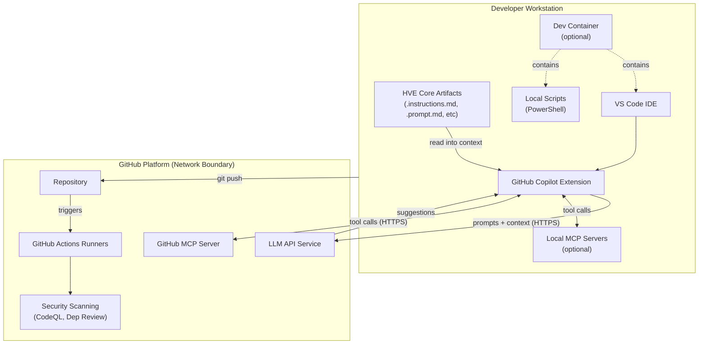

## Executive Summary

HVE Core is an enterprise prompt engineering framework for GitHub Copilot consisting of:

* Markdown-based prompt artifacts (instructions, prompts, agents, skills)
* PowerShell automation scripts for linting and validation
* GitHub Actions CI/CD workflows
* VS Code extension packaging utilities
* The Mural skill runtime: a Python CLI and embedded stdio MCP server with an OAuth client, local token store, and outbound HTTP egress to the Mural REST API

Most of the repository contains no runtime services, databases, or user data storage and is targeted primarily by supply chain and developer workflow threats.
The Mural skill is the exception: it executes locally, holds OAuth tokens in the OS keyring (or an encrypted file fallback), and makes authenticated requests to a third-party SaaS.
Threats specific to that runtime are analyzed in the [OAuth Authentication Threats](#oauth-authentication-threats) and [MCP Server Trust Analysis](#mcp-server-trust-analysis) sections.
Security relies on defense-in-depth with 20+ automated controls validated through CI/CD pipelines.

### Security Posture Overview

| Category                 | Status  | Control Count | Automated |
|--------------------------|---------|---------------|-----------|
| Supply Chain Security    | Strong  | 8 controls    | 100%      |
| Code Quality             | Strong  | 5 controls    | 100%      |
| Access Control           | Strong  | 4 controls    | 100%      |
| Vulnerability Management | Strong  | 3 controls    | 100%      |
| Total                    | **20+** | **20**        | **100%**  |

## Contents

* [System Description](#system-description)
* [Trust Boundaries](#trust-boundaries)
* [Security Model](#security-model)
  * [STRIDE Threats](#stride-threats)
  * [Dev Container Threats](#dev-container-threats)
  * [AI-Specific Threats](#ai-specific-threats)
  * [Responsible AI Threats](#responsible-ai-threats)
  * [OAuth Authentication Threats](#oauth-authentication-threats)
* [Security Controls](#security-controls)
* [Assurance Argument](#assurance-argument)
* [MCP Server Trust Analysis](#mcp-server-trust-analysis)
* [Quantitative Security Metrics](#quantitative-security-metrics)
* [References](#references)

## System Description

### Components

HVE Core contains five primary component categories:

1. **Prompt Engineering Artifacts** (`.github/instructions/`, `.github/prompts/`, `.github/agents/`, `.github/skills/`)
   * Markdown files with YAML frontmatter
   * Consumed by GitHub Copilot during development sessions
   * No executable code execution within prompts

2. **PowerShell Scripts** (`scripts/`)
   * Linting and validation utilities
   * CI/CD automation support
   * No external network connections except documented tool downloads

3. **GitHub Actions Workflows** (`.github/workflows/`)
   * PR validation pipeline
   * Security scanning (CodeQL, dependency review)
   * Release automation

4. **VS Code Extension** (`extension/`)
   * Packaging configuration
   * Extension manifest
   * No telemetry or data collection

5. **Mural Skill Runtime** (`.github/skills/experimental/mural/`)
   * Python CLI and embedded stdio MCP server
   * OAuth 2.0 Authorization Code + PKCE client with per-user on-disk token cache (mode `0600`)
   * Outbound HTTPS to the Mural REST API; trust posture detailed in [MCP Server Trust Analysis](#mcp-server-trust-analysis) and [OAuth Authentication Threats](#oauth-authentication-threats)

### Data Flow



### Security Inheritance from GitHub Copilot

HVE Core artifacts are consumed by GitHub Copilot, which provides foundational security:

| Inherited Control               | Provider       | HVE Core Responsibility                 |
|---------------------------------|----------------|-----------------------------------------|
| LLM input/output filtering      | GitHub Copilot | None; artifacts are Copilot inputs      |
| Token encryption in transit     | GitHub Copilot | None; handled by Copilot infrastructure |
| Organization policy enforcement | GitHub Copilot | Document compatible policy options      |
| Audit logging                   | GitHub Copilot | None; uses Copilot audit streams        |
| SOC 2 Type II compliance        | GitHub         | None; infrastructure control            |

## Trust Boundaries

### Boundary Diagram

```text
┌──────────────────────────────────────────────────────────────────────────────┐
│                    TRUST BOUNDARY: Repository Contents                       │
│  ┌────────────────────────────────────────────────────────────────────────┐  │
│  │                         Controlled Artifacts                           │  │
│  │  ┌────────────┐  ┌────────────┐  ┌────────────┐  ┌────────────────┐   │  │
│  │  │ Prompts    │  │ Scripts    │  │ Workflows  │  │ Documentation  │   │  │
│  │  │ .md files  │  │ .ps1 files │  │ .yml files │  │ .md files      │   │  │
│  │  └────────────┘  └────────────┘  └────────────┘  └────────────────┘   │  │
│  └────────────────────────────────────────────────────────────────────────┘  │
│                                      │                                       │
│  ┌───────────────────────────────────▼────────────────────────────────────┐  │
│  │                   TRUST BOUNDARY: CI/CD Pipeline                       │  │
│  │  ┌────────────┐  ┌────────────┐  ┌────────────┐  ┌────────────────┐   │  │
│  │  │ PR Valid.  │  │ CodeQL     │  │ Dep Review │  │ Release        │   │  │
│  │  │ Workflow   │  │ Analysis   │  │ Workflow   │  │ Workflow       │   │  │
│  │  └────────────┘  └────────────┘  └────────────┘  └────────────────┘   │  │
│  └────────────────────────────────────────────────────────────────────────┘  │
└──────────────────────────────────────────────────────────────────────────────┘
                                       │
     ┌─────────────────────────────────┼──────────────────────────────────┐
     │                                 ▼                                  │
     │            TRUST BOUNDARY: External Dependencies                   │
     │  ┌────────────┐  ┌────────────┐  ┌────────────┐  ┌──────────────┐ │
     │  │ npm        │  │ GitHub     │  │ PowerShell │  │ Third-party  │ │
     │  │ Packages   │  │ Actions    │  │ Gallery    │  │ MCP Servers  │ │
     │  └────────────┘  └────────────┘  └────────────┘  └──────────────┘ │
     └────────────────────────────────────────────────────────────────────┘
```

### Boundary Descriptions

| Boundary              | Assets Protected                       | Controls Enforced                                            |
|-----------------------|----------------------------------------|--------------------------------------------------------------|
| Repository Contents   | Source code, prompts, scripts          | CODEOWNERS, branch protection, PR review                     |
| CI/CD Pipeline        | Build artifacts, security scan results | Minimal permissions, dependency pinning                      |
| External Dependencies | npm packages, Actions, MCP servers     | Dependency review, staleness monitoring                      |
| Dev Container         | Development environment, tooling       | SHA256 verification, first-party features                    |
| Mural Skill Runtime   | OAuth tokens, Mural API egress         | OS keyring / `0600` token cache, PKCE, loopback redirect URI |

## Security Model

This section documents threats using [STRIDE](https://learn.microsoft.com/azure/security/develop/threat-modeling-tool-threats) methodology (Spoofing, Tampering, Repudiation, Information Disclosure, Denial of Service, Elevation of Privilege), supplemented with AI-specific and Responsible AI threat categories.

### STRIDE Threats

#### S-1: Compromised GitHub Action via Tag Substitution

| Field             | Value                                                                                |
|-------------------|--------------------------------------------------------------------------------------|
| **Category**      | Spoofing                                                                             |
| **Asset**         | CI/CD pipeline integrity                                                             |
| **Threat**        | Attacker compromises upstream Action repository and replaces tag with malicious code |
| **Likelihood**    | Medium (documented supply chain attacks exist)                                       |
| **Impact**        | High (full CI/CD compromise, secret exfiltration)                                    |
| **Mitigations**   | Dependency pinning for all Actions, staleness monitoring, CodeQL scanning            |
| **Residual Risk** | Low (SHA immutable; requires GitHub infrastructure compromise)                       |
| **Status**        | Mitigated                                                                            |

#### S-2: npm Package Substitution Attack

| Field             | Value                                                       |
|-------------------|-------------------------------------------------------------|
| **Category**      | Spoofing                                                    |
| **Asset**         | Build dependencies                                          |
| **Threat**        | Malicious package published with same name or typosquatting |
| **Likelihood**    | Medium (common attack vector)                               |
| **Impact**        | Medium (limited runtime exposure; primarily build-time)     |
| **Mitigations**   | Package-lock.json integrity, npm audit, dependency review   |
| **Residual Risk** | Low                                                         |
| **Status**        | Mitigated                                                   |

#### T-1: Unauthorized Modification of Security Controls

| Field             | Value                                                             |
|-------------------|-------------------------------------------------------------------|
| **Category**      | Tampering                                                         |
| **Asset**         | Workflow files, security scripts                                  |
| **Threat**        | Attacker with write access disables security checks               |
| **Likelihood**    | Low (requires compromised maintainer account)                     |
| **Impact**        | High (security controls bypassed)                                 |
| **Mitigations**   | CODEOWNERS enforcement, branch protection, PR review requirements |
| **Residual Risk** | Low                                                               |
| **Status**        | Mitigated                                                         |

#### T-2: Malicious Prompt Injection via PR

| Field             | Value                                                         |
|-------------------|---------------------------------------------------------------|
| **Category**      | Tampering                                                     |
| **Asset**         | Prompt artifacts                                              |
| **Threat**        | Contributor submits prompt with hidden malicious instructions |
| **Likelihood**    | Medium (social engineering possible)                          |
| **Impact**        | Medium (affects Copilot behavior for consumers)               |
| **Mitigations**   | PR review, CODEOWNERS, frontmatter validation                 |
| **Residual Risk** | Medium (semantic analysis not automated)                      |
| **Status**        | Partially Mitigated                                           |

#### R-1: Untraceable Configuration Changes

| Field             | Value                                                      |
|-------------------|------------------------------------------------------------|
| **Category**      | Repudiation                                                |
| **Asset**         | Repository configuration                                   |
| **Threat**        | Admin makes security-impacting changes without audit trail |
| **Likelihood**    | Low (GitHub provides audit logs)                           |
| **Impact**        | Medium (accountability gap)                                |
| **Mitigations**   | GitHub audit log, branch protection audit events           |
| **Residual Risk** | Low                                                        |
| **Status**        | Mitigated                                                  |

#### I-1: Secret Exposure in Logs or Artifacts

| Field             | Value                                                               |
|-------------------|---------------------------------------------------------------------|
| **Category**      | Information Disclosure                                              |
| **Asset**         | Repository secrets, tokens                                          |
| **Threat**        | Secrets accidentally logged or included in build artifacts          |
| **Likelihood**    | Low (minimal secret usage)                                          |
| **Impact**        | High (credential compromise)                                        |
| **Mitigations**   | GitHub secret masking, GitHub secret scanning, minimal secret usage |
| **Residual Risk** | Low                                                                 |
| **Status**        | Mitigated                                                           |

#### I-2: Sensitive Information in Prompt Artifacts

| Field             | Value                                                               |
|-------------------|---------------------------------------------------------------------|
| **Category**      | Information Disclosure                                              |
| **Asset**         | Prompt files, documentation                                         |
| **Threat**        | Internal URLs, API keys, or proprietary patterns exposed in prompts |
| **Likelihood**    | Low (review process catches obvious cases)                          |
| **Impact**        | Medium (information leakage)                                        |
| **Mitigations**   | PR review, GitHub secret scanning, documentation guidelines         |
| **Residual Risk** | Low                                                                 |
| **Status**        | Mitigated                                                           |

#### D-1: CI/CD Resource Exhaustion

| Field             | Value                                                             |
|-------------------|-------------------------------------------------------------------|
| **Category**      | Denial of Service                                                 |
| **Asset**         | GitHub Actions minutes, runner availability                       |
| **Threat**        | Malicious PR triggers expensive workflows repeatedly              |
| **Likelihood**    | Low (requires PR creation privileges)                             |
| **Impact**        | Low (billing impact, temporary delays)                            |
| **Mitigations**   | Workflow approval for first-time contributors, concurrency limits |
| **Residual Risk** | Low                                                               |
| **Status**        | Mitigated                                                         |

#### D-2: Dependency Confusion Blocking Builds

| Field             | Value                                                          |
|-------------------|----------------------------------------------------------------|
| **Category**      | Denial of Service                                              |
| **Asset**         | Build pipeline                                                 |
| **Threat**        | Attacker publishes conflicting package preventing clean builds |
| **Likelihood**    | Low                                                            |
| **Impact**        | Medium (build failures)                                        |
| **Mitigations**   | Package-lock.json, scoped packages                             |
| **Residual Risk** | Low                                                            |
| **Status**        | Mitigated                                                      |

#### E-1: Workflow Token Abuse

| Field             | Value                                                                                            |
|-------------------|--------------------------------------------------------------------------------------------------|
| **Category**      | Elevation of Privilege                                                                           |
| **Asset**         | GitHub Actions tokens                                                                            |
| **Threat**        | Compromised workflow step uses GITHUB_TOKEN beyond intended scope                                |
| **Likelihood**    | Low (minimal permissions declared)                                                               |
| **Impact**        | Medium (depends on token permissions)                                                            |
| **Mitigations**   | Minimal permissions pattern, persist-credentials: false, inline comments on elevated permissions |
| **Residual Risk** | Low                                                                                              |
| **Status**        | Mitigated with Accepted Risk                                                                     |

##### Accepted Risk: Token-Permissions Alerts

OpenSSF Scorecard Token-Permissions flags `security-events: write` as overly broad across workflow files. This permission is required for `github/codeql-action/upload-sarif` and `github/codeql-action/analyze` to upload SARIF results to the repository Security tab. The `security-events` scope grants access only to code scanning alert data and cannot modify repository content, settings, or secrets.

Scorecard's own `scorecard.yml` requires the same permission to publish results, creating a circular dependency in the token-permissions check.

Affected workflow jobs:

| Workflow                          | Job                          |
|-----------------------------------|------------------------------|
| `release-stable.yml`              | `dependency-pinning-scan`    |
| `release-stable.yml`              | `gitleaks-scan`              |
| `pr-validation.yml`               | `dependency-pinning-check`   |
| `pr-validation.yml`               | `workflow-permissions-check` |
| `pr-validation.yml`               | `gitleaks-scan`              |
| `pr-validation.yml`               | `codeql`                     |
| `security-scan.yml`               | `codeql`                     |
| `weekly-security-maintenance.yml` | `validate-pinning`           |
| `weekly-security-maintenance.yml` | `codeql-analysis`            |

Defense-in-depth controls:

* All workflows declare job-level permissions, not workflow-level
* `persist-credentials: false` set on all checkout steps
* Inline YAML comments document each `security-events: write` declaration
* SARIF upload is the only write operation performed under this permission

#### E-2: Branch Protection Bypass

| Field             | Value                                                            |
|-------------------|------------------------------------------------------------------|
| **Category**      | Elevation of Privilege                                           |
| **Asset**         | Protected branches                                               |
| **Threat**        | Admin bypasses branch protection to merge unauthorized changes   |
| **Likelihood**    | Low (requires admin access and intentional bypass)               |
| **Impact**        | High (security controls circumvented)                            |
| **Mitigations**   | Branch protection rules, audit logging, "Do not allow bypassing" |
| **Residual Risk** | Low                                                              |
| **Status**        | Mitigated                                                        |

### Dev Container Threats

These threats address risks in the development container configuration used for Codespaces and local container development.

#### DC-1: Feature Tag Substitution Attack

| Field             | Value                                                                    |
|-------------------|--------------------------------------------------------------------------|
| **Category**      | Spoofing                                                                 |
| **Asset**         | Dev container configuration                                              |
| **Threat**        | Malicious update to a feature version tag introduces compromised tooling |
| **Likelihood**    | Low (first-party Microsoft features only)                                |
| **Impact**        | Medium (development environment compromise)                              |
| **Mitigations**   | First-party features only, PR review of devcontainer.json changes        |
| **Residual Risk** | Low (Microsoft-maintained features with release controls)                |
| **Status**        | Mitigated                                                                |

#### DC-2: Lifecycle Script Tampering

| Field             | Value                                                           |
|-------------------|-----------------------------------------------------------------|
| **Category**      | Tampering                                                       |
| **Asset**         | Container initialization scripts                                |
| **Threat**        | Attacker modifies on-create.sh or post-create.sh to inject code |
| **Likelihood**    | Low (requires PR approval, CODEOWNERS protection)               |
| **Impact**        | High (arbitrary code execution in dev environment)              |
| **Mitigations**   | CODEOWNERS, PR review, branch protection                        |
| **Residual Risk** | Low                                                             |
| **Status**        | Mitigated                                                       |

#### DC-3: External Binary Download Compromise

| Field             | Value                                                       |
|-------------------|-------------------------------------------------------------|
| **Category**      | Spoofing                                                    |
| **Asset**         | External tools (gitleaks, shellcheck)                       |
| **Threat**        | Compromised download source serves malicious binary         |
| **Likelihood**    | Very Low (SHA256 verification enforced)                     |
| **Impact**        | High (malicious tooling in dev environment)                 |
| **Mitigations**   | SHA256 checksum verification in on-create.sh                |
| **Residual Risk** | Very Low (cryptographic verification prevents substitution) |
| **Status**        | Mitigated                                                   |

### AI-Specific Threats

These threats address risks specific to AI/ML systems as documented by [OWASP LLM Top 10](https://owasp.org/www-project-top-10-for-large-language-model-applications/) and [MITRE ATLAS](https://atlas.mitre.org/).

#### AI-1: Prompt Injection via Artifact Content

| Field             | Value                                                                  |
|-------------------|------------------------------------------------------------------------|
| **Category**      | LLM01: Prompt Injection (OWASP)                                        |
| **Asset**         | Copilot behavior, downstream code generation                           |
| **Threat**        | Malicious instructions embedded in prompt artifacts manipulate Copilot |
| **Likelihood**    | Medium                                                                 |
| **Impact**        | Medium (affects code generation quality and safety)                    |
| **Mitigations**   | PR review, CODEOWNERS, clear artifact structure guidelines             |
| **Residual Risk** | Medium (inherent to prompt-based systems)                              |
| **Status**        | Partially Mitigated                                                    |

#### AI-2: Insecure Output Handling

| Field             | Value                                                             |
|-------------------|-------------------------------------------------------------------|
| **Category**      | LLM02: Insecure Output Handling (OWASP)                           |
| **Asset**         | Generated code                                                    |
| **Threat**        | Copilot generates insecure code patterns based on prompt guidance |
| **Likelihood**    | Medium                                                            |
| **Impact**        | Variable (depends on consumer's review practices)                 |
| **Mitigations**   | Security-focused prompts, consumer code review responsibility     |
| **Residual Risk** | Medium (HVE Core provides guidance, not enforcement)              |
| **Status**        | Accepted with Documentation                                       |

#### AI-3: Training Data Poisoning (Indirect)

| Field             | Value                                                     |
|-------------------|-----------------------------------------------------------|
| **Category**      | LLM03: Training Data Poisoning (OWASP)                    |
| **Asset**         | Copilot model behavior                                    |
| **Threat**        | Malicious patterns in HVE Core influence Copilot training |
| **Likelihood**    | Very Low (Copilot training controlled by GitHub)          |
| **Impact**        | Low (HVE Core is small input to large training corpus)    |
| **Mitigations**   | Out of scope; GitHub controls training pipeline           |
| **Residual Risk** | Very Low                                                  |
| **Status**        | Accepted (Outside Control)                                |

#### AI-4: Model Denial of Service

| Field             | Value                                                           |
|-------------------|-----------------------------------------------------------------|
| **Category**      | LLM04: Model Denial of Service (OWASP)                          |
| **Asset**         | Copilot availability                                            |
| **Threat**        | Crafted prompts cause excessive resource consumption in Copilot |
| **Likelihood**    | Very Low                                                        |
| **Impact**        | Low (Copilot has rate limiting)                                 |
| **Mitigations**   | Copilot's built-in rate limiting and resource management        |
| **Residual Risk** | Very Low                                                        |
| **Status**        | Accepted (Outside Control)                                      |

#### AI-5: Supply Chain Vulnerabilities (LLM-Specific)

| Field             | Value                                                        |
|-------------------|--------------------------------------------------------------|
| **Category**      | LLM05: Supply-Chain Vulnerabilities (OWASP)                  |
| **Asset**         | MCP server integrations                                      |
| **Threat**        | Compromised MCP server provides malicious context to Copilot |
| **Likelihood**    | Low (first-party servers) to Medium (third-party)            |
| **Impact**        | Medium (affects code generation context)                     |
| **Mitigations**   | MCP server trust analysis, documentation of trust levels     |
| **Residual Risk** | Low to Medium depending on server                            |
| **Status**        | Mitigated with Documentation                                 |

See [MCP Server Trust Analysis](#mcp-server-trust-analysis) for Mural-skill-specific OAuth credential and token-cache leakage controls.

#### AI-6: Sensitive Information Disclosure

| Field             | Value                                                                |
|-------------------|----------------------------------------------------------------------|
| **Category**      | LLM06: Sensitive Information Disclosure (OWASP)                      |
| **Asset**         | User context, code patterns                                          |
| **Threat**        | Prompt artifacts cause Copilot to expose sensitive patterns          |
| **Likelihood**    | Low                                                                  |
| **Impact**        | Medium                                                               |
| **Mitigations**   | Consumer responsibility; prompt guidelines discourage sensitive data |
| **Residual Risk** | Low                                                                  |
| **Status**        | Mitigated with Documentation                                         |

#### AI-7: Insecure Plugin Design

| Field             | Value                                                           |
|-------------------|-----------------------------------------------------------------|
| **Category**      | LLM07: Insecure Plugin Design (OWASP)                           |
| **Asset**         | MCP server integrations, VS Code extension                      |
| **Threat**        | Extension or MCP server allows unauthorized operations          |
| **Likelihood**    | Low (extension has no sensitive operations)                     |
| **Impact**        | Low to Medium                                                   |
| **Mitigations**   | Minimal extension functionality, MCP server trust documentation |
| **Residual Risk** | Low                                                             |
| **Status**        | Mitigated                                                       |

#### AI-8: Excessive Agency

| Field             | Value                                                    |
|-------------------|----------------------------------------------------------|
| **Category**      | LLM08: Excessive Agency (OWASP)                          |
| **Asset**         | Autonomous Copilot operations                            |
| **Threat**        | Prompts grant Copilot excessive autonomous capabilities  |
| **Likelihood**    | Low (prompts are guidance, not permissions)              |
| **Impact**        | Variable                                                 |
| **Mitigations**   | Copilot's built-in guardrails, tool confirmation dialogs |
| **Residual Risk** | Low                                                      |
| **Status**        | Mitigated (Copilot Controls)                             |

#### AI-9: Overreliance

| Field             | Value                                                      |
|-------------------|------------------------------------------------------------|
| **Category**      | LLM09: Overreliance (OWASP)                                |
| **Asset**         | Code quality, developer decision-making                    |
| **Threat**        | Developers accept Copilot output without verification      |
| **Likelihood**    | Medium                                                     |
| **Impact**        | Variable (depends on context)                              |
| **Mitigations**   | Documentation emphasizing review, security-focused prompts |
| **Residual Risk** | Medium (behavioral, not technical)                         |
| **Status**        | Accepted with Documentation                                |

#### AI-10: Model Theft (N/A)

| Field             | Value                                       |
|-------------------|---------------------------------------------|
| **Category**      | LLM10: Model Theft (OWASP)                  |
| **Asset**         | N/A                                         |
| **Threat**        | HVE Core does not host or distribute models |
| **Likelihood**    | N/A                                         |
| **Impact**        | N/A                                         |
| **Mitigations**   | N/A                                         |
| **Residual Risk** | N/A                                         |
| **Status**        | Not Applicable                              |

#### AI-11: AML.T0043 Craft Adversarial Data (MITRE ATLAS)

| Field             | Value                                                        |
|-------------------|--------------------------------------------------------------|
| **Category**      | MITRE ATLAS AML.T0043                                        |
| **Asset**         | Prompt artifacts                                             |
| **Threat**        | Adversary crafts prompt content to cause model misbehavior   |
| **Likelihood**    | Medium                                                       |
| **Impact**        | Medium                                                       |
| **Mitigations**   | PR review process, CODEOWNERS, artifact structure validation |
| **Residual Risk** | Medium                                                       |
| **Status**        | Partially Mitigated                                          |

#### AI-12: AML.T0048 Evade ML Model (MITRE ATLAS)

| Field             | Value                                                         |
|-------------------|---------------------------------------------------------------|
| **Category**      | MITRE ATLAS AML.T0048                                         |
| **Asset**         | Security recommendations in prompts                           |
| **Threat**        | Prompts designed to cause Copilot to bypass security guidance |
| **Likelihood**    | Low                                                           |
| **Impact**        | Medium                                                        |
| **Mitigations**   | Security-first prompt design principles, review process       |
| **Residual Risk** | Low                                                           |
| **Status**        | Mitigated                                                     |

For runtime supply-chain posture of locally executed MCP servers, see the [MCP Server Trust Analysis](#mcp-server-trust-analysis) runtime trust table.

### Responsible AI Threats

These threats address ethical and responsible AI considerations aligned with Microsoft's Responsible AI principles.

#### RAI-1: Fairness - Biased Code Generation Patterns

| Field             | Value                                                                      |
|-------------------|----------------------------------------------------------------------------|
| **Category**      | Fairness (Responsible AI)                                                  |
| **Asset**         | Generated code quality across contexts                                     |
| **Threat**        | Prompts inadvertently favor certain coding styles or exclude accessibility |
| **Likelihood**    | Medium                                                                     |
| **Impact**        | Medium (affects inclusivity of generated code)                             |
| **Mitigations**   | Inclusive language guidelines, accessibility-aware prompts                 |
| **Residual Risk** | Medium                                                                     |
| **Status**        | Partially Mitigated                                                        |

#### RAI-2: Reliability - Inconsistent Prompt Behavior

| Field             | Value                                                       |
|-------------------|-------------------------------------------------------------|
| **Category**      | Reliability & Safety (Responsible AI)                       |
| **Asset**         | Prompt consistency                                          |
| **Threat**        | Same prompt produces significantly different outputs        |
| **Likelihood**    | Medium (inherent to LLMs)                                   |
| **Impact**        | Low to Medium                                               |
| **Mitigations**   | Structured prompts, explicit instructions, testing guidance |
| **Residual Risk** | Medium (LLM behavior inherently variable)                   |
| **Status**        | Accepted with Documentation                                 |

#### RAI-3: Privacy - Context Leakage via Prompts

| Field             | Value                                                         |
|-------------------|---------------------------------------------------------------|
| **Category**      | Privacy & Security (Responsible AI)                           |
| **Asset**         | Developer context, code patterns                              |
| **Threat**        | Prompts cause Copilot to surface or infer private information |
| **Likelihood**    | Low                                                           |
| **Impact**        | Medium                                                        |
| **Mitigations**   | Privacy-conscious prompt design, consumer guidelines          |
| **Residual Risk** | Low                                                           |
| **Status**        | Mitigated with Documentation                                  |

#### RAI-3a: Privacy - M365 Transcript Data Materialization

| Field             | Value                                                                                                                                                                                                                                                                                        |
|-------------------|----------------------------------------------------------------------------------------------------------------------------------------------------------------------------------------------------------------------------------------------------------------------------------------------|
| **Category**      | Privacy & Security (Responsible AI)                                                                                                                                                                                                                                                          |
| **Asset**         | Meeting transcripts, customer confidential data, PII                                                                                                                                                                                                                                         |
| **Threat**        | The meeting-analyst agent retrieves M365 transcripts containing sensitive data and writes them to local files in `.copilot-tracking/`. Data may be exposed through accidental commits (`git add -f`), gitignore misconfiguration, shared Codespaces, CI/CD logs, or unencrypted disk access. |
| **Likelihood**    | Medium (users may not recognize transcript sensitivity; gitignore is the only barrier)                                                                                                                                                                                                       |
| **Impact**        | High (customer confidential data, PII, trade secrets)                                                                                                                                                                                                                                        |
| **Mitigations**   | Gitignore for `.copilot-tracking/`, agent-level data sensitivity notice and pre-flight classification prompt, anonymization guidance in agent instructions, data retention cleanup at handoff, documentation in threat model and agent catalog                                               |
| **Residual Risk** | Medium (gitignore is not a security control; user awareness is behavioral)                                                                                                                                                                                                                   |
| **Status**        | Partially Mitigated with Documentation                                                                                                                                                                                                                                                       |

#### RAI-4: Inclusiveness - Exclusionary Language in Artifacts

| Field             | Value                                                    |
|-------------------|----------------------------------------------------------|
| **Category**      | Inclusiveness (Responsible AI)                           |
| **Asset**         | Prompt artifacts, documentation                          |
| **Threat**        | Language in prompts excludes or marginalizes user groups |
| **Likelihood**    | Low (writing style guidelines address this)              |
| **Impact**        | Medium (affects adoption and trust)                      |
| **Mitigations**   | Inclusive writing guidelines, spell check, PR review     |
| **Residual Risk** | Low                                                      |
| **Status**        | Mitigated                                                |

#### RAI-5: Transparency - Undocumented Prompt Behavior

| Field             | Value                                                            |
|-------------------|------------------------------------------------------------------|
| **Category**      | Transparency (Responsible AI)                                    |
| **Asset**         | User understanding of system behavior                            |
| **Threat**        | Prompts cause unexpected Copilot behavior not explained to users |
| **Likelihood**    | Medium                                                           |
| **Impact**        | Low to Medium                                                    |
| **Mitigations**   | Clear documentation, explicit prompt descriptions in frontmatter |
| **Residual Risk** | Low                                                              |
| **Status**        | Mitigated                                                        |

#### RAI-6: Accountability - Unclear Responsibility for Generated Code

| Field             | Value                                                                |
|-------------------|----------------------------------------------------------------------|
| **Category**      | Accountability (Responsible AI)                                      |
| **Asset**         | Liability and responsibility clarity                                 |
| **Threat**        | Ambiguity about who is responsible for Copilot-generated code issues |
| **Likelihood**    | Medium (common confusion)                                            |
| **Impact**        | Medium                                                               |
| **Mitigations**   | Documentation clarifying HVE Core provides guidance only             |
| **Residual Risk** | Low                                                                  |
| **Status**        | Mitigated with Documentation                                         |

#### RAI-7: Human Oversight - Automated Changes Without Review

| Field             | Value                                                          |
|-------------------|----------------------------------------------------------------|
| **Category**      | Human Oversight (Responsible AI)                               |
| **Asset**         | Code quality, security                                         |
| **Threat**        | Prompts encourage accepting Copilot suggestions without review |
| **Likelihood**    | Low (prompts emphasize review)                                 |
| **Impact**        | Variable                                                       |
| **Mitigations**   | Prompts include review reminders, security-conscious patterns  |
| **Residual Risk** | Low                                                            |
| **Status**        | Mitigated                                                      |

#### RAI-8: Value Alignment - Prompts Conflicting with Organizational Values

| Field             | Value                                                         |
|-------------------|---------------------------------------------------------------|
| **Category**      | Value Alignment (Responsible AI)                              |
| **Asset**         | Organizational trust                                          |
| **Threat**        | Prompt artifacts conflict with consumer organization's values |
| **Likelihood**    | Low                                                           |
| **Impact**        | Medium (reputational)                                         |
| **Mitigations**   | General-purpose prompts, customization guidance for consumers |
| **Residual Risk** | Low                                                           |
| **Status**        | Mitigated with Documentation                                  |

#### RAI-9: Proportionality - Overly Aggressive Automation

| Field             | Value                                                                    |
|-------------------|--------------------------------------------------------------------------|
| **Category**      | Proportionality (Responsible AI)                                         |
| **Asset**         | Developer autonomy                                                       |
| **Threat**        | Prompts push Copilot toward excessive automation reducing human judgment |
| **Likelihood**    | Low                                                                      |
| **Impact**        | Medium                                                                   |
| **Mitigations**   | Human-in-the-loop design patterns in prompts                             |
| **Residual Risk** | Low                                                                      |
| **Status**        | Mitigated                                                                |

#### RAI-10: Contestability - No Mechanism to Challenge AI Decisions

| Field             | Value                                                                    |
|-------------------|--------------------------------------------------------------------------|
| **Category**      | Contestability (Responsible AI)                                          |
| **Asset**         | User agency                                                              |
| **Threat**        | Users cannot override or question Copilot behavior influenced by prompts |
| **Likelihood**    | Low (Copilot suggestions are optional)                                   |
| **Impact**        | Low                                                                      |
| **Mitigations**   | Copilot's non-mandatory nature, edit/reject options built-in             |
| **Residual Risk** | Very Low                                                                 |
| **Status**        | Mitigated (Copilot Controls)                                             |

#### RAI-11: Societal Impact - Deskilling Developers

| Field             | Value                                                         |
|-------------------|---------------------------------------------------------------|
| **Category**      | Societal Impact (Responsible AI)                              |
| **Asset**         | Developer skill development                                   |
| **Threat**        | Over-reliance on AI-assisted coding reduces skill development |
| **Likelihood**    | Medium (industry-wide concern)                                |
| **Impact**        | Low for HVE Core specifically                                 |
| **Mitigations**   | Prompts emphasize learning and understanding, not just output |
| **Residual Risk** | Medium (societal, not technical)                              |
| **Status**        | Accepted with Documentation                                   |

#### RAI-12: Environmental Impact - Compute Resource Awareness

| Field             | Value                                                   |
|-------------------|---------------------------------------------------------|
| **Category**      | Environmental Impact (Responsible AI)                   |
| **Asset**         | Compute resources                                       |
| **Threat**        | Inefficient prompts cause unnecessary model computation |
| **Likelihood**    | Low                                                     |
| **Impact**        | Low (marginal compute impact)                           |
| **Mitigations**   | Efficient prompt design guidelines                      |
| **Residual Risk** | Very Low                                                |
| **Status**        | Accepted                                                |

#### RAI-13: Misinformation - Prompts Generating Incorrect Information

| Field             | Value                                                             |
|-------------------|-------------------------------------------------------------------|
| **Category**      | Misinformation (Responsible AI)                                   |
| **Asset**         | Documentation and code accuracy                                   |
| **Threat**        | Prompts cause Copilot to generate plausible but incorrect content |
| **Likelihood**    | Medium (LLM hallucination is known issue)                         |
| **Impact**        | Medium                                                            |
| **Mitigations**   | Verification prompts, citation requirements in prompt guidelines  |
| **Residual Risk** | Medium (inherent LLM limitation)                                  |
| **Status**        | Partially Mitigated                                               |

### OAuth Authentication Threats

These threats address risks specific to the OAuth 2.0 Authorization Code + PKCE flow used by the [Mural skill](https://github.com/microsoft/hve-core/blob/main/.github/skills/experimental/mural/SKILL.md) and apply to any future skill that authenticates against a third-party authorization server using a loopback redirect URI on the developer workstation.

The catalog uses an extended 11-row format that adds **Source** (verbatim citation), **Trust Boundary Crossed**, and **Detection** to the standard STRIDE row template.

Mural-specific facts are sourced from `https://developers.mural.co/public/docs/oauth` (fetched 2026-05-10).

The verbatim quotes and validation log are recorded in [`.copilot-tracking/research/2026-05-10/oauth-stride-threat-model-validation-research.md`](https://github.com/microsoft/hve-core/blob/main/.copilot-tracking/research/2026-05-10/oauth-stride-threat-model-validation-research.md).

External standards are cited inline.

> **Mural documentation contradiction:** Mural's OAuth doc narrative claims refresh tokens are rotated, but the documented JSON response schema and reference paragraph confirm they are NOT (`{ "access_token": ..., "expires_in": ... }` only; "You can reuse your refresh_token as many times as you need"). The schema and reference paragraph are authoritative. OA-11 below is built on the verified non-rotation behavior; do not be misled by Mural's narrative.

#### OA-1: Authorization Server Phishing / Spoofed Consent Page

| Field                      | Value                                                                                                                                                                                                                                                                       |
|----------------------------|-----------------------------------------------------------------------------------------------------------------------------------------------------------------------------------------------------------------------------------------------------------------------------|
| **Category**               | Spoofing                                                                                                                                                                                                                                                                    |
| **Asset**                  | User credentials, OAuth grant decision                                                                                                                                                                                                                                      |
| **Threat**                 | Attacker directs the user to a look-alike Mural consent page (typosquatted domain or DNS hijack) and harvests credentials or coerces an OAuth grant for an attacker-controlled client                                                                                       |
| **Likelihood**             | Low (requires user-side browser deception or DNS attack)                                                                                                                                                                                                                    |
| **Impact**                 | High (account takeover; attacker-issued tokens with full delegated scope)                                                                                                                                                                                                   |
| **Mitigations**            | Skill constructs the authorization URL from a hardcoded constant (`https://app.mural.co/api/public/v1/authorization/oauth2/`); HTTPS enforced; user instructed to verify URL bar before consenting; client_id is non-secret                                                 |
| **Residual Risk**          | Low (deception happens outside the skill's trust boundary; relies on user vigilance and OS DNS integrity)                                                                                                                                                                   |
| **Status**                 | Mitigated with Documentation                                                                                                                                                                                                                                                |
| **Source**                 | RFC 6819 §4.1.4 (Threat: End-User Credentials Phished); MITRE ATT&CK [T1539](https://attack.mitre.org/techniques/T1539/) (Steal Web Session Cookie); Mural authorization endpoint verbatim: "Authorization URL: `https://app.mural.co/api/public/v1/authorization/oauth2/`" |
| **Trust Boundary Crossed** | Browser ↔ Mural Authorization Server                                                                                                                                                                                                                                        |
| **Detection**              | Out of band (Mural account-side anomaly review at [https://app.mural.co/account/api](https://app.mural.co/account/api)); the local skill cannot detect this                                                                                                                 |

#### OA-2: Authorization Server Mix-Up via Missing `iss` Parameter

| Field                      | Value                                                                                                                                                                                                                                                                                                                                                           |
|----------------------------|-----------------------------------------------------------------------------------------------------------------------------------------------------------------------------------------------------------------------------------------------------------------------------------------------------------------------------------------------------------------|
| **Category**               | Spoofing                                                                                                                                                                                                                                                                                                                                                        |
| **Asset**                  | Authorization-code-to-token exchange integrity                                                                                                                                                                                                                                                                                                                  |
| **Threat**                 | If the skill ever supports more than one authorization server, an attacker AS that the user has previously authorized could redirect a code from itself to Mural's token endpoint (or vice versa) and the client cannot distinguish the issuer because Mural does not return RFC 9207 `iss`                                                                     |
| **Likelihood**             | Very Low for current single-AS skill design; Medium if multi-AS support is added                                                                                                                                                                                                                                                                                |
| **Impact**                 | High (cross-AS token confusion; attacker-controlled token usable against legitimate AS)                                                                                                                                                                                                                                                                         |
| **Mitigations**            | Skill is single-AS by design; per-request `state` enforcement (skill `_run_login` L2200, L2237) binds callback to issuing request; PKCE `code_verifier` (RFC 7636) cryptographically binds the code to this client and authorization request; do not add a second AS without first implementing RFC 9207 issuer validation or equivalent per-AS state-namespace |
| **Residual Risk**          | Low for current design; would become Medium if multi-AS is added before mitigation                                                                                                                                                                                                                                                                              |
| **Status**                 | Mitigated by Design (single-AS skill)                                                                                                                                                                                                                                                                                                                           |
| **Source**                 | RFC 9207 §1 (OAuth 2.0 Authorization Server Issuer Identification); RFC 9700 §4.4 (AS Mix-Up); Mural callback verified to expose `code` + `state` only (no `iss`): "[https://cleverexample.com/oauth/callback?code=:code&state=:state](https://cleverexample.com/oauth/callback?code=:code&state=:state)"                                                       |
| **Trust Boundary Crossed** | Browser ↔ Mural Authorization Server; Skill Process ↔ Mural Token Endpoint                                                                                                                                                                                                                                                                                      |
| **Detection**              | Cross-AS code rejection logged at the wrong AS's token endpoint (`invalid_grant` or `invalid_client`); audit AS-side for unexpected token requests                                                                                                                                                                                                              |

#### OA-3: Loopback Redirect URI Hijack

| Field                      | Value                                                                                                                                                                                                                                                                                                                                              |
|----------------------------|----------------------------------------------------------------------------------------------------------------------------------------------------------------------------------------------------------------------------------------------------------------------------------------------------------------------------------------------------|
| **Category**               | Spoofing                                                                                                                                                                                                                                                                                                                                           |
| **Asset**                  | Authorization code in transit from browser to skill loopback handler                                                                                                                                                                                                                                                                               |
| **Threat**                 | A co-resident process on the developer workstation binds the loopback port before the skill or races the bind, intercepting the authorization code delivered to `http://127.0.0.1:<port>/callback`                                                                                                                                                 |
| **Likelihood**             | Low on single-user workstations; Medium on shared dev hosts and Codespaces with port forwarding                                                                                                                                                                                                                                                    |
| **Impact**                 | High (intercepted code can be exchanged for tokens until single-use enforcement triggers; PKCE prevents exchange but only if the attacker lacks the verifier)                                                                                                                                                                                      |
| **Mitigations**            | Loopback handler binds before authorization request is opened (`_start_loopback_server` L2087); ephemeral port; PKCE binds the code to this client's `code_verifier` so an interceptor without the verifier cannot exchange the code; redirect URI validated against an allow-list (`_validate_redirect_uri` L2110, `_resolve_redirect_uri` L2148) |
| **Residual Risk**          | Low (PKCE is the load-bearing control; the verifier is held only in-process and never logged via `_REDACT_KEYS`)                                                                                                                                                                                                                                   |
| **Status**                 | Mitigated                                                                                                                                                                                                                                                                                                                                          |
| **Source**                 | RFC 8252 §7.3 (Loopback Interface Redirection); RFC 7636 §1 (PKCE motivation: authorization code interception attack); CAPEC-21 (Exploitation of Trusted Identifiers)                                                                                                                                                                              |
| **Trust Boundary Crossed** | Browser ↔ Skill Process (loopback)                                                                                                                                                                                                                                                                                                                 |
| **Detection**              | `EADDRINUSE` on bind; loopback handler logs unexpected callbacks; second `invalid_grant` ("already used") on token exchange attempt                                                                                                                                                                                                                |

#### OA-4: Client Impersonation via Leaked `client_secret`

| Field                      | Value                                                                                                                                                                                                                                                                                                                                                                      |
|----------------------------|----------------------------------------------------------------------------------------------------------------------------------------------------------------------------------------------------------------------------------------------------------------------------------------------------------------------------------------------------------------------------|
| **Category**               | Spoofing                                                                                                                                                                                                                                                                                                                                                                   |
| **Asset**                  | Mural-issued `client_secret` for the registered OAuth application                                                                                                                                                                                                                                                                                                          |
| **Threat**                 | Mural documents only the confidential-client OAuth flow (no public-client / PKCE-only path), so the skill must hold a `client_secret`. If that secret leaks (env-var dump, log capture, file-permission downgrade, accidental commit, screen share), an attacker can impersonate the registered client and complete token exchanges for any user-issued authorization code |
| **Likelihood**             | Low (skill enforces 0600 file permissions and redacts secrets from logs)                                                                                                                                                                                                                                                                                                   |
| **Impact**                 | Critical (full client impersonation; attacker can mint tokens for any user who completes the OAuth dance against the legitimate AS)                                                                                                                                                                                                                                        |
| **Mitigations**            | `_check_credential_file_perms` L530 enforces 0600 mode on the credential file; `_REDACT_KEYS` L140 includes `client_secret` and is exercised by `_redact()` L1332 across all log-emission paths; secret never written to stdout; documented rotation runbook in skill `SECURITY.md` G-EOP-1; lint rule prohibits hardcoded credentials                                     |
| **Residual Risk**          | Low (depends on `_REDACT_KEYS` test coverage; Q3=a parallel work item adds the missing `test_redaction.py` to lock the contract)                                                                                                                                                                                                                                           |
| **Status**                 | Mitigated                                                                                                                                                                                                                                                                                                                                                                  |
| **Source**                 | RFC 6749 §2.3.1 (Client Password); RFC 6819 §4.1.1 (Threat: Obtaining Client Secrets); Mural verbatim: "client_secret: The secret key you copied when you created your app in Mural."                                                                                                                                                                                      |
| **Trust Boundary Crossed** | Skill Process ↔ Token Cache File; Skill Process ↔ Log Sinks                                                                                                                                                                                                                                                                                                                |
| **Detection**              | File-mode audit (`_check_credential_file_perms`); gitleaks pre-commit; CodeQL secret-pattern scanning; Mural-side anomaly detection on token-request volume                                                                                                                                                                                                                |

#### OA-5: Authorization Request Tampering / CSRF (Missing `state`)

| Field                      | Value                                                                                                                                                                                                                                                                                              |
|----------------------------|----------------------------------------------------------------------------------------------------------------------------------------------------------------------------------------------------------------------------------------------------------------------------------------------------|
| **Category**               | Tampering                                                                                                                                                                                                                                                                                          |
| **Asset**                  | Authorization-request integrity; binding of callback to legitimate user session                                                                                                                                                                                                                    |
| **Threat**                 | Attacker tricks the user's browser into issuing a forged callback containing an attacker-issued authorization code, causing the skill to bind the user's local session to an attacker's Mural account (cross-account login CSRF) or to honor an attacker-tampered `redirect_uri` / `scope`         |
| **Likelihood**             | Low when skill enforces `state`; Medium if `state` enforcement is dropped because Mural marks `state` optional                                                                                                                                                                                     |
| **Impact**                 | High (cross-account binding; data exfiltration to attacker's Mural workspace; or scope upgrade)                                                                                                                                                                                                    |
| **Mitigations**            | Skill MUST enforce `state` regardless of Mural's "optional" classification; `_run_login` generates and verifies `state` at L2200 and L2237; `redirect_uri` is allow-listed via `_validate_redirect_uri` L2110; `scope` is constructed from a hardcoded constant; PKCE binds the code to the client |
| **Residual Risk**          | Low (assuming `state` enforcement remains; regression test recommended; see Phase 5 follow-on work)                                                                                                                                                                                                |
| **Status**                 | Mitigated                                                                                                                                                                                                                                                                                          |
| **Source**                 | RFC 6749 §10.12 (Cross-Site Request Forgery); OAuth 2.1 §4.1.1 (state REQUIRED); RFC 9700 §4.7 (CSRF on Redirect URI); Mural verbatim (note marks state as optional, contradicting OAuth 2.1): "state: A value that you randomly generate and store. (This is optional, but recommended.)"         |
| **Trust Boundary Crossed** | Browser ↔ Skill Process (loopback)                                                                                                                                                                                                                                                                 |
| **Detection**              | `state` mismatch in `_LoopbackHandler` callback; logged as security event (state value itself is not logged; only the mismatch fact)                                                                                                                                                               |

#### OA-6: Authorization Code Replay

| Field                      | Value                                                                                                                                                                                                                                                                                                                                                                |
|----------------------------|----------------------------------------------------------------------------------------------------------------------------------------------------------------------------------------------------------------------------------------------------------------------------------------------------------------------------------------------------------------------|
| **Category**               | Tampering                                                                                                                                                                                                                                                                                                                                                            |
| **Asset**                  | One-time-use guarantee on the authorization code                                                                                                                                                                                                                                                                                                                     |
| **Threat**                 | Attacker who observes an authorization code (in browser history, referer header, log scrape, or screen capture) attempts to exchange it a second time at the token endpoint                                                                                                                                                                                          |
| **Likelihood**             | Low (Mural enforces single-use server-side; PKCE additionally requires the verifier)                                                                                                                                                                                                                                                                                 |
| **Impact**                 | High if replay succeeds (attacker tokens issued to attacker client)                                                                                                                                                                                                                                                                                                  |
| **Mitigations**            | Mural enforces single-use codes; PKCE `code_verifier` binds the exchange to this client; skill exchanges the code immediately on receipt and never retains it; code is in `_REDACT_KEYS` so it is never logged; authorization-code TTL (V8) is undocumented but bounded by single-use and the prompt-revoke runbook                                                  |
| **Residual Risk**          | Very Low                                                                                                                                                                                                                                                                                                                                                             |
| **Status**                 | Mitigated                                                                                                                                                                                                                                                                                                                                                            |
| **Source**                 | RFC 6819 §4.4.1.1 (Threat: Eavesdropping or Leaking Authorization Codes); RFC 7636 §1 (PKCE); Mural verbatim: "If the provided authorization grant (code) or refresh token is invalid, **already used**, expired, revoked, does not match the redirect_uri used in the authorization request, or was issued to another client, you will receive ... `invalid_grant`" |
| **Trust Boundary Crossed** | Skill Process ↔ Mural Token Endpoint                                                                                                                                                                                                                                                                                                                                 |
| **Detection**              | `invalid_grant` with "already used" semantics on second exchange; monitor token-endpoint error rate                                                                                                                                                                                                                                                                  |

#### OA-7: OAuth Audit Trail Gaps (Repudiation)

| Field                      | Value                                                                                                                                                                                                                                                                                                      |
|----------------------------|------------------------------------------------------------------------------------------------------------------------------------------------------------------------------------------------------------------------------------------------------------------------------------------------------------|
| **Category**               | Repudiation                                                                                                                                                                                                                                                                                                |
| **Asset**                  | OAuth event audit log (login, refresh, revoke, scope grant)                                                                                                                                                                                                                                                |
| **Threat**                 | A user repudiates an OAuth grant or token-issued action because the skill emits no client-side audit record, and the Mural-side audit trail is the only source of truth                                                                                                                                    |
| **Likelihood**             | Medium (the skill writes operational logs but does not emit a structured audit event for OAuth lifecycle transitions)                                                                                                                                                                                      |
| **Impact**                 | Medium (forensic investigation must rely entirely on Mural-side logs; correlation with local client activity is impossible)                                                                                                                                                                                |
| **Mitigations**            | Skill emits structured logger events for `login_completed`, `token_refreshed`, `token_revoked`; Mural-side audit log retrieved via account-side review at [https://app.mural.co/account/api](https://app.mural.co/account/api); correlation via per-request `state` value (logged as opaque ID, not value) |
| **Residual Risk**          | Medium (client-side audit log is operator-managed and not centralized; recommend SIEM forwarding for high-assurance deployments; see Phase 5 follow-on)                                                                                                                                                    |
| **Status**                 | Partially Mitigated                                                                                                                                                                                                                                                                                        |
| **Source**                 | RFC 6819 §5.1.4 (Audit and Trail Threats); NIST SP 800-92 (Guide to Computer Security Log Management); OWASP ASVS V8.3 (Logging and Monitoring)                                                                                                                                                            |
| **Trust Boundary Crossed** | Skill Process ↔ Log Sinks; Skill Process ↔ Mural API                                                                                                                                                                                                                                                       |
| **Detection**              | Out-of-band review of Mural API audit log; gap analysis between client-side log timestamps and Mural-side events                                                                                                                                                                                           |

#### OA-8: Token / Secret Leakage via Application Logs

| Field                      | Value                                                                                                                                                                                                                                                                                                                                                                                                                                                                            |
|----------------------------|----------------------------------------------------------------------------------------------------------------------------------------------------------------------------------------------------------------------------------------------------------------------------------------------------------------------------------------------------------------------------------------------------------------------------------------------------------------------------------|
| **Category**               | Information Disclosure                                                                                                                                                                                                                                                                                                                                                                                                                                                           |
| **Asset**                  | `access_token`, `refresh_token`, `client_secret`, `code`, `code_verifier`, future `id_token` / `assertion` / `client_assertion` / `device_code` / `password`                                                                                                                                                                                                                                                                                                                     |
| **Threat**                 | A high-severity log line emits a request body, response body, header dictionary, exception traceback, or URL containing one of the sensitive fields above; the value lands in operator log files, CI logs, or remote log aggregators                                                                                                                                                                                                                                             |
| **Likelihood**             | Medium (Python developers commonly `LOGGER.error("Request failed: %s", response.text)` without thinking about token contents)                                                                                                                                                                                                                                                                                                                                                    |
| **Impact**                 | Critical (token reuse against Mural API for the lifetime of the token; refresh tokens are non-rotated per OA-11 and remain valid until manual revocation)                                                                                                                                                                                                                                                                                                                        |
| **Mitigations**            | Centralized `_redact()` L1332 pipes all loggable structures through `_REDACT_KEYS` L140; skill convention forbids direct `LOGGER.*` calls on response bodies / request bodies / URLs; `_REDACT_KEYS` test (`test_redaction.py`) locks the key list; instructions file [`mural-log-hygiene.instructions.md`](https://github.com/microsoft/hve-core/blob/main/.github/instructions/experimental/mural/mural-log-hygiene.instructions.md) is mandatory reading for any skill change |
| **Residual Risk**          | Medium pending `_REDACT_KEYS` expansion (Q3=a) and audit of remaining direct `LOGGER` call sites (`mural.py` L1509, L1746, L4128, L4143, L5064, L5071, L9271; `print(authorize_url)` L2228; lowercase loggers L95, L103, L110)                                                                                                                                                                                                                                                   |
| **Status**                 | Partially Mitigated (active remediation tracked under Phase 5 follow-on work)                                                                                                                                                                                                                                                                                                                                                                                                    |
| **Source**                 | RFC 6819 §5.1.6 (Threat: Information Leakage); RFC 9700 §2.6 (Token Storage and Handling); OWASP ASVS V7.1 (Log Content Requirements); MITRE ATT&CK [T1552.001](https://attack.mitre.org/techniques/T1552/001/) (Credentials in Files)                                                                                                                                                                                                                                           |
| **Trust Boundary Crossed** | Skill Process ↔ Log Sinks                                                                                                                                                                                                                                                                                                                                                                                                                                                        |
| **Detection**              | Pre-merge gitleaks scan; static-analysis rule for `LOGGER\.(debug\|info\|warning\|error\|exception)\(.*\\b(response\|request\|url\|body\|headers\|token\|secret\|code)\\b` patterns; SIEM alert on Mural-token regex in log streams                                                                                                                                                                                                                                              |

#### OA-9: Token Leakage via Browser Referer / History

| Field                      | Value                                                                                                                                                                                                                                                                               |
|----------------------------|-------------------------------------------------------------------------------------------------------------------------------------------------------------------------------------------------------------------------------------------------------------------------------------|
| **Category**               | Information Disclosure                                                                                                                                                                                                                                                              |
| **Asset**                  | Authorization code; tokens (if ever placed in URL fragment)                                                                                                                                                                                                                         |
| **Threat**                 | Authorization code in the redirect URL leaks via Referer header on subsequent navigation, browser history, screen-share, browser-sync, or third-party browser extension exfiltration                                                                                                |
| **Likelihood**             | Medium (codes appear in the loopback URL by design)                                                                                                                                                                                                                                 |
| **Impact**                 | Low for authorization code (single-use, PKCE-protected, immediately exchanged); Critical if access tokens were ever placed in URL                                                                                                                                                   |
| **Mitigations**            | Skill never uses implicit grant or fragment-encoded tokens (Authorization Code only); loopback handler closes the browser tab via auto-redirect to a static "you may close this window" page after callback receipt, breaking the Referer chain; PKCE neutralizes leaked code value |
| **Residual Risk**          | Low                                                                                                                                                                                                                                                                                 |
| **Status**                 | Mitigated                                                                                                                                                                                                                                                                           |
| **Source**                 | RFC 6819 §4.4.2.5 (Threat: Authorization Code Leakage through Counterfeit Web Site); RFC 9700 §2.1.2 (avoid implicit grant); OWASP ASVS V51.4                                                                                                                                       |
| **Trust Boundary Crossed** | Browser ↔ Skill Process (loopback)                                                                                                                                                                                                                                                  |
| **Detection**              | Out of band (browser-history forensics); not directly detectable by the skill                                                                                                                                                                                                       |

#### OA-10: Token Cache File Disclosure

| Field                      | Value                                                                                                                                                                                                                                                                                                  |
|----------------------------|--------------------------------------------------------------------------------------------------------------------------------------------------------------------------------------------------------------------------------------------------------------------------------------------------------|
| **Category**               | Information Disclosure                                                                                                                                                                                                                                                                                 |
| **Asset**                  | Persisted `access_token`, `refresh_token`, `client_secret` in the on-disk credential cache                                                                                                                                                                                                             |
| **Threat**                 | Another local user, container co-tenant, backup process, dotfile-syncer, or accidental `git add` reads the credential cache file from the user's home directory                                                                                                                                        |
| **Likelihood**             | Low on properly configured single-user workstations; Medium in shared dev hosts, Codespaces, and dotfile repositories                                                                                                                                                                                  |
| **Impact**                 | Critical (refresh token grants tokens until manual revocation; non-rotated per OA-11)                                                                                                                                                                                                                  |
| **Mitigations**            | `_check_credential_file_perms` L530 enforces 0600 mode and refuses to load on permission widening; cache lock via `_acquire_cache_lock` L1121 prevents partial writes; cache path documented in skill `SECURITY.md`; `.gitignore` covers default cache locations; documented backup-exclusion guidance |
| **Residual Risk**          | Low (file-system-level controls; OS account compromise defeats this mitigation)                                                                                                                                                                                                                        |
| **Status**                 | Mitigated                                                                                                                                                                                                                                                                                              |
| **Source**                 | RFC 9700 §2.6 (Token Storage and Handling); OWASP ASVS V8.2 (Client-Side Data Protection); MITRE ATT&CK [T1555.003](https://attack.mitre.org/techniques/T1555/003/) (Credentials from Web Browsers: analog for cached tokens); CAPEC-509 (Kerberoasting: analog for cached credential theft)           |
| **Trust Boundary Crossed** | Skill Process ↔ Token Cache File                                                                                                                                                                                                                                                                       |
| **Detection**              | Permission-mode self-check on every read (`_check_credential_file_perms`); audit-log file access via OS auditd / fs_usage if enabled                                                                                                                                                                   |

#### OA-11: Refresh Token Theft (Long-Lived, Non-Rotated)

| Field                      | Value                                                                                                                                                                                                                                                                                                                                                                                                                                   |
|----------------------------|-----------------------------------------------------------------------------------------------------------------------------------------------------------------------------------------------------------------------------------------------------------------------------------------------------------------------------------------------------------------------------------------------------------------------------------------|
| **Category**               | Information Disclosure                                                                                                                                                                                                                                                                                                                                                                                                                  |
| **Asset**                  | `refresh_token` issued by Mural                                                                                                                                                                                                                                                                                                                                                                                                         |
| **Threat**                 | An attacker who exfiltrates the `refresh_token` (via OA-8 log leak, OA-10 file disclosure, OA-4 client_secret combined with stolen code, or out-of-band shoulder-surf) can obtain access tokens **indefinitely** until the user manually revokes the grant. Mural does NOT rotate refresh tokens despite their narrative documentation suggesting otherwise; verified via the response schema and the explicit "reuse" statement        |
| **Likelihood**             | Low (depends on a prior exfiltration vector landing successfully)                                                                                                                                                                                                                                                                                                                                                                       |
| **Impact**                 | Critical (long-lived persistence; full delegated scope until manual revocation)                                                                                                                                                                                                                                                                                                                                                         |
| **Mitigations**            | Refresh token covered by `_REDACT_KEYS` (OA-8 control); persisted only with 0600 mode (OA-10 control); skill `SECURITY.md` G-EOP-1 documents the Mural-account revocation runbook ([https://app.mural.co/account/api](https://app.mural.co/account/api)); refresh code path `_apply_refresh` L1597 does not log the token value; consumers warned that refresh tokens are non-rotated and that revocation is the only invalidation path |
| **Residual Risk**          | Medium (residual depends on user adherence to revocation runbook on suspected compromise; non-rotation is an upstream design decision the skill cannot change)                                                                                                                                                                                                                                                                          |
| **Status**                 | Partially Mitigated (Mural-side limitation documented; client-side controls maximized)                                                                                                                                                                                                                                                                                                                                                  |
| **Source**                 | RFC 9700 §2.2.2 (Refresh Token Protection); RFC 6819 §5.2.2.3 (Refresh Token Rotation); Mural verbatim refresh-response schema: `{ "access_token": <TOKEN>, "expires_in": <EXPIRATION (in seconds)> }` (no `refresh_token` field); Mural verbatim reference paragraph: "You can reuse your refresh_token as many times as you need to get a new access_token."                                                                          |
| **Trust Boundary Crossed** | Skill Process ↔ Token Cache File; Skill Process ↔ Mural Token Endpoint                                                                                                                                                                                                                                                                                                                                                                  |
| **Detection**              | Mural-side anomaly detection on token-endpoint request frequency or geographic distribution; out-of-band review at [https://app.mural.co/account/api](https://app.mural.co/account/api)                                                                                                                                                                                                                                                 |

#### OA-12: PKCE Verifier Leakage or Weak Entropy

| Field                      | Value                                                                                                                                                                                                                                                                                                                                                                                           |
|----------------------------|-------------------------------------------------------------------------------------------------------------------------------------------------------------------------------------------------------------------------------------------------------------------------------------------------------------------------------------------------------------------------------------------------|
| **Category**               | Information Disclosure                                                                                                                                                                                                                                                                                                                                                                          |
| **Asset**                  | PKCE `code_verifier` (must remain secret to bind the code exchange)                                                                                                                                                                                                                                                                                                                             |
| **Threat**                 | Verifier leaks via log emission, weak entropy (predictable RNG), or insufficient length (fewer than 43 chars), allowing an attacker who also captured the `code` (OA-3 / OA-9) to exchange it                                                                                                                                                                                                   |
| **Likelihood**             | Low (skill uses `secrets.token_urlsafe`)                                                                                                                                                                                                                                                                                                                                                        |
| **Impact**                 | High if combined with a code interception                                                                                                                                                                                                                                                                                                                                                       |
| **Mitigations**            | `_generate_pkce_pair` L1307 uses `secrets.token_urlsafe(64)` yielding 86 URL-safe characters (well above the RFC 7636 minimum of 43); `_verify_pkce` L1314 enforces S256 method (the only modern method, since Mural does not document PKCE method parameters the skill assumes S256 per RFC 7636 §4.2); verifier never logged (not in any log call site) and never persisted (in-process only) |
| **Residual Risk**          | Very Low                                                                                                                                                                                                                                                                                                                                                                                        |
| **Status**                 | Mitigated                                                                                                                                                                                                                                                                                                                                                                                       |
| **Source**                 | RFC 7636 §4.1 (Code Verifier minimum entropy 256 bits, length 43–128); RFC 7636 §7.1 (Entropy of code_verifier); RFC 9700 §2.1.1 (PKCE for all OAuth clients); Mural verbatim PKCE acknowledgment: "we support PKCE (Proof Key for Code Exchange)"; note PKCE request/response parameters are NOT documented in Mural's parameter tables, so the skill implements per RFC 7636                  |
| **Trust Boundary Crossed** | In-process (verifier never crosses boundary except via TLS to token endpoint)                                                                                                                                                                                                                                                                                                                   |
| **Detection**              | Token-exchange `invalid_grant` indicates verifier mismatch; entropy regression detected by unit test on `_generate_pkce_pair`                                                                                                                                                                                                                                                                   |

#### OA-13: Authorization Endpoint Denial of Service

| Field                      | Value                                                                                                                                                                                                                         |
|----------------------------|-------------------------------------------------------------------------------------------------------------------------------------------------------------------------------------------------------------------------------|
| **Category**               | Denial of Service                                                                                                                                                                                                             |
| **Asset**                  | Mural authorization endpoint availability for this client / user                                                                                                                                                              |
| **Threat**                 | Buggy automation or attacker triggers repeated authorization requests (loopback handler crashes mid-flow, retried in a tight loop, or login storm), consuming Mural-side rate-limit budget and locking the user out           |
| **Likelihood**             | Low                                                                                                                                                                                                                           |
| **Impact**                 | Medium (skill unavailable until rate-limit window resets; user may need account-side intervention)                                                                                                                            |
| **Mitigations**            | Single in-flight `_run_login` enforced by cache lock (`_acquire_cache_lock` L1121); exponential backoff on retryable errors; user-initiated only (no automatic re-login on every API call); documented login cadence guidance |
| **Residual Risk**          | Low                                                                                                                                                                                                                           |
| **Status**                 | Mitigated                                                                                                                                                                                                                     |
| **Source**                 | RFC 6819 §5.1.5.2 (Threat: Denial of Service Attacks); OWASP ASVS V11 (Business Logic Verification)                                                                                                                           |
| **Trust Boundary Crossed** | Skill Process ↔ Mural Authorization Server                                                                                                                                                                                    |
| **Detection**              | HTTP 429 from Mural; cache-lock contention metric                                                                                                                                                                             |

#### OA-14: Token Endpoint Refresh Storm

| Field                      | Value                                                                                                                                                                                                                                                                                                          |
|----------------------------|----------------------------------------------------------------------------------------------------------------------------------------------------------------------------------------------------------------------------------------------------------------------------------------------------------------|
| **Category**               | Denial of Service                                                                                                                                                                                                                                                                                              |
| **Asset**                  | Mural token endpoint availability; cached token consistency across concurrent skill invocations                                                                                                                                                                                                                |
| **Threat**                 | Concurrent skill processes each detect the access token is expired and race to refresh; the resulting refresh storm hammers Mural's token endpoint and may produce inconsistent cached state                                                                                                                   |
| **Likelihood**             | Low for single-user usage; Medium when the skill is invoked from multiple terminals or automation contexts simultaneously                                                                                                                                                                                      |
| **Impact**                 | Low to Medium (rate-limit penalty; brief unavailability)                                                                                                                                                                                                                                                       |
| **Mitigations**            | Cache lock (`_acquire_cache_lock` L1121) serializes refresh; refresh attempt re-reads the cache after acquiring the lock to avoid duplicate refresh; access-token TTL of 900s (Mural verbatim "OAuth tokens expire after 15 minutes") sets refresh cadence; documented "do not script-loop the skill" guidance |
| **Residual Risk**          | Low                                                                                                                                                                                                                                                                                                            |
| **Status**                 | Mitigated                                                                                                                                                                                                                                                                                                      |
| **Source**                 | RFC 9700 §2.2.2; Mural verbatim: "By default, OAuth tokens expire after 15 minutes"                                                                                                                                                                                                                            |
| **Trust Boundary Crossed** | Skill Process ↔ Mural Token Endpoint                                                                                                                                                                                                                                                                           |
| **Detection**              | HTTP 429 from token endpoint; cache-lock wait-time metric                                                                                                                                                                                                                                                      |

#### OA-15: Scope Upgrade / Consent Phishing

| Field                      | Value                                                                                                                                                                                                                                                                                                                                                                    |
|----------------------------|--------------------------------------------------------------------------------------------------------------------------------------------------------------------------------------------------------------------------------------------------------------------------------------------------------------------------------------------------------------------------|
| **Category**               | Elevation of Privilege                                                                                                                                                                                                                                                                                                                                                   |
| **Asset**                  | Granted OAuth scope set                                                                                                                                                                                                                                                                                                                                                  |
| **Threat**                 | Skill (or a future variant) requests broader scopes than required for the task at hand, or an attacker tampers with the scope parameter mid-flow to escalate; consent-phishing pattern is a recognized MITRE ATT&CK technique                                                                                                                                            |
| **Likelihood**             | Low (skill scope set is hardcoded and minimal)                                                                                                                                                                                                                                                                                                                           |
| **Impact**                 | High (excessive scope grants enable destructive operations or data exfiltration beyond the user's expected approval)                                                                                                                                                                                                                                                     |
| **Mitigations**            | Scope is constructed from a hardcoded constant (not user-influenced); destructive operations require an explicit dispatch-time scope re-check (mural-skill-discipline `/memories/repo/`); least-privilege scope set documented in skill `SECURITY.md`; tag-level scopes (`room:read`, `room:write`) are space-delimited and case-sensitive per Mural's documented format |
| **Residual Risk**          | Low                                                                                                                                                                                                                                                                                                                                                                      |
| **Status**                 | Mitigated                                                                                                                                                                                                                                                                                                                                                                |
| **Source**                 | MITRE ATT&CK [T1528](https://attack.mitre.org/techniques/T1528/) (Steal Application Access Token); CAPEC-593 (Session Hijacking); RFC 6819 §5.1.5.1 (Threat: Obtaining Tokens with Wrong Scope); OWASP ASVS V51.2.1 (least-privilege scope)                                                                                                                              |
| **Trust Boundary Crossed** | Browser ↔ Mural Authorization Server                                                                                                                                                                                                                                                                                                                                     |
| **Detection**              | Scope diff between requested and granted (if Mural ever emits granted scope in token response); periodic Mural-side scope audit at [https://app.mural.co/account/api](https://app.mural.co/account/api)                                                                                                                                                                  |

#### OA-16: Bearer Token Theft Enabling Cross-Resource Replay

| Field                      | Value                                                                                                                                                                                                                                                                                                                                                   |
|----------------------------|---------------------------------------------------------------------------------------------------------------------------------------------------------------------------------------------------------------------------------------------------------------------------------------------------------------------------------------------------------|
| **Category**               | Elevation of Privilege                                                                                                                                                                                                                                                                                                                                  |
| **Asset**                  | Bearer `access_token` issued by Mural                                                                                                                                                                                                                                                                                                                   |
| **Threat**                 | A bearer token (no client-binding) stolen via OA-8 / OA-10 / OA-11 can be replayed against any Mural API endpoint by any actor who possesses the token, with no cryptographic proof-of-possession required. RFC 9449 (DPoP) and FAPI 2.0 sender-constrained token profiles would mitigate this but Mural does not currently document support for either |
| **Likelihood**             | Low (depends on a prior exfiltration vector)                                                                                                                                                                                                                                                                                                            |
| **Impact**                 | High (full delegated scope until token expires; refresh token compounds the window per OA-11)                                                                                                                                                                                                                                                           |
| **Mitigations**            | Defense in depth via OA-4 (client_secret protection), OA-8 (log redaction), OA-10 (file mode), OA-11 (revocation runbook); access-token TTL of 900s caps the post-theft replay window for the access token specifically; track Mural's roadmap for sender-constrained token support and adopt RFC 9449 DPoP if/when offered                             |
| **Residual Risk**          | Medium (cannot be fully mitigated without upstream Mural support for sender-constrained tokens; this is an architectural limitation of bearer-token OAuth)                                                                                                                                                                                              |
| **Status**                 | Partially Mitigated (architectural limitation documented)                                                                                                                                                                                                                                                                                               |
| **Source**                 | RFC 9449 (OAuth 2.0 Demonstrating Proof of Possession (DPoP)); FAPI 2.0 Security Profile §5.3 (sender-constrained access tokens); RFC 9700 §2.2.1 (Token Replay Prevention); MITRE ATT&CK [T1550.001](https://attack.mitre.org/techniques/T1550/001/) (Application Access Token); CAPEC-593                                                             |
| **Trust Boundary Crossed** | Skill Process ↔ Mural API                                                                                                                                                                                                                                                                                                                               |
| **Detection**              | Mural-side anomaly detection on user-agent, IP, or request-pattern divergence                                                                                                                                                                                                                                                                           |

#### OA-17: Stolen-Token Abuse Window via Missing Rotation + Long Refresh TTL

| Field                      | Value                                                                                                                                                                                                                                                                                                                                                                                                                                                                                                              |
|----------------------------|--------------------------------------------------------------------------------------------------------------------------------------------------------------------------------------------------------------------------------------------------------------------------------------------------------------------------------------------------------------------------------------------------------------------------------------------------------------------------------------------------------------------|
| **Category**               | Elevation of Privilege                                                                                                                                                                                                                                                                                                                                                                                                                                                                                             |
| **Asset**                  | Compromise-recovery time (the window between token theft and effective revocation)                                                                                                                                                                                                                                                                                                                                                                                                                                 |
| **Threat**                 | Because Mural does not rotate refresh tokens (OA-11) and does not document a refresh-token TTL, a stolen refresh token combined with absence of rotation means recovery requires the user to perform manual revocation at the Mural account UI. Until they do, the attacker retains the same authority as the legitimate user. This compounds the impact of any successful exfiltration vector                                                                                                                     |
| **Likelihood**             | Low (compound event: requires successful exfiltration AND delayed user response)                                                                                                                                                                                                                                                                                                                                                                                                                                   |
| **Impact**                 | Critical (open-ended persistence)                                                                                                                                                                                                                                                                                                                                                                                                                                                                                  |
| **Mitigations**            | Documented incident-response runbook in skill `SECURITY.md` G-EOP-1 (Mural revocation URL: [https://app.mural.co/account/api](https://app.mural.co/account/api)); access-token TTL of 900s caps the access-token-only attack window; client-side defenses against exfiltration (OA-4, OA-8, OA-10) reduce the precondition probability; advise consumers to monitor Mural account-side audit log on a routine cadence; track Mural's roadmap for refresh-token rotation support and adopt as soon as it is offered |
| **Residual Risk**          | Medium (cannot be fully mitigated without upstream Mural support for refresh-token rotation; this is a documented Mural design limitation, not a skill defect)                                                                                                                                                                                                                                                                                                                                                     |
| **Status**                 | Partially Mitigated (architectural limitation documented; G-EOP-2 in skill `SECURITY.md` is now CONFIRMED CORRECT against Mural's published documentation)                                                                                                                                                                                                                                                                                                                                                         |
| **Source**                 | RFC 9700 §2.2.2 (Refresh Token Protection; recommends rotation); RFC 6819 §5.2.2.3 (Refresh Token Rotation); OAuth 2.1 §4.3.1; Mural verbatim refresh-response schema: `{ "access_token": <TOKEN>, "expires_in": <EXPIRATION (in seconds)> }` (no `refresh_token`); Mural verbatim reuse statement: "You can reuse your refresh_token as many times as you need to get a new access_token."; Mural account-side revocation: [https://app.mural.co/account/api](https://app.mural.co/account/api)                   |
| **Trust Boundary Crossed** | Skill Process ↔ Mural API; User ↔ Mural Account Console                                                                                                                                                                                                                                                                                                                                                                                                                                                            |
| **Detection**              | Out-of-band Mural account-side audit; alert on token-issuance anomaly                                                                                                                                                                                                                                                                                                                                                                                                                                              |

## Security Controls

### Supply Chain Security Controls

| ID   | Control                         | Implementation                                  | Validates Against |
|------|---------------------------------|-------------------------------------------------|-------------------|
| SC-1 | Dependency Pinning Validation   | Test-DependencyPinning.ps1                      | S-1, S-2          |
| SC-2 | SHA Staleness Monitoring        | Test-SHAStaleness.ps1                           | S-1               |
| SC-3 | Dependency Review               | dependency-review.yml                           | S-2, AI-5         |
| SC-4 | npm Security Audit              | npm audit in pr-validation.yml                  | S-2               |
| SC-5 | Dependabot Updates              | dependabot.yml                                  | S-1, S-2          |
| SC-6 | Tool Checksum Verification      | scripts/security/tool-checksums.json            | S-1               |
| SC-7 | SBOM Generation and Attestation | anchore/sbom-action, actions/attest in main.yml | S-1, S-2          |
| SC-8 | SBOM Dependency Diff            | sbom-diff job in main.yml                       | S-1, S-2          |

#### SC-8: SBOM Dependency Diff Implementation

The `sbom-diff` job in `main.yml` runs during each release to surface supply chain changes between consecutive versions. It compares the current dependency SBOM against the previous release, generating a structured `dependency-diff.md` report that is uploaded to the GitHub Release.

| Field            | Value                                                                      |
|------------------|----------------------------------------------------------------------------|
| **Trigger**      | Runs when `release_created == 'true'`, after SBOM generation completes     |
| **Input**        | SPDX JSON dependency SBOMs from current build and previous GitHub Release  |
| **Output**       | `dependency-diff.md` uploaded to the GitHub Release as an asset            |
| **Failure Mode** | `continue-on-error: true` prevents diff failures from blocking the release |
| **Permissions**  | `contents: write` (release asset upload only)                              |

The diff script parses SPDX JSON packages, excludes root document entries, and categorizes changes into three groups:

* Added packages not present in the previous release
* Removed packages no longer included in the current build
* Version changes where the same package appears in both releases at different versions

When no previous release exists or the prior release lacks a dependency SBOM, the job exits cleanly without producing a diff. This graceful degradation ensures the first release in a repository proceeds without error.

### Code Quality Controls

| ID   | Control                | Implementation                   | Validates Against |
|------|------------------------|----------------------------------|-------------------|
| CQ-1 | CodeQL Analysis        | codeql-analysis.yml              | T-1, E-1          |
| CQ-2 | Markdown Linting       | lint:md npm script               | T-2, RAI-4        |
| CQ-3 | Frontmatter Validation | Validate-MarkdownFrontmatter.ps1 | T-2               |
| CQ-4 | PowerShell Analysis    | Invoke-PSScriptAnalyzer.ps1      | T-1               |
| CQ-5 | YAML Linting           | Invoke-YamlLint.ps1              | T-1               |

### Access Controls

| ID   | Control                      | Implementation                | Validates Against |
|------|------------------------------|-------------------------------|-------------------|
| AC-1 | Branch Protection            | Repository settings           | T-1, E-2          |
| AC-2 | CODEOWNERS Enforcement       | .github/CODEOWNERS            | T-1, T-2          |
| AC-3 | PR Review Requirements       | Branch protection rules       | T-2, AI-1         |
| AC-4 | Minimal Workflow Permissions | permissions: in all workflows | E-1               |

### Vulnerability Management Controls

| ID   | Control                         | Implementation                                      | Validates Against |
|------|---------------------------------|-----------------------------------------------------|-------------------|
| VM-1 | Coordinated Disclosure          | SECURITY.md                                         | I-1               |
| VM-2 | Secret Scanning                 | GitHub native, gitleaks PR gate (gitleaks-scan.yml) | I-1, I-2          |
| VM-3 | Credential Persistence Disabled | persist-credentials: false                          | I-1, E-1          |

## Assurance Argument

This section presents the security assurance case using Goal Structuring Notation (GSN) patterns.

### Top-Level Goal

G0: HVE Core is acceptably secure for its intended use as an enterprise prompt engineering framework.

### Supporting Goals

| Goal   | Statement                                      | Strategy                               |
|--------|------------------------------------------------|----------------------------------------|
| **G1** | Supply chain attacks are mitigated             | S1: Defense-in-depth controls          |
| **G2** | Unauthorized modifications are prevented       | S2: Access control enforcement         |
| **G3** | AI-specific risks are documented and addressed | S3: Risk acceptance with documentation |
| **G4** | Responsible AI principles are followed         | S4: Guidelines and review processes    |

### Evidence Mapping

| Goal | Evidence                                                                                                                                             |
|------|------------------------------------------------------------------------------------------------------------------------------------------------------|
| G1   | Dependency pinning logs, staleness reports, dependency review results, SBOM attestation verification, dependency SBOM diff reports                   |
| G2   | Branch protection configuration, CODEOWNERS file, PR review history                                                                                  |
| G3   | This security model document, [OAuth Authentication Threats](#oauth-authentication-threats), [MCP Server Trust Analysis](#mcp-server-trust-analysis) |
| G4   | Writing style guidelines, inclusive language checks, PR reviews                                                                                      |

### Assumptions and Justifications

| ID | Assumption                                 | Justification                         |
|----|--------------------------------------------|---------------------------------------|
| A1 | GitHub platform security is adequate       | SOC 2 Type II certified               |
| A2 | GitHub Copilot provides baseline AI safety | Microsoft RAI compliance              |
| A3 | Contributors act in good faith             | PR review provides verification       |
| A4 | Consumers implement their own code review  | Documented as consumer responsibility |

### Argument Summary

HVE Core achieves acceptable security through:

1. Automated Controls: 20+ security controls execute automatically via CI/CD
2. Defense-in-Depth: Multiple overlapping controls for critical threats
3. Transparent Risk Acceptance: AI-inherent risks documented with clear boundaries
4. Inherited Security: Uses GitHub and Copilot platform security

## MCP Server Trust Analysis

HVE Core documents integrations with Model Context Protocol servers. This section analyzes the trust posture of each server.

> [!NOTE]
> GitHub MCP is enabled by default in VS Code when using GitHub Copilot. The other servers are optional and recommended for an optimal HVE Core development experience. See [MCP Configuration](../getting-started/mcp-configuration.md) for setup instructions.

### Server Summary

| Server             | Provider  | Classification | Trust Level | Data Flow Risk | Default |
|--------------------|-----------|----------------|-------------|----------------|---------|
| GitHub MCP         | GitHub    | First-party    | High        | Low            | Yes     |
| Azure DevOps MCP   | Microsoft | First-party    | High        | Low            | No      |
| Microsoft Docs MCP | Microsoft | First-party    | High        | Low            | No      |
| Context7 MCP       | Upstash   | Third-party    | Medium      | Medium         | No      |
| Mural skill MCP    | hve-core  | First-party    | High        | Medium         | No      |

### GitHub MCP Server

| Attribute          | Assessment                                                |
|--------------------|-----------------------------------------------------------|
| **Operator**       | GitHub (Microsoft subsidiary)                             |
| **Deployment**     | Remote (github.com hosted) or local                       |
| **Authentication** | OAuth, GitHub App tokens, PATs                            |
| **Authorization**  | Inherits GitHub permission model                          |
| **Data Handling**  | Data stays within GitHub ecosystem                        |
| **Audit**          | GitHub audit log captures operations                      |
| **Recommendation** | Low risk; enable organization policies for access control |

### Azure DevOps MCP Server

| Attribute          | Assessment                                            |
|--------------------|-------------------------------------------------------|
| **Operator**       | Microsoft                                             |
| **Deployment**     | Local only (npx invocation)                           |
| **Authentication** | Browser-based Azure AD login                          |
| **Authorization**  | Inherits Azure DevOps permissions                     |
| **Data Handling**  | No persistent storage by MCP server                   |
| **Audit**          | Azure DevOps audit log                                |
| **Recommendation** | Low risk; standard Microsoft security practices apply |

### Microsoft Docs MCP Server

| Attribute          | Assessment                                                      |
|--------------------|-----------------------------------------------------------------|
| **Operator**       | Microsoft                                                       |
| **Deployment**     | Remote (learn.microsoft.com API)                                |
| **Authentication** | None required (public documentation)                            |
| **Authorization**  | Rate limiting only                                              |
| **Data Handling**  | Read-only queries; no user data transmitted beyond search terms |
| **Audit**          | Standard Microsoft API logging                                  |
| **Recommendation** | Low risk; queries limited to public documentation               |

### Context7 MCP Server

| Attribute          | Assessment                                                   |
|--------------------|--------------------------------------------------------------|
| **Operator**       | Upstash (third-party)                                        |
| **Deployment**     | Local client, Upstash backend                                |
| **Authentication** | API keys via Upstash dashboard                               |
| **Authorization**  | Rate limiting, enterprise SSO available                      |
| **Data Handling**  | Queries processed locally; only topics sent to backend       |
| **Audit**          | API logs with 30-day retention                               |
| **Recommendation** | Medium risk; evaluate topic extraction for sensitive context |

### Mural Skill MCP Server

| Attribute          | Assessment                                                                                                                                                                                                                          |
|--------------------|-------------------------------------------------------------------------------------------------------------------------------------------------------------------------------------------------------------------------------------|
| **Operator**       | hve-core (`.github/skills/experimental/mural/`)                                                                                                                                                                                     |
| **Deployment**     | Local stdio (`python -m mural mcp`)                                                                                                                                                                                                 |
| **Authentication** | Per-user Mural OAuth app via Authorization Code + PKCE loopback flow                                                                                                                                                                |
| **Authorization**  | Inherits the granted Mural scope set; destructive tools re-check `granted_scopes` at dispatch                                                                                                                                       |
| **Data Handling**  | Tokens persisted to a per-user on-disk cache (mode `0600`); Mural payloads returned as untrusted text in MCP tool results                                                                                                           |
| **Audit**          | stderr request log plus Mural API audit trail                                                                                                                                                                                       |
| **Threat Model**   | [Mural Skill Security Model](https://github.com/microsoft/hve-core/blob/main/.github/skills/experimental/mural/SECURITY.md); OAuth-flow STRIDE entries OA-1..OA-17 in [OAuth Authentication Threats](#oauth-authentication-threats) |
| **Recommendation** | Medium data-flow risk; treat all returned widget text as untrusted, restrict OAuth scopes via `MURAL_SCOPES` where possible                                                                                                         |

#### Outstanding Hardening Work

Follow-up items identified during the Phase 5 review of the Mural skill OAuth surface (tracked in `.copilot-tracking/reviews/2026-05-10/mural-oauth-review.md`):

* `_REDACT_KEYS` allow-list and callsite audit completed in `.copilot-tracking/reviews/2026-05-10/mural-redact-callsite-audit.md`; all `LOGGER.*` and `_emit` callsites confirmed safe and `code_challenge` removed from the redact list (public by PKCE design).
* Build an Atheris fuzz harness under `.github/skills/experimental/mural/tests/fuzz/` exercising `_redact()` and `_LoopbackHandler` request parsing.
* `MURAL_KEYRING_BACKEND` is a developer trust toggle: when set, the skill imports the named module via `importlib` and uses it as the OS keyring backend. Treat any value as code-execution surface; operators must only set it to a backend module they own or fully trust. Unset by default; on-disk cache (`0600`) is the production path.

### Trust Recommendations

1. First-party servers (GitHub, Azure DevOps, Microsoft Docs): Enable with organization policy controls; GitHub MCP is enabled by default
2. Third-party servers (Context7): Evaluate data flow, use API key rotation, review Upstash trust center

## Quantitative Security Metrics

### Configured Thresholds

| Metric                        | Threshold | Source                      |
|-------------------------------|-----------|-----------------------------|
| Dependency Pinning Compliance | ≥95%      | dependency-pinning-scan.yml |
| SHA Staleness                 | ≤30 days  | sha-staleness-check.yml     |
| Dependency Review Fail        | moderate  | dependency-review.yml       |
| npm Audit Fail Level          | moderate  | pr-validation.yml           |
| Required PR Reviewers         | 1         | Branch protection           |

### Security Response Commitments

| Commitment                | SLA      | Source        |
|---------------------------|----------|---------------|
| Security Report Response  | 24 hours | SECURITY.md   |
| Governance Change Comment | 1 week   | GOVERNANCE.md |

### Validation Workflow Coverage

| Workflow                        | Trigger            | Security Checks                                                |
|---------------------------------|--------------------|----------------------------------------------------------------|
| pr-validation.yml               | PR to main/develop | Pinning, npm audit, CodeQL, gitleaks                           |
| release-stable.yml              | Push to main       | Pinning, gitleaks, SBOM attestation, dependency diff (release) |
| codeql-analysis.yml             | Push, PR, weekly   | Static analysis                                                |
| dependency-review.yml           | PR to main/develop | Vulnerability scanning                                         |
| weekly-security-maintenance.yml | Sundays 2 AM UTC   | Pinning, staleness, CodeQL                                     |

## References

### Internal Documentation

* [SECURITY.md](https://github.com/microsoft/hve-core/blob/main/SECURITY.md): Vulnerability disclosure process
* [GOVERNANCE.md](https://github.com/microsoft/hve-core/blob/main/GOVERNANCE.md): Project governance and roles
* [Branch Protection](branch-protection.md): Repository protection configuration
* [MCP Configuration](../getting-started/mcp-configuration.md): MCP server setup guidance

### External Standards

* [OpenSSF Best Practices Silver Criteria](https://www.bestpractices.dev/en/criteria/1)
* [OWASP LLM Top 10](https://owasp.org/www-project-top-10-for-large-language-model-applications/)
* [MITRE ATLAS](https://atlas.mitre.org/)
* [Microsoft Responsible AI Standard](https://www.microsoft.com/ai/responsible-ai)
* [STRIDE Threat Model](https://learn.microsoft.com/azure/security/develop/threat-modeling-tool-threats)
* [GitHub Security Best Practices](https://docs.github.com/en/actions/security-guides/security-hardening-for-github-actions)

### OAuth Standards (Authorization Code + PKCE)

* [RFC 6749 - The OAuth 2.0 Authorization Framework](https://datatracker.ietf.org/doc/html/rfc6749)
* [RFC 6819 - OAuth 2.0 Threat Model and Security Considerations](https://datatracker.ietf.org/doc/html/rfc6819)
* [RFC 7636 - PKCE for OAuth Public Clients](https://datatracker.ietf.org/doc/html/rfc7636)
* [RFC 8252 - OAuth 2.0 for Native Apps](https://datatracker.ietf.org/doc/html/rfc8252)
* [RFC 9207 - OAuth 2.0 Authorization Server Issuer Identification](https://datatracker.ietf.org/doc/html/rfc9207)
* [RFC 9449 - OAuth 2.0 Demonstrating Proof of Possession (DPoP)](https://datatracker.ietf.org/doc/html/rfc9449)
* [RFC 9700 - Best Current Practice for OAuth 2.0 Security](https://datatracker.ietf.org/doc/html/rfc9700)
* [OWASP ASVS V51 - OAuth and OIDC](https://github.com/OWASP/ASVS)
* [FAPI 2.0 Security Profile](https://openid.net/specs/fapi-2_0-security-profile.html)
* [Mural OAuth 2.0 Reference](https://developers.mural.co/public/docs/oauth)

---

🤖 *Crafted with precision by ✨Copilot following brilliant human instruction, then carefully refined by our team of discerning human reviewers.*
