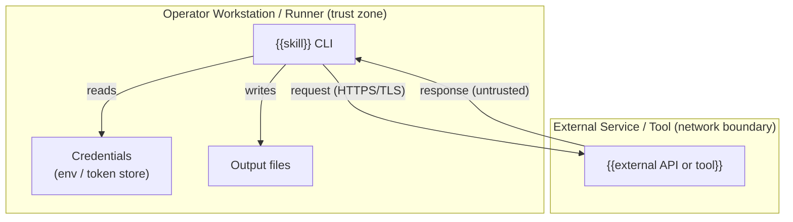

<!-- markdownlint-disable-file -->
<!--
USAGE: Copy this file to `.github/skills/<collection>/<skill>/SECURITY.md` and replace every
{{PLACEHOLDER}} and guidance comment. Every diagram, asset, adversary, mitigation, and risk
rating MUST be derived from the skill's actual runtime — never invent threats or ratings.
Delete sections only when a category genuinely does not apply, and say so explicitly.
This template mirrors `docs/security/security-model.md` so per-skill models reach full parity.
-->
# {{Skill}} Skill Security Model

{{One-paragraph intro: name the runtime files, the trust-bucket decomposition, and state
"Each bucket enumerates all six STRIDE categories with the in-code mitigations that address them."}}

> **See also: repo-wide STRIDE model.** This skill participates in the repository-wide threat model recorded in `docs/security/security-model.md` and is registered in its Skill Security Models section. In the copied `SECURITY.md`, link to the repo model with a relative path such as `../../../../docs/security/security-model.md`.

## Executive Summary

{{2-4 sentences: what the skill does, its highest-risk behavior, and the overall residual-risk posture.}}

### Security Posture Overview

| Dimension          | Value                                                                    |
|--------------------|--------------------------------------------------------------------------|
| Runtime surface    | {{e.g., REST CLI; environment credentials; subprocess}}                  |
| Trust buckets      | {{count and one-line list, e.g., B1 CLI→API, B2 credentials, B3 caller}} |
| Credentials        | {{what secrets are handled and how}}                                     |
| Network egress     | {{endpoints reached, transport}}                                         |
| Open residual gaps | {{count}} ({{highest severity}})                                         |

## Contents

* [System Description](#system-description)
* [Trust Boundaries](#trust-boundaries)
* [Assets](#assets)
* [Adversaries](#adversaries)
* [Bucket B1: {{name}}](#bucket-b1-name)
* [Enterprise Readiness Gaps](#enterprise-readiness-gaps)
* [References](#references)

## System Description

### Components

1. {{runtime file}} — {{role}}
2. {{runtime file}} — {{role}}

### Data Flow



## Trust Boundaries

### Boundary Diagram

```text
┌───────────────────────────────────────────────────────────┐
│ TRUST BOUNDARY: Operator Workstation / Runner             │
│  ┌─────────────┐   ┌──────────────┐   ┌────────────────┐  │
│  │ {{skill}}   │   │ Credentials  │   │ Output files   │  │
│  │ CLI         │   │ (env/store)  │   │                │  │
│  └─────────────┘   └──────────────┘   └────────────────┘  │
└───────────────────────────┬───────────────────────────────┘
                            │ TLS
        ┌────────────────────▼────────────────────┐
        │ TRUST BOUNDARY: External Service / Tool  │
        │  ┌────────────────────────────────────┐  │
        │  │ {{external API or tool}}           │  │
        │  └────────────────────────────────────┘  │
        └──────────────────────────────────────────┘
```

### Boundary Descriptions

| Boundary               | Assets Protected               | Controls Enforced                          |
|------------------------|--------------------------------|--------------------------------------------|
| {{Workstation/Runner}} | {{credentials, outputs}}       | {{env handling, file perms}}               |
| {{External Service}}   | {{request/response integrity}} | {{TLS, no-redirect opener, response caps}} |

## Assets

| Id | Asset     | Lifetime     | Notes     |
|----|-----------|--------------|-----------|
| A1 | {{asset}} | {{lifetime}} | {{notes}} |

## Adversaries

| Id    | Adversary     | In-scope mitigations |
|-------|---------------|----------------------|
| ADV-a | {{adversary}} | {{mitigations}}      |

<!-- For EACH trust bucket, add a `## Bucket Bn: {{name}}` section (there is no umbrella
"Trust Buckets" heading). Enumerate ALL SIX STRIDE categories as ### headings in canonical
order: Spoofing, Tampering, Repudiation, Information Disclosure, Denial of Service,
Elevation of Privilege. Use "Not applicable. <reason>." where a category genuinely does not apply.
End each bucket with a ### Risk Rating summary table. -->

## Bucket B1: {{name}}

### Spoofing

* {{mitigation}}

### Tampering

* {{mitigation}}

### Repudiation

* {{mitigation, or "Not applicable. <reason>."}}

### Information Disclosure

* {{mitigation}}

### Denial of Service

* {{mitigation}}

### Elevation of Privilege

* {{mitigation}}

### Risk Rating

| Threat     | Likelihood       | Impact           | Residual Risk    | Status                                         |
|------------|------------------|------------------|------------------|------------------------------------------------|
| {{threat}} | {{Low/Med/High}} | {{Low/Med/High}} | {{Low/Med/High}} | {{Mitigated / Partially Mitigated / Accepted}} |

## Enterprise Readiness Gaps

The following are known limitations recorded so operators can make informed deployment decisions. Severity ratings are the project's own assessment and are not equivalent to a CVSS score.

| Id          | Gap     | Severity                               | Status          |
|-------------|---------|----------------------------------------|-----------------|
| G-{{CAT}}-1 | {{gap}} | {{Category-Level, e.g., InfoDisc-Med}} | {{disposition}} |

<!-- Gap IDs are per-file-scoped: G-{STRIDE-token}-{N}. Tokens: SPF, TAM, REP, INF, DOS, EOP,
plus SUP (supply chain) and TLS (transport) specials. Cite public links only; never reference
internal `.copilot-tracking/` paths in this shipped artifact. -->

For an active issue tracker entry covering these gaps, see the [hve-core issues list](https://github.com/microsoft/hve-core/issues).

## References

* [STRIDE Threat Model](https://learn.microsoft.com/azure/security/develop/threat-modeling-tool-threats)
* {{relevant OWASP list, e.g., OWASP Top 10 / LLM Top 10}}
* {{the skill's external API/tool security docs}}
* Repository security model — `docs/security/security-model.md`

🤖 Crafted with precision by ✨Copilot following brilliant human instruction, then carefully refined by our team of discerning human reviewers.
